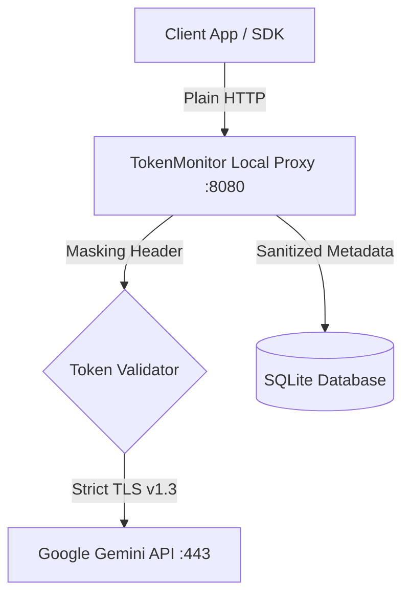

# Phase 00: Prerequisites & Environment Specification
## System: Token & Usage Monitor (`TokenMonitor`)
**Date:** 2026-09-08 | **Author:** System Architect & Operations Engineer  
**Standard Reference:** Skill `infra_research_runbook` & `golang-expert-guidelines`

---

## 1. Tổng quan Mục tiêu

Tài liệu này xác lập các yêu cầu tiên quyết về phần cứng, môi trường mạng, hệ điều hành, phân quyền bảo mật và các thành phần phụ thuộc trước khi triển khai hệ thống **TokenMonitor** — hệ thống giám sát thời gian thực lưu lượng token (Prompt, Output, CoT Thinking, Context Caching) và tần suất sử dụng LLM.

---

## 2. Hardware Sizing & Capacity Planning

Hệ thống được thiết kế theo tư duy **Simplicity First & High Efficiency** (tối ưu bằng Golang và SQLite WAL Mode), tiêu tốn cực ít tài nguyên máy chủ hoặc máy trạm cá nhân:

| Cấu hình | Yêu cầu Tối thiểu (Minimum) | Khuyến nghị (Recommended) | Ghi chú kỹ thuật |
| :--- | :--- | :--- | :--- |
| **CPU** | 1 Core (1.5 GHz+) | 2 Cores (2.0 GHz+) | Go runtime tận dụng đa luồng cho Proxy và Background Rollup Worker |
| **RAM** | 256 MB RAM | 512 MB – 1 GB RAM | Dung lượng RAM phụ thuộc vào kích thước in-memory ring buffer (khoảng 50 MB khi buffer 10,000 requests) |
| **Disk Space** | 2 GB khả dụng | 10 GB+ SSD / NVMe | SQLite lưu ~200 bytes/request. 1 triệu requests tốn khoảng 200 MB dung lượng database |
| **Disk IOPS** | 500 IOPS | 2,000+ IOPS | Chế độ SQLite WAL mode yêu cầu tốc độ flush disk nhanh để tránh nghẽn I/O |

---

## 3. Network & Port Matrix

Hệ thống lắng nghe và kết nối qua các cổng mạng sau. Đảm bảo các cổng không bị xung đột với các tiến trình khác trên máy:

| Port | Giao thức | Hướng | Mô tả dịch vụ | Phạm vi truy cập |
| :--- | :--- | :--- | :--- | :--- |
| **`8080`** | HTTP/1.1, HTTP/2 | Inbound | Cổng Proxy Interceptor (Chặn bắt request/response Gemini) | `127.0.0.1` (Cục bộ) hoặc LAN nội bộ |
| **`9090`** | HTTP/1.1, WebSocket | Inbound | Cổng Web UI Dashboard & REST Metrics API | `127.0.0.1` hoặc LAN (có reverse proxy) |
| **`443`** | HTTPS | Outbound | Gọi ra Upstream `generativelanguage.googleapis.com` / Google OAuth | Mạng Internet (Strict SSL/TLS) |

> Trích dẫn cổng cấu hình tại: [TokenMonitor_Ref_002_config_template.yaml](./references/TokenMonitor_Ref_002_config_template.yaml) (Dòng 8, 18)

---

## 4. Software & OS Dependencies

### 4.1. Hệ điều hành hỗ trợ
* **Windows:** Windows 10 / 11 hoặc Windows Server 2019+ (Đã kiểm chứng trên môi trường PowerShell).
* **Linux:** Ubuntu 20.04+, Debian 11+, RHEL/CentOS 8+, Rocky Linux 9+.

### 4.2. Runtime & Thư viện
* **Go Compiler:** `Go 1.22+` (bắt buộc hỗ trợ cải tiến `net/http` router mới và `sync.Pool`).
* **SQLite:** Engine nhúng sẵn thông qua CGO (`github.com/mattn/go-sqlite3`) hoặc thuần Go không CGO (`modernc.org/sqlite`).
* **Trình duyệt Web:** Chrome, Edge, Firefox bản hiện đại (hỗ trợ ES6 Module, CSS Grid, Canvas để vẽ biểu đồ Chart.js).

---

## 5. Security & Permission Matrix

Để đảm bảo tuân thủ nghiêm ngặt các quy chuẩn bảo mật:

### Checklist Kiểm tra An toàn Bảo mật:
- [x] **Masking Credentials:** Tuyệt đối không ghi `Authorization: Bearer` hoặc API Key thô vào database log. Chỉ lưu hash hoặc trạng thái hiệu lực.
- [x] **Localhost Binding:** Mặc định bind vào `127.0.0.1` để ngăn chặn các máy lạ trong cùng mạng WiFi/LAN quét cổng và xem dashboard cá nhân.
- [x] **File System Permissions:** File database `token_monitor.db` và file cấu hình `config.yaml` phải được cấp quyền `0600` (chỉ user sở hữu tiến trình được đọc/ghi).
- [x] **Zero Telemetry Leakage:** Không gửi dữ liệu token usage về bất kỳ máy chủ bên thứ ba nào ngoài lưu trữ nội bộ trên máy người dùng.
