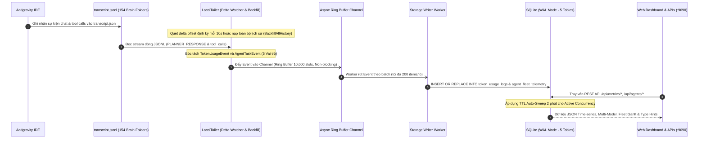
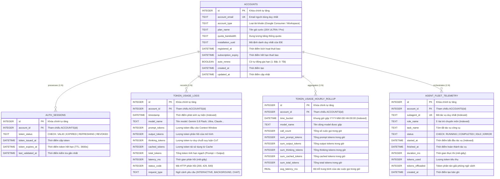
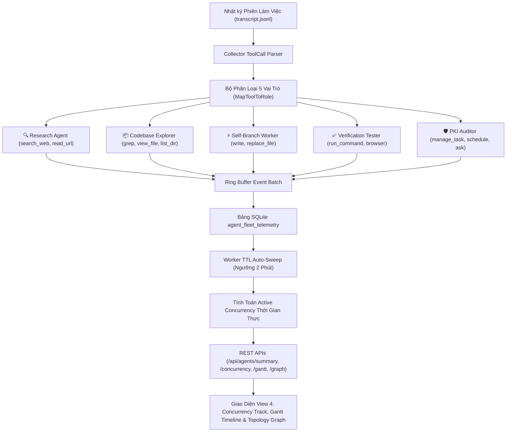

# Phase 01: Core Architecture & Underlying Mechanics
## System: Token & Usage Monitor (`TokenMonitor`)
**Date:** 2026-09-08 | **Author:** System Architect & Operations Engineer  
**Standard Reference:** Skill `infra_research_runbook` & `golang-expert-guidelines`

---

## 1. Tổng quan Kiến trúc

**TokenMonitor** được xây dựng nhằm mục tiêu thu thập, chuẩn hóa và trực quan hóa toàn diện mức độ tiêu thụ tài nguyên AI. Hệ thống sử dụng mô hình **Dual-Source Ingestion Engine** để thu thập dữ liệu:

1. **Passive Log Ingestion (Kênh Chính Cục Bộ - 100% Offline):** Bộ quét log cục bộ (`LocalTailer`) đọc các tệp `transcript.jsonl` và trạng thái `state.vscdb` từ thư mục làm việc của Antigravity IDE với quyền chỉ đọc (`O_RDONLY`), hoàn toàn không gửi request ra ngoài Internet.
2. **Active Realtime Ingestion (Kênh Mở Rộng):** Go Transparent Reverse Proxy hỗ trợ bóc tách `usageMetadata` khi cấu hình ứng dụng đi qua proxy trung gian (mặc định tắt để đảm bảo an toàn chính sách).

> [!TIP]
> **SƠ ĐỒ KIẾN TRÚC TƯƠNG TÁC (INTERACTIVE ARCHIFY DIAGRAMS):**
> * 🏛️ **Bản đồ Kiến trúc & Ranh giới Bảo mật:** [tokenmonitor-architecture.html](../tokenmonitor-architecture.html)  
>   *(Hỗ trợ Pan/Zoom, xem theo 4 góc nhìn Guided Views, chuyển giao diện Sáng/Tối, và xuất ảnh PNG/SVG chuẩn)*
> * 🌊 **Sơ đồ Dòng chảy Dữ liệu Token (Dataflow Trace):** [tokenmonitor-dataflow.html](../tokenmonitor-dataflow.html)  
>   *(Hỗ trợ hiệu ứng dòng chảy động Trace Animation 5 giai đoạn: Sources -> Ingestion -> Processing -> Persistence -> Analytics)*

---

## 2. Luồng Dữ liệu Đầu cuối (End-to-End Data Pipeline)



---

## 3. Cơ chế Bóc tách `usageMetadata` Chuyên sâu

Dựa theo chuẩn đặc tả của Google Gemini API, phản hồi JSON trả về trường `usageMetadata`. TokenMonitor phân tích và ánh xạ vào các trường dữ liệu đo lường cụ thể:

> Cấu trúc JSON mẫu tại: [TokenMonitor_Ref_003_gemini_usage_metadata_spec.json](./references/TokenMonitor_Ref_003_gemini_usage_metadata_spec.json) (Dòng 14 - 34)

| Chỉ số trên Dashboard | Trường JSON trong API | Ý nghĩa Kỹ thuật & Nghiệp vụ |
| :--- | :--- | :--- |
| **Prompt Tokens (Input)** | `usageMetadata.promptTokenCount` | Tổng số token đầu vào nạp vào ngữ cảnh mô hình (Context Window), bao gồm System Prompt, Lịch sử hội thoại, và Workspace Context. |
| **Output Tokens (Candidates)** | `usageMetadata.candidatesTokenCount` | Số token kết quả được sinh ra bởi mô hình. |
| **Thinking Tokens (CoT)** | `candidatesTokensDetails[modality='THINKING'].tokenCount` | Token suy luận chuỗi tư duy ngầm (Chain-of-Thought) của các model tư duy sâu (Gemini 2.0 / 3.8 Flash Thinking). Giúp đo lường độ phức tạp của bài toán. |
| **Cached Tokens** | `usageMetadata.cachedContentTokenCount` | Lượng token được tái sử dụng từ bộ nhớ đệm (Prompt Caching). Tỷ lệ này càng cao (vd: 92.9% như trong ảnh) thì chi phí và độ trễ phản hồi càng giảm tối đa. |
| **Total Grand Tokens** | `usageMetadata.totalTokenCount` | Tổng lượng token tính phí hoặc tính vào hạn ngạch (thường bằng `promptTokenCount + candidatesTokenCount`). |

---

## 4. Quản lý Vòng đời OAuth Token & Quota Bandwidth

### 4.1. Cơ chế Đếm ngược TTL Token (`Valid - Expires in ...`)
Token truy cập OAuth2 của Google có thời gian sống (TTL) tiêu chuẩn là **3,600 giây (60 phút)**.
1. Khi phiên làm việc bắt đầu hoặc có lệnh refresh token, TokenMonitor ghi nhận:
   $$\text{token\_expires\_at} = \text{token\_issued\_at} + 3599\text{s}$$
2. Mỗi khi Dashboard truy vấn trạng thái:
   $$\Delta t = \text{token\_expires\_at} - \text{time.Now()}$$
   * Nếu $\Delta t > 0$: Trạng thái `Valid (Expires in XmYs)`.
   * Nếu $\Delta t \le 0$: Kích hoạt cờ `EXPIRED` và thông báo cần refresh token.

### 4.2. Giám sát Tần suất & Băng thông Quota (20X Plan)
* **RPM (Requests Per Minute):** Đo lường số lượt gọi API trong cửa sổ trượt 60 giây.
* **TPM (Tokens Per Minute):** Đo lường lưu lượng token tiêu thụ trên mỗi phút.
* Phân loại theo Model Engine: Bóc tách riêng biệt giữa các model tiêu tốn quota cao (ví dụ: `Gemini Ultra`) và các model tốc độ cao (ví dụ: `Gemini 3.8 Flash`) để vẽ biểu đồ phân bổ tỷ lệ chính xác.

---

## 5. Thiết kế Cơ sở Dữ liệu & Sơ đồ Thực thể Mối quan hệ (ERD)

Dữ liệu được lưu trữ nội bộ trong SQLite theo kiến trúc 2 tầng tối ưu (Raw Logs + Rollup Bucket) với ranh giới toàn vẹn quan hệ khóa ngoại (Foreign Keys) nghiêm ngặt:

> Tài liệu chi tiết từ điển dữ liệu: [TokenMonitor_Ref_004_database_erd.md](./references/TokenMonitor_Ref_004_database_erd.md)  
> Tệp khởi tạo SQL: [TokenMonitor_Ref_001_schema.sql](./references/TokenMonitor_Ref_001_schema.sql)

### 5.1. Sơ đồ Thực thể Mối quan hệ (Entity-Relationship Diagram)



### 5.2. Nguyên lý Vận hành Lưu trữ 2 Tầng
1. **Tầng Raw Logs (`token_usage_logs`):** Lưu vết chi tiết từng câu trả lời của AI với đầy đủ các loại token, độ trễ và mã lỗi HTTP. Dùng để xem chi tiết theo từng phút hoặc truy vết sự cố.
2. **Tầng Rollup (`token_usage_hourly_rollup`):** Định kỳ mỗi 5 phút, tiến trình nền tự động gộp các bản ghi cùng 1 giờ thành 1 dòng duy nhất có `SUM(prompt_tokens)`, `SUM(cached_tokens)`, `AVG(latency_ms)`. Khi người dùng mở Dashboard xem 7 ngày hay 30 ngày, hệ thống truy vấn thẳng vào bảng Rollup, đảm bảo tốc độ phản hồi luôn `< 10ms`.

---

## 6. Đặc tả Cấu hình Các File & Cấu Trúc Dự Án (File & Config Specification)

### 6.1. Cấu trúc Cây Thư mục Dự Án (Repository Tree)
```text
TokenMonitor/
├── main.go                       # Điểm khởi chạy chính: nạp config, khởi động buffer, tailer, server
├── config.yaml                   # File cấu hình hoạt động chính của ứng dụng
├── go.mod / go.sum               # Khai báo Go dependencies (modernc.org/sqlite, yaml.v3)
├── token_monitor.exe             # Binary độc lập duy nhất (đã nhúng Web UI tĩnh)
├── tokenmonitor_test.go          # Bộ kiểm thử End-to-End tự động
├── collector/                    # Module thu thập và phân tích dữ liệu
│   ├── buffer.go                 # In-Memory Ring Buffer không khóa tải 10,000 sự kiện/giây
│   ├── models.go                 # Định nghĩa cấu trúc sự kiện TokenUsageEvent & chuẩn hóa model
│   ├── proxy.go                  # Reverse Proxy bóc tách usageMetadata (mặc định tắt)
│   └── tailer.go                 # LocalTailer quét file transcript.jsonl thụ động trên SSD
├── storage/                      # Module lưu trữ cơ sở dữ liệu SQLite
│   ├── db.go                     # Khởi tạo SQLite, connection pool, nạp PRAGMA WAL mode & migrations
│   ├── detector.go               # Đọc an toàn thông tin tài khoản từ state.vscdb (mode=ro)
│   └── repository.go             # Các hàm truy vấn Time-series, Daily metrics, Model breakdown
├── web/                          # Module máy chủ Web Dashboard
│   ├── handler.go                # REST API handlers và nhúng file tĩnh (//go:embed static/*)
│   └── static/                   # Tài nguyên giao diện người dùng
│       └── index.html            # Dashboard tích hợp Chart.js, Apache ECharts, CSS Zero-Scroll
├── data/                         # Thư mục lưu trữ dữ liệu nội bộ
│   ├── token_monitor.db          # Cơ sở dữ liệu SQLite chính
│   ├── token_monitor.db-wal      # Write-Ahead Log của SQLite
│   └── token_monitor.db-shm      # Shared Memory index của SQLite
└── docs/                         # Toàn bộ tài liệu kỹ thuật chuẩn Runbook
    ├── tokenmonitor-architecture.html   # Sơ đồ kiến trúc tương tác Archify
    ├── tokenmonitor-dataflow.html       # Sơ đồ dòng chảy dữ liệu tương tác Archify
    └── TokenMonitor_20260908/           # Bộ 7 tài liệu Runbook (Phase 00 -> 06)
```

### 6.2. Đặc tả Chi tiết File Cấu hình `config.yaml`

| Khối Cấu Hình | Thuộc Tính | Kiểu | Mặc Định Khuyến Nghị | Ý Nghĩa Kỹ Thuật & Bảo Mật |
| :--- | :--- | :--- | :--- | :--- |
| **`server`** | `dashboard_port` | `int` | `9090` | Cổng lắng nghe của giao diện Web Dashboard |
| | `bind_address` | `string` | `"127.0.0.1"` | **Bảo mật tuyệt đối:** Chỉ cho phép truy cập từ máy tính nội bộ (localhost) |
| | `read_timeout_seconds` | `int` | `15` | Giới hạn thời gian đọc HTTP request |
| | `write_timeout_seconds` | `int` | `30` | Giới hạn thời gian phản hồi HTTP payload |
| **`proxy`** | `enabled` | `bool` | `false` | **Tắt mặc định:** Để hệ thống chạy ở chế độ đọc log thụ động 100% an toàn cho tài khoản |
| | `listen_port` | `int` | `8080` | Cổng lắng nghe của proxy khi cần kích hoạt |
| | `upstream_target` | `string` | `"https://generativelanguage.googleapis.com"` | Máy chủ chuyển tiếp khi bật proxy |
| **`database`** | `sqlite_path` | `string` | `"./data/token_monitor.db"` | Đường dẫn file SQLite lưu trữ dữ liệu |
| | `max_open_conns` | `int` | `25` | Số kết nối tối đa mở đồng thời |
| | `max_idle_conns` | `int` | `10` | Số kết nối rảnh rỗi giữ trong pool |
| | `enable_wal_mode` | `bool` | `true` | Kích hoạt WAL mode để đọc ghi đồng thời không bị lock |
| | `rollup_interval_seconds`| `int` | `300` | Chu kỳ 5 phút chạy worker tổng hợp số liệu theo giờ |
| **`local_tailer`**| `enabled` | `bool` | `true` | **Kênh thu thập chính:** Quét log nội bộ của IDE |
| | `ide_brain_dir` | `string` | Đường dẫn `.gemini\...\brain` | Thư mục chứa các file `transcript.jsonl` |
| | `poll_interval_seconds` | `int` | `10` | Chu kỳ quét kiểm tra có câu chat mới phát sinh |
| **`account_profile`**| `email` | `string` | Email hiển thị | Chuỗi email hiển thị làm nhãn trên Dashboard |
| | `plan_name` | `string` | `"Google AI Ultra"` | Tên gói cước hiển thị trên Dashboard |

---

## 7. Kiến Trúc Multi-Agent Orchestration & Fleet Telemetry Engine

Hệ thống quản lý, phân loại và đo lường mức tải của toàn bộ đội ngũ Subagent hoạt động ngầm theo kiến trúc sau:



### 7.1. Phân Loại 5 Vai Trò Chuyên Môn
| Vai Trò | Tên Kỹ Thuật | Nhóm Công Cụ Trích Xuất | Nhiệm Vụ Cốt Lõi |
| :--- | :--- | :--- | :--- |
| 🔍 **Research Agent** | `Research Agent` | `search_web`, `read_url_content` | Tìm kiếm tài liệu, tra cứu API docs, thu thập thông tin mạng ngoài |
| 📦 **Codebase Explorer** | `Codebase Explorer` | `grep_search`, `list_dir`, `view_file` | Đọc cấu trúc cây thư mục, tìm kiếm biểu thức code và đọc nội dung file |
| ⚡ **Self-Branch Worker** | `Self-Branch Worker` | `write_to_file`, `replace_file_content`, `multi_replace_file_content` | Trực tiếp chỉnh sửa, tạo mới mã nguồn và tài liệu trên máy trạm |
| ✅ **Verification Tester** | `Verification Tester` | `run_command`, `browser_subagent` | Thực thi lệnh biên dịch, chạy unit test, kiểm tra giao diện trình duyệt |
| 🛡️ **PKI Auditor** | `PKI Auditor` | `manage_task`, `schedule`, `ask_question`, `generate_image` | Quản lý tiến trình nền, lập lịch hẹn giờ, tương tác xác nhận với người dùng |

### 7.2. Giải Thuật Tính Toán Active Concurrency & Cơ Chế TTL Auto-Sweep 2 Phút
- **Định nghĩa Tải Đồng Thời:** Số lượng tác vụ Subagent / Tool Call đang thực thi song song trong cửa sổ thời gian thực (2 phút gần nhất).
- **Cơ chế Chống Dồn Tích Task Cũ (Anti-Stale Accumulation):**
  Trong [storage/repository.go](file:///e:/GoogleDrive/WorkSpace/Code/ProjectGolang/GoLangDev/TokenMonitor/storage/repository.go):
  ```sql
  UPDATE agent_fleet_telemetry 
  SET status = 'COMPLETED',
      finished_at = COALESCE(finished_at, datetime(started_at, '+' || MAX(duration_ms/1000, 2) || ' seconds'))
  WHERE status = 'RUNNING' 
    AND started_at < datetime('now', '-2 minutes');
  ```
- **Cửa Sổ Đếm Đồng Thời An Toàn:**
  Chỉ đếm các bản ghi thỏa mãn `status = 'RUNNING' AND started_at >= datetime('now', '-2 minutes')`.
- **Phân Cấp Trạng Thái Concurrency:**
  - `runningCount == 0`: `Fleet Standing By • Ready`
  - `runningCount <= 3`: `Safe Load • 0 Throttling`
  - `runningCount <= 5`: `Optimal Parallelism • Active`
  - `runningCount > 5`: `Peak Concurrency • Heavy Load` (Tự động nâng mức trần tải `CapacityCeiling = runningCount + 2`)

### 7.3. Đồ Thị Topo Mạng Lưới Đa Tác Nhân (Multi-Agent & Multi-Project Topology Graph)
- **Mô Hình Mạng Lưới 3 Tầng Phân Cấp:**
  - *Tầng 1 (Root Node)*: Orchestrator / Lead Agent giữ vai trò chỉ huy và điều phối tổng thể.
  - *Tầng 2 (Project Nodes)*: Workspace Projects phân tách theo từng kho lưu trữ mã nguồn.
  - *Tầng 3 (Subagent Nodes)*: 5 vai trò tác tử chuyên biệt (`Research`, `Explorer`, `Worker`, `Tester`, `Auditor`).
- **Quy Hoạch Lực Động Cân Bằng (Balanced Force-Directed Physics):**
  - Khởi tạo hình tròn `initLayout: 'circular'` và hệ số cản `friction: 0.75` dập tắt dao động trong vòng 1-2 giây.
  - Tích hợp lực hút trọng tâm mạnh `gravity: 0.18 - 0.22` hướng về tâm `(50%, 50%)` kết hợp dải đẩy co giãn `repulsion: 160 - 260` và độ dài liên kết `edgeLength: [40, 110]`, triệt tiêu hoàn toàn hiện tượng nút bị văng ra ngoài khung hình.
  - Tự động căn tỷ lệ khung nhìn `zoom: 0.82 - 0.95` đảm bảo khoảng đệm an toàn bốn phía.
- **Công Nghệ Smart Edge Labels & Chống Va Chạm Nhãn:**
  - Kích hoạt thuật toán tự động ẩn nhãn va chạm `labelLayout: { hideOverlap: true }` trong ECharts.
  - Ở chế độ *Smart Edge Labels*, hệ thống ẩn các nhãn số tĩnh rối mắt trên đường liên kết và chỉ kích hoạt badge neon phát sáng khi người dùng di chuột vào nút tương ứng (`focus: 'adjacency'`).
- **Đồng Bộ Hóa Bộ Lọc Thời Gian Thực & Gom Cụm Toàn Diện:**
  Toàn bộ dữ liệu đồ thị được đồng bộ hóa tức thì với bộ lọc thời gian toàn cục (`?range=today|24h|7d|30d|all`), loại bỏ hoàn toàn giới hạn cứng `LIMIT 500` để tổng hợp đầy đủ 100% dữ liệu thực tế phát sinh theo đúng khung thời gian người dùng lựa chọn.

---

## 8. Hệ Thống Interactive Floating Type-Hint Tooltip Engine

Để hỗ trợ người vận hành hiểu rõ cặn kẽ mọi chỉ số kỹ thuật trên Dashboard:
- **Kiến Trúc UI:** Cấu trúc Dark Glassmorphism nổi độc lập (`#global-type-hint`, `position: fixed`, `pointer-events: none`, `z-index: 100000`).
- **Thư Viện Dữ Liệu Type Hint:** Mỗi phần tử mang class `.has-hint` được gắn 5 thuộc tính ngữ nghĩa:
  1. `data-hint-title`: Tiêu đề chuẩn hóa kèm tên tiếng Việt.
  2. `data-hint-tag`: Thẻ phân loại (`REAL-TIME LOAD`, `INPUT CONTEXT`, `RELIABILITY`, `EFFICIENCY`...).
  3. `data-hint-desc`: Mô tả chi tiết ý nghĩa kỹ thuật và nghiệp vụ.
  4. `data-hint-source`: Chỉ rõ nguồn dữ liệu gốc (bảng SQLite / trường JSON transcript).
  5. `data-hint-note`: Khuyến cáo kỹ thuật, mức tải an toàn hoặc lưu ý vận hành.
- **Thuật Toán Định Vị Biên (Edge Boundary Detection):** Tự động phát hiện mép phải và mép dưới màn hình (`window.innerWidth`, `window.innerHeight`) để đảo hướng hiển thị tooltip, chống tràn khung hình.


