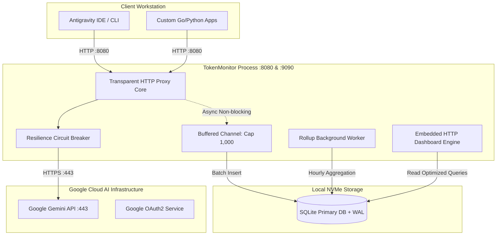

# Phase 02: Production & Deployment Design
## System: Token & Usage Monitor (`TokenMonitor`)
**Date:** 2026-09-08 | **Author:** Senior Infrastructure & System Operations Expert  
**Standard Reference:** Skill `infra_research_runbook`, `rate-limit-skills` & `golang-expert-guidelines`

---

## 1. Mô hình Topology Triển khai

Hệ thống TokenMonitor được thiết kế để phục vụ 2 kịch bản chính:
1. **Mô hình Standalone Local Daemon (Phổ biến nhất):** Chạy trực tiếp trên máy trạm (Workstation/Laptop) của lập trình viên, giám sát các phiên gọi AI từ IDE hoặc script Go/Python cục bộ.
2. **Mô hình Centralized Gateway (Đội nhóm / Team Hub):** Chạy trên một server nội bộ, đóng vai trò Proxy Gateway tập trung cho nhiều lập trình viên cùng chia sẻ quota hoặc quản lý tập trung hạn mức dự án.

---

## 2. Thiết kế Cơ chế Resilience & Chống Gián đoạn (Zero-Loss Logging)

Áp dụng tiêu chuẩn từ bộ skill `rate-limit-skills` và `golang-expert-guidelines`:

### 2.1. Non-Blocking Async Ingestion
* Proxy tuyệt đối không được làm tăng độ trễ (latency) của phản hồi LLM. Khi nhận được `usageMetadata` từ upstream Gemini, proxy ngay lập tức stream kết quả về cho client.
* Việc ghi log được đẩy vào một Go buffered channel: `make(chan *TokenUsageEvent, 1000)` (dung lượng chuẩn 1.000 sự kiện).
* Nếu channel đầy (chẳng hạn khi ổ đĩa bị kẹt I/O hoặc nghẽn giao dịch), hệ thống áp dụng cơ chế **Non-blocking Drop**: in log cảnh báo `[WARN]` và bỏ qua sự kiện, tuyệt đối không bao giờ làm treo hoặc chặn (block) request của client hay tiến trình quét log cục bộ.

### 2.2. Circuit Breaker cho Upstream API
* Nếu Google API gặp sự cố (trả về mã lỗi 500, 502, 503 liên tục quá 5 lần trong 10 giây), Circuit Breaker chuyển sang trạng thái `OPEN` để fail-fast, ngăn chặn tình trạng thắt cổ chai kết nối (Connection Starvation) trên máy trạm.
* Sau 30 giây, Circuit Breaker chuyển sang `HALF-OPEN` để thăm dò một request kiểm tra trước khi phục hồi hoàn toàn.

---

## 3. Quản lý Dung lượng & Chính sách Lưu trữ (Retention Policy)

> Cấu hình đường dẫn và tham số tại: [TokenMonitor_Ref_002_config_template.yaml](./references/TokenMonitor_Ref_002_config_template.yaml) (Dòng 28 - 38)

Để giữ cho database luôn nhỏ gọn và tốc độ truy vấn biểu đồ luôn đạt mức < 10ms:

| Tầng dữ liệu | Thời gian lưu trữ (Retention) | Tần suất dọn dẹp | Hành động xử lý |
| :--- | :--- | :--- | :--- |
| **Raw Logs (`token_usage_logs`)** | **30 ngày gần nhất** | Chạy hàng ngày lúc 02:00 sáng | Xóa các bản ghi chi tiết cũ hơn 30 ngày sau khi đã tổng hợp vào bảng Rollup. |
| **Hourly Rollup (`token_usage_hourly_rollup`)** | **365 ngày (1 năm)** | Giữ nguyên theo năm | Dung lượng cực nhẹ (~24 rows/ngày $\times$ số model $\approx$ 18,000 rows/năm $\approx$ 5 MB). |
| **SQLite VACUUM** | Hàng tháng | Ngày 1 mỗi tháng | Tự động chạy `PRAGMA auto_vacuum = INCREMENTAL;` để giải phóng dung lượng đĩa vật lý thừa. |

---

## 4. Thiết kế High Availability (Cho Mô hình Đội nhóm / Centralized)

Trong trường hợp triển khai trên máy chủ Linux tập trung:
* **Process Manager:** Sử dụng **Systemd Service** (tự động khởi động lại sau 5 giây nếu gặp crash: `Restart=always`, `RestartSec=5`).
* **Built-in Auto-Backup Engine (Enterprise Non-Blocking):** Tích hợp sẵn daemon Auto-Backup trong nhân mã nguồn TokenMonitor (`storage/backup.go`), tự động snapshot định kỳ (mặc định 60 phút) qua SQLite native `VACUUM INTO`:
  - Hợp nhất toàn bộ dữ liệu từ Write-Ahead Log (`.db-wal`) vào 1 file `.db` snapshot duy nhất (`token_monitor_backup_YYYYMMDD_HHMMSS.db`).
  - Không khóa tiến trình ghi (Non-blocking I/O).
  - Tự động xoay vòng dọn dẹp giữ lại đúng `max_keep` bản (mặc định 7 bản).
  - Tự động cập nhật file chuẩn hóa `data/backup/token_monitor.db` phục vụ khôi phục 1-click tức thì (RPO $\le$ 60p, RTO $<$ 10s).
  - Hoàn toàn miễn nhiễm với xung đột đồng bộ Google Drive.
* **Graceful Shutdown:** Bắt tín hiệu `SIGINT`, `SIGTERM` trong Go: đóng cổng lắng nghe, flush hết channel in-memory, thực hiện 1 lần snapshot backup an toàn cuối cùng trước khi tiến trình tắt hoàn toàn (Zero Data Loss).
