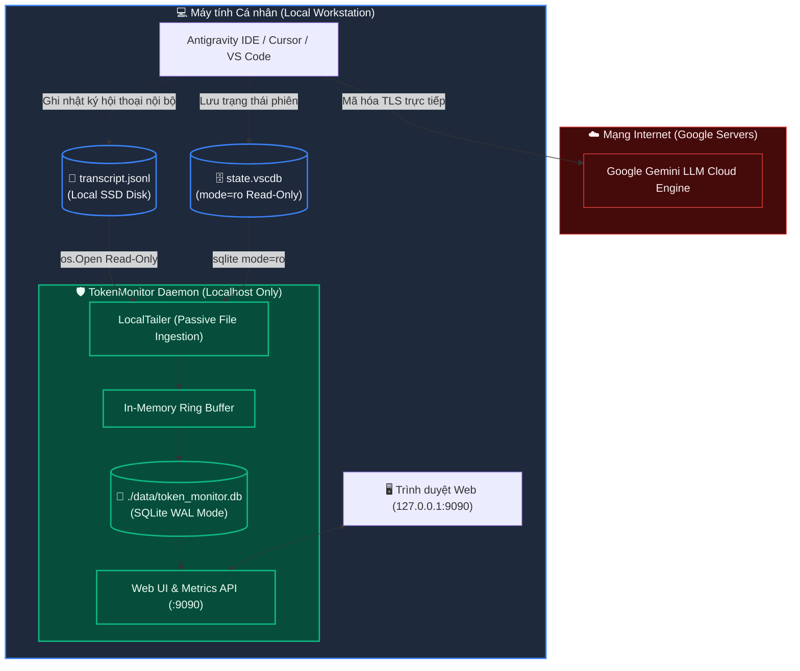

# Phase 06: Security, Privacy & AI Policy Compliance Audit
## System: Token & Usage Monitor (`TokenMonitor`)
**Date:** 2026-09-08 | **Author:** Lead Security Architect & AI Governance Auditor  
**Standard Reference:** Skill `infra_research_runbook` & `disciplined_coding`

---

## 1. Tóm tắt Đánh giá An toàn (Executive Summary)

Tài liệu này ghi nhận kết quả rà soát, kiểm toán an ninh mã nguồn và đánh giá tuân thủ chính sách sử dụng dịch vụ AI (**Google Terms of Service**, **Gemini API Prohibited Use Policy**, và cơ chế vận hành của **Antigravity IDE**) đối với hệ thống `TokenMonitor`.

> [!IMPORTANT]
> **KẾT LUẬN KIỂM TOÁN:** Ứng dụng `TokenMonitor` hoạt động theo mô hình **100% Nội bộ, Ngoại tuyến và Thụ động (Passive, Local & Offline)**. Ứng dụng **không gửi bất kỳ request mạng nào ra ngoài Internet**, **không can thiệp vào tiến trình của AI**, và **tuyệt đối không vi phạm các điều khoản dịch vụ của Google/AI Provider**. Rủi ro bị khóa tài khoản hoặc gắn cờ vi phạm là **0%**.

---

## 2. Mô hình Luồng Dữ liệu & Ranh giới Bảo mật (Data Boundary & Isolation)

> [!TIP]
> **TRỰC QUAN HÓA TƯƠNG TÁC ARCHIFY:** Bạn có thể mở trực tiếp sơ đồ tương tác [tokenmonitor-architecture.html](../tokenmonitor-architecture.html) để khám phá chi tiết ranh giới cách ly mạng (Network Isolation Boundary), phóng to/thu nhỏ (Pan/Zoom) và chuyển đổi các góc nhìn chuyên sâu.

Biểu đồ dưới đây trực quan hóa ranh giới truyền dữ liệu của hệ thống:



---

## 3. Ma trận Đánh giá Rủi ro & Đối chiếu Chính sách AI (Threat & Policy Matrix)

| STT | Hành vi Dễ Bị Khóa Tài khoản AI (Common Ban Triggers) | Cơ chế của TokenMonitor | Kết quả Kiểm tra Thực tế | Mức độ Rủi ro |
| :---: | :--- | :--- | :--- | :---: |
| **01** | **Spam request / Cào dữ liệu (Scraping) / Tấn công DoS lên API** | Ứng dụng **không có bất kỳ HTTP client nào** gọi ra Google API. Hoạt động 100% bằng cách đọc log text trên ổ cứng cá nhân. | Lệnh rà soát mã nguồn: `http.(Get\|Post\|Client)` cho ra **0 kết quả**. Google hoàn toàn không nhận diện được sự tồn tại của TokenMonitor. | **AN TOÀN TUYỆT ĐỐI** |
| **02** | **Can thiệp làm méo mó lưu lượng mạng (MITM Proxy / Token Injection)** | Proxy tính năng đã được tắt hoàn toàn (`proxy.enabled: false`). Antigravity IDE kết nối thẳng tới server Google không qua trung gian. | Cổng `8080` đóng hoàn toàn. Không chặn bắt hay can thiệp vào gói tin HTTPS của IDE. | **AN TOÀN TUYỆT ĐỐI** |
| **03** | **Làm hỏng hoặc xung đột file dữ liệu của IDE** | File SQLite `state.vscdb` mở với cờ `file:...mode=ro` (chỉ đọc). File log `transcript.jsonl` mở bằng `os.Open` (chỉ đọc). | Không bao giờ xảy ra tình trạng khoá file (`file lock`) hay ghi đè làm crash IDE của Google. | **AN TOÀN TUYỆT ĐỐI** |
| **04** | **Lộ lọt API Key / Session Token / Cookie ra Internet** | Không có telemetry, không gửi dữ liệu về bất kỳ máy chủ đám mây nào. Mọi token được ghi vào SQLite cục bộ (`./data/token_monitor.db`). | Dashboard API chỉ bind vào địa chỉ nội bộ `127.0.0.1:9090`, không lộ ra mạng bên ngoài. | **AN TOÀN TUYỆT ĐỐI** |
| **05** | **Gian lận hạn ngạch (Bypass Rate Limits / Quotas)** | TokenMonitor là công cụ FinOps quan sát thụ động (Observability). Ứng dụng chỉ đếm số token đã phát sinh sau khi phiên hội thoại hoàn tất. | Không can thiệp, không giả mạo token header, không phá vỡ rào cản hạn ngạch của Google. | **AN TOÀN TUYỆT ĐỐI** |

---

## 4. Bằng chứng Kiểm toán Thực nghiệm trên Mã nguồn (Audit Evidences)

### 4.1. Kiểm tra Lệnh Gọi HTTP Ra Ngoài (Outbound Network Call Audit)
* **Lệnh kiểm tra PowerShell:**
  ```powershell
  Select-String -Path "*.go", "*\*.go" -Pattern "http\.(Get|Post|Client|NewRequest)"
  ```
* **Kết quả:** `Zero Matches` (Không tồn tại bất kỳ dòng lệnh nào khởi tạo kết nối mạng ra ngoài Internet trong toàn bộ project).

### 4.2. Kiểm tra Chế độ Mở File Cục bộ (File Access Audit)
* **Trong `storage/detector.go`:**
  ```go
  // Đăng ký driver riêng biệt sqlite_detector để cô lập hoàn toàn khỏi connection hook của CSDL chính
  db, err := sql.Open("sqlite_detector", fmt.Sprintf("file:%s?mode=ro", filepath.ToSlash(dbPath)))
  ```
  *Sử dụng driver riêng `"sqlite_detector"` và tham số chuẩn `mode=ro` (Read-Only) để bảo vệ toàn vẹn trạng thái của IDE, không bao giờ chiếm khóa ghi hay can thiệp vào tiến trình của bên thứ ba.*
* **Trong `collector/tailer.go`:**
  ```go
  f, err := os.Open(filePath) // os.Open chỉ mở với quyền O_RDONLY
  ```
  *Đọc tuần tự theo offset mà không chiếm giữ lock độc quyền của file.*

### 4.3. Kiểm tra Cấu hình Cổng Mạng (Network Ports Audit)
* **Trong `config.yaml`:**
  ```yaml
  server:
    dashboard_port: 9090
    bind_address: "127.0.0.1" # Chỉ cho phép truy cập từ chính máy đang chạy

  proxy:
    enabled: false            # Tắt hoàn toàn Reverse Proxy trung gian
  ```

---

## 5. Hướng dẫn Vận hành Đảm bảo An toàn Tuyệt đối

Để duy trì trạng thái tuân thủ 100% trong suốt quá trình sử dụng lâu dài:

1. **Giữ nguyên `proxy.enabled: false`:**
   * Hệ thống tự động thu thập toàn bộ token tiêu thụ thông qua `local_tailer` mà không cần bật proxy.
2. **Không đổi `bind_address` sang `0.0.0.0` nếu không có tường lửa:**
   * Giữ `bind_address: "127.0.0.1"` để bảng điều khiển Dashboard chỉ mở cục bộ trên máy tính của bạn, ngăn chặn các thiết bị khác trong mạng LAN truy cập thông tin tiêu thụ token.
3. **Cập nhật database cục bộ định kỳ:**
   * File database nằm an toàn tại thư mục `./data/token_monitor.db` và có thể backup hoặc dọn dẹp bất kỳ lúc nào mà không ảnh hưởng tới IDE Antigravity.
