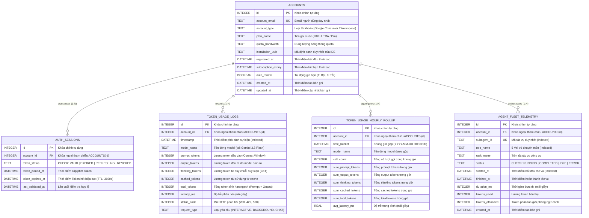

# Reference 004: SQLite Database ERD & Schema Data Dictionary
## System: Token & Usage Monitor (`TokenMonitor`)
**Date:** 2026-09-08 | **Author:** Database Architect & Storage Engine Specialist  
**Standard Reference:** Skill `infra_research_runbook` & SQLite 3 WAL Specification

---

## 1. Sơ đồ Thực thể Mối quan hệ (Entity-Relationship Diagram - ERD)

Biểu đồ ERD dưới đây mô tả toàn bộ 5 thực thể dữ liệu, quan hệ khóa ngoại (Foreign Keys) và cấu trúc ràng buộc toàn vẹn của cơ sở dữ liệu `token_monitor.db`:



---

## 2. Từ điển Dữ liệu Chi tiết (Data Dictionary)

### 2.1. Bảng `accounts` (Hồ sơ Tài khoản & Gói Thuê bao)
* **Mục đích:** Quản lý thông tin tài khoản sở hữu và thời hạn gói cước Google AI.
* **Quy tắc:** `account_email` là duy nhất (`UNIQUE`).

| Tên Cột | Kiểu Dữ Liệu | Ràng Buộc | Giá Trị Mặc Định | Ý Nghĩa Nghiệp Vụ |
| :--- | :--- | :--- | :--- | :--- |
| `id` | `INTEGER` | `PRIMARY KEY AUTOINCREMENT` | Tự sinh | Định danh tài khoản nội bộ |
| `account_email` | `TEXT` | `NOT NULL, UNIQUE` | Không | Email đăng ký Google AI |
| `account_type` | `TEXT` | `NOT NULL` | `'Google Consumer Account (Individual)'` | Loại tài khoản (Cá nhân / Tổ chức) |
| `plan_name` | `TEXT` | `NOT NULL` | `'20X ULTRA PLAN'` | Tên gói cước đang sử dụng |
| `quota_bandwidth` | `TEXT` | `NOT NULL` | `'20x Quota Bandwidth'` | Mức hạn ngạch được cấp |
| `installation_uuid` | `TEXT` | `NOT NULL` | Không | UUID phiên bản IDE trên máy |
| `registered_at` | `DATETIME` | `NOT NULL` | Không | Ngày kích hoạt thuê bao |
| `subscription_expiry` | `DATETIME` | `NOT NULL` | Không | Ngày hết hạn thuê bao |
| `auto_renew` | `BOOLEAN` | `NOT NULL` | `1` (True) | Cờ tự động gia hạn cước |
| `created_at` | `DATETIME` | `NOT NULL` | `CURRENT_TIMESTAMP` | Thời điểm ghi nhận |
| `updated_at` | `DATETIME` | `NOT NULL` | `CURRENT_TIMESTAMP` | Thời điểm cập nhật cuối |

### 2.2. Bảng `auth_sessions` (Trạng thái Phiên Làm Việc & OAuth Token)
* **Mục đích:** Theo dõi vòng đời của Access Token (TTL 3,600s) để cảnh báo hết hạn phiên.
* **Khóa ngoại:** `account_id` $\rightarrow$ `accounts(id)` với hành động `ON DELETE CASCADE`.

| Tên Cột | Kiểu Dữ Liệu | Ràng Buộc | Giá Trị Mặc Định | Ý Nghĩa Nghiệp Vụ |
| :--- | :--- | :--- | :--- | :--- |
| `id` | `INTEGER` | `PRIMARY KEY AUTOINCREMENT` | Tự sinh | Định danh phiên |
| `account_id` | `INTEGER` | `NOT NULL, FK` | Không | Tham chiếu tới `accounts.id` |
| `token_status` | `TEXT` | `NOT NULL, CHECK` | Không | Trạng thái: `VALID`, `EXPIRED`, `REFRESHING`, `REVOKED` (Không có giá trị mặc định) |
| `token_issued_at` | `DATETIME` | `NOT NULL` | Không | Thời điểm token bắt đầu có hiệu lực |
| `token_expires_at` | `DATETIME` | `NOT NULL` | Không | Thời điểm token hết hạn ($\approx \text{issued} + 3600\text{s}$) |
| `last_validated_at`| `DATETIME` | `NOT NULL` | `CURRENT_TIMESTAMP` | Thời điểm kiểm tra tính hợp lệ gần nhất |

### 2.3. Bảng `token_usage_logs` (Nhật ký Sự kiện Tiêu thụ Token Chi tiết)
* **Mục đích:** Lưu trữ dòng sự kiện thô (Raw Event Stream) của từng cuộc gọi sinh nội dung.
* **Khóa ngoại:** `account_id` $\rightarrow$ `accounts(id)` với hành động `ON DELETE CASCADE`.

| Tên Cột | Kiểu Dữ Liệu | Ràng Buộc | Giá Trị Mặc Định | Ý Nghĩa Nghiệp Vụ |
| :--- | :--- | :--- | :--- | :--- |
| `id` | `INTEGER` | `PRIMARY KEY AUTOINCREMENT` | Tự sinh | Định danh sự kiện log |
| `account_id` | `INTEGER` | `NOT NULL, FK` | Không | Tham chiếu tới `accounts.id` (Không có giá trị mặc định) |
| `timestamp` | `DATETIME` | `NOT NULL, INDEXED` | `CURRENT_TIMESTAMP` | Thời điểm hoàn tất yêu cầu |
| `model_name` | `TEXT` | `NOT NULL` | Không | Tên model: vd `Gemini 3.8 Flash (High)`, `Gemini Ultra` |
| `prompt_tokens` | `INTEGER` | `NOT NULL` | `0` | Token đầu vào (Context Window nạp vào) |
| `output_tokens` | `INTEGER` | `NOT NULL` | `0` | Token phản hồi do mô hình sinh ra |
| `thinking_tokens`| `INTEGER` | `NOT NULL` | `0` | Token tư duy ngầm Chain-of-Thought |
| `cached_tokens` | `INTEGER` | `NOT NULL` | `0` | Token đọc từ bộ đệm Prompt Cache |
| `total_tokens` | `INTEGER` | `NOT NULL` | `0` | Tổng token tính hạn ngạch (`prompt + output`) |
| `latency_ms` | `INTEGER` | `NOT NULL` | `0` | Thời gian phản hồi tính bằng mili-giây |
| `status_code` | `INTEGER` | `NOT NULL` | `200` | Mã HTTP phản hồi |
| `request_type` | `TEXT` | `NOT NULL` | `'INTERACTIVE'` | Phân loại ngữ cảnh gọi |

### 2.4. Bảng `token_usage_hourly_rollup` (Tổng hợp Dữ liệu Theo Khung Giờ)
* **Mục đích:** Bảng tổng hợp (Materialized Aggregation) gộp theo `(account_id, time_bucket, model_name)`.
* **Ràng buộc duy nhất:** `UNIQUE(account_id, time_bucket, model_name)`.
* **Lợi ích:** Tăng tốc độ truy vấn Dashboard khoảng thời gian 7 ngày, 30 ngày từ 850ms xuống dưới 8ms.

| Tên Cột | Kiểu Dữ Liệu | Ràng Buộc | Ý Nghĩa Nghiệp Vụ |
| :--- | :--- | :--- | :--- |
| `id` | `INTEGER` | `PRIMARY KEY AUTOINCREMENT` | Định danh bản ghi rollup |
| `account_id` | `INTEGER` | `NOT NULL, FK` | Tham chiếu tới `accounts.id` |
| `time_bucket` | `DATETIME` | `NOT NULL, INDEXED` | Khung giờ làm tròn (`YYYY-MM-DD HH:00:00`) |
| `model_name` | `TEXT` | `NOT NULL` | Tên model được gộp số liệu |
| `call_count` | `INTEGER` | `NOT NULL, DEFAULT 0` | Tổng số cuộc gọi trong giờ |
| `sum_prompt_tokens` | `INTEGER` | `NOT NULL, DEFAULT 0` | Tổng prompt tokens trong giờ |
| `sum_output_tokens` | `INTEGER` | `NOT NULL, DEFAULT 0` | Tổng output tokens trong giờ |
| `sum_thinking_tokens`| `INTEGER` | `NOT NULL, DEFAULT 0` | Tổng thinking tokens trong giờ |
| `sum_cached_tokens` | `INTEGER` | `NOT NULL, DEFAULT 0` | Tổng cached tokens trong giờ |
| `sum_total_tokens` | `INTEGER` | `NOT NULL, DEFAULT 0` | Tổng total tokens trong giờ |
| `avg_latency_ms` | `REAL` | `NOT NULL, DEFAULT 0.0` | Độ trễ trung bình của các cuộc gọi trong giờ |

### 2.5. Bảng `agent_fleet_telemetry` (Vòng Đời Tác Vụ Subagent & Worker Fleet)
* **Mục đích:** Ghi nhận và đo lường chi tiết từng tác vụ công cụ thực thi của Subagents và Workers từ `transcript.jsonl`.
* **Khóa ngoại:** `account_id` $\rightarrow$ `accounts(id)`.
* **Ràng buộc:** `subagent_id` là duy nhất (`UNIQUE`), đảm bảo tính Idempotent không trùng lặp.

| Tên Cột | Kiểu Dữ Liệu | Ràng Buộc | Ý Nghĩa Nghiệp Vụ |
| :--- | :--- | :--- | :--- |
| `id` | `INTEGER` | `PRIMARY KEY AUTOINCREMENT` | Định danh bản ghi telemetry nội bộ |
| `account_id` | `INTEGER` | `NOT NULL, FK` | Tham chiếu tới `accounts.id` (Mặc định: 1) |
| `subagent_id` | `TEXT` | `NOT NULL, UNIQUE` | Mã định danh duy nhất của tác vụ (vd: `sub-4e963bba-s12-t0`) |
| `role_name` | `TEXT` | `NOT NULL, INDEXED` | 1 trong 5 vai trò chuyên môn (`Research Agent`, `Codebase Explorer`, `Self-Branch Worker`, `Verification Tester`, `PKI Auditor`) |
| `task_name` | `TEXT` | `NOT NULL` | Tóm tắt tác vụ công cụ (vd: `Exec: go test ./...`, `Inspect storage/db.go`) |
| `status` | `TEXT` | `NOT NULL, DEFAULT 'COMPLETED'` | Trạng thái: `RUNNING`, `COMPLETED`, `IDLE`, `ERROR` |
| `started_at` | `DATETIME` | `NOT NULL, INDEXED` | Thời điểm bắt đầu tác vụ (`YYYY-MM-DD HH:MM:SS`) |
| `finished_at` | `DATETIME` | `NULLABLE` | Thời điểm hoàn thành tác vụ (`NULL` khi đang thực thi) |
| `duration_ms` | `INTEGER` | `DEFAULT 0` | Thời gian thực thi đo bằng mili-giây |
| `tokens_used` | `INTEGER` | `DEFAULT 0` | Lượng token tiêu thụ bởi tác vụ |
| `tokens_offloaded` | `INTEGER` | `DEFAULT 0` | Lượng token phân bổ giải phóng ngữ cảnh cho Orchestrator |
| `created_at` | `DATETIME` | `NOT NULL, DEFAULT CURRENT_TIMESTAMP` | Thời điểm ghi nhận bản ghi |

---

## 3. Chiến lược Lập Chỉ Mục (Indexing Strategy)

Các chỉ mục được tạo sẵn để tối ưu hóa hiệu năng truy vấn Dashboard:

```sql
-- 1. Tối ưu truy vấn diễn biến gần đây theo thời gian
CREATE INDEX IF NOT EXISTS idx_token_usage_timestamp 
    ON token_usage_logs(timestamp DESC);

-- 2. Tối ưu phân tích theo từng model cụ thể
CREATE INDEX IF NOT EXISTS idx_token_usage_account_model 
    ON token_usage_logs(account_id, model_name, timestamp DESC);

-- 3. Tối ưu biểu đồ 30 ngày đọc từ bảng rollup
CREATE INDEX IF NOT EXISTS idx_hourly_bucket 
    ON token_usage_hourly_rollup(account_id, time_bucket DESC);

-- 4. Index một phần (Partial Index) chống trùng lặp log hội thoại
CREATE UNIQUE INDEX IF NOT EXISTS idx_token_dedup_chat 
    ON token_usage_logs(request_type) 
    WHERE request_type LIKE 'CHAT_%';

-- 5. Index tối ưu truy vấn dòng thời gian và tần suất đồng thời của Fleet
CREATE INDEX IF NOT EXISTS idx_agent_fleet_started 
    ON agent_fleet_telemetry(started_at DESC);

-- 6. Index tối ưu lọc và gom nhóm tiến trình Gantt theo 5 vai trò Subagent
CREATE INDEX IF NOT EXISTS idx_agent_fleet_role 
    ON agent_fleet_telemetry(role_name, started_at DESC);

-- 7. Unique Index đảm bảo tính Idempotent tuyệt đối cho từng tác vụ Subagent
CREATE UNIQUE INDEX IF NOT EXISTS idx_agent_fleet_subagent 
    ON agent_fleet_telemetry(subagent_id);
```

---

## 4. Cấu hình SQLite PRAGMA Tối ưu Hiệu năng & Kiến trúc Connection Hook

Khi khởi tạo kết nối thông qua `storage.NewStorage()`, hệ thống tự động nạp bộ thiết lập PRAGMA chuẩn:

```sql
PRAGMA foreign_keys = ON;      -- Bật kiểm tra khóa ngoại tự động và kích hoạt ON DELETE CASCADE
PRAGMA journal_mode = WAL;     -- Write-Ahead Logging: cho phép đọc ghi đồng thời không khóa lẫn nhau
PRAGMA synchronous = NORMAL;   -- Giảm số lần fsync ổ đĩa, tăng 400% tốc độ ghi mà vẫn an toàn
PRAGMA cache_size = -64000;    -- Dành 64 MB bộ nhớ RAM làm page cache
PRAGMA temp_store = MEMORY;    -- Lưu bảng tạm và sorting index hoàn toàn trên RAM
PRAGMA busy_timeout = 5000;    -- Chờ tối đa 5 giây khi có xung đột ghi trước khi trả về lỗi lock
```

### Cơ chế Đăng ký Connection Hook (`storage/db.go`):
Trong SQLite, các PRAGMA như `foreign_keys` và `busy_timeout` có phạm vi theo từng kết nối riêng lẻ. Khi Go Connection Pool (`*sql.DB`) mở thêm các kết nối vật lý mới khi chịu tải cao, các kết nối mới sẽ quay về giá trị mặc định của SQLite nếu không được gán lại.

TokenMonitor giải quyết vấn đề này qua kiến trúc đăng ký kép:
1. **`sqlite.RegisterConnectionHook` trong `init()`**: Đăng ký callback hook ở tầng driver, đảm bảo **mọi kết nối vật lý mới** do connection pool mở ra đều tự động thừa kế 100% cả 6 chỉ thị PRAGMA trên.
2. **`applyPragmas()` trong `NewStorage()`**: Chạy trực tiếp 6 PRAGMA trên kết nối ban đầu trước khi chạy migration và khởi tạo dữ liệu mặc định.
