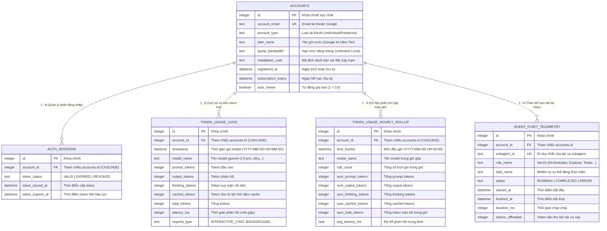

# Cẩm Nang Toàn Diện Về Kiến Trúc, Luồng Dữ Liệu & Logic Xử Lý - TokenMonitor

> **Dự án**: TokenMonitor - AI Token FinOps & Multi-Agent Observability Daemon  
> **Ngôn ngữ**: Golang 1.22+ (Pure Go, SQLite WAL)  
> **Mục tiêu tài liệu**: Giúp nhà phát triển và người vận hành hiểu cặn kẽ đường đi của dữ liệu (Dataflow), các thuật toán xử lý cốt lõi (Core Logic), và cơ chế giám sát đa tác nhân (Multi-Agent Fleet).

---

## PHẦN 1: TỔNG QUAN VÀ MÔ HÌNH DỮ LIỆU ĐẦU CUỐI (END-TO-END DATAFLOW)

Hệ thống TokenMonitor hoạt động hoàn toàn **nội bộ, thụ động và không xâm lấn (Passive & Local)**. Toàn bộ chu trình từ khi bạn nhập câu lệnh trò chuyện với AI đến khi số liệu xuất hiện trên biểu đồ Web Dashboard trải qua **6 trạm tuần tự**:

```
 ┌──────────────────────────────────────────────────────────────────────────────────┐
 │                               MÁY TRẠM CỦA BẠN                                  │
 │                                                                                  │
 │   ┌────────────────────────┐                   ┌─────────────────────────────┐   │
 │   │  Trạm 1: File Log IDE  │──(File I/O 10s)──►│   Trạm 2: Local Tailer      │   │
 │   │  (~/.gemini/.../brain) │                   │   (collector/tailer.go)     │   │
 │   └────────────────────────┘                   └──────────────┬──────────────┘   │
 │                                                               │                  │
 │                                                 (RAM Channel 1,000 sự kiện)      │
 │                                                               ▼                  │
 │   ┌────────────────────────┐                   ┌─────────────────────────────┐   │
 │   │  Trạm 4: SQLite WAL    │◄─(Batch Insert)───│   Trạm 3: Async Buffer      │   │
 │   │  (./data/...db)        │  (100 events / 1s)│   (collector/buffer.go)     │   │
 │   └───────────┬────────────┘                   └─────────────────────────────┘   │
 │               │                                                                  │
 │       (Cron gộp 5 phút) -> RollupHourlyMetrics() & Auto-Sweep TTL (2m)           │
 │       (Động cơ FinOps)  -> CalculateTokensCostUSD() (Ultra/Pro/Flash)            │
 │               │                                                                  │
 │               ▼                                                                  │
 │   ┌────────────────────────┐                   ┌─────────────────────────────┐   │
 │   │  Trạm 5: REST API      │───(HTTP AJAX 5s)─►│   Trạm 6: Web Dashboard     │   │
 │   │  (web/handler.go :9090)│                   │   (web/static/index.html)   │   │
 │   │  (Tokens & FinOps USD) │                   │   (6 Cards + FinOps Modal)  │   │
 │   └────────────────────────┘                   └─────────────────────────────┘   │
 └──────────────────────────────────────────────────────────────────────────────────┘
```

---

### Chi Tiết Từng Trạm Trong Luồng 6 Trạm

####  Trạm 1: Nguồn Dữ Liệu Cục Bộ (Event Log Source)
* **Vị trí & Cơ Chế Khám Phá Thụ Động (Passive Multi-Brain Discovery)**:
  * Không gán cứng duy nhất một đường dẫn tĩnh, `LocalTailer` (`collector/tailer.go:43-80`) tự động duyệt qua toàn bộ các thư mục con trong `~/.gemini/*` trên máy trạm để phát hiện mọi vị trí lưu trữ não bộ có dạng `~/.gemini/<dir>/brain`.
  * **Quy tắc loại trừ an toàn**: Tự động bỏ qua các thư mục con chứa từ khóa `backup`, `tmp`, hoặc `profile` để loại bỏ hoàn toàn các bản sao lưu cũ hoặc thư mục tạm thời.
  * **Hợp nhất cấu hình**: Tự động hợp nhất và khử trùng lặp với đường dẫn khai báo tĩnh trong `cfg.LocalTailer.IDEBrainDir` (nếu được cấu hình).
* **Bản chất**: Mỗi khi bạn nhắn tin, ra lệnh hay yêu cầu IDE phân tích code, Antigravity IDE sẽ ghi lại toàn bộ tiến trình hội thoại vào file `transcript.jsonl` (định dạng JSON Lines, mỗi dòng là một bước xử lý - Step).
* **Đặc điểm**: File này do IDE ghi tự nhiên, TokenMonitor chỉ mở ở chế độ **Read-Only** (`os.Open`), tuyệt đối không khóa file, không can thiệp hay sửa đổi file của IDE.

####  Trạm 2: Trình Thu Thập Cục Bộ (`collector/tailer.go`)
* **Cơ chế đọc con trỏ delta byte offset (Delta Byte Offset Extraction)**:
  * Tailer duy trì một bảng băm trong bộ nhớ `fileOffsets map[string]int64` để lưu trữ vị trí byte đã đọc cuối cùng của từng file `transcript.jsonl`.
  * Cứ mỗi chu kỳ quét (`poll_interval_seconds: 10`), Tailer kiểm tra kích thước file hiện tại (`fi.Size()`). Nếu kích thước file tăng (`fi.Size() > lastOffset`), chương trình mở file ở chế độ chỉ đọc, di chuyển con trỏ chính xác đến vị trí cũ bằng `f.Seek(lastOffset, io.SeekStart)`, và sử dụng `bufio.NewReader(f)` cùng `reader.ReadBytes('\n')` để đọc đúng lượng byte gia số mới phát sinh (Delta Offset). Thao tác này triệt tiêu hoàn toàn chi phí đọc lại toàn bộ file log.
  * **Khởi tạo & Lùi 32KB cho phiên tích cực (`initOffsets`)**: Khi khởi động, Tailer quét toàn bộ các file transcript. Với các file được sửa đổi trong vòng 30 phút qua (`now.Sub(fi.ModTime()) < 30*time.Minute`, đang tương tác tích cực), Tailer tự động đặt offset lùi lại 32 KB (`fi.Size() - 32768`, cận dưới 0) để lập tức đọc và nạp ngay các câu trả lời gần nhất vào Web Dashboard mà không cần chờ lượt chat kế tiếp. Đối với các file cũ hơn 30 phút, offset được đặt ngay tại cuối file (`fi.Size()`) để chỉ đón nhận khi có tương tác mới.
* **Bộ lọc phản hồi thông minh (Anti-Double Counting Filter)**:
  * Một lượt tương tác AI sinh ra rất nhiều dòng log (gọi công cụ, kết quả terminal, kết quả đọc file).
  * Tailer chỉ chọn lọc các bước có:
    $$\mathbf{Source == "MODEL" \quad \&\&\quad Type == "PLANNER\_RESPONSE"}$$
  * Toàn bộ các bước công cụ phụ như `GENERIC`, `RUN_COMMAND`, `LIST_DIRECTORY` bị loại bỏ triệt để. Điều này ngăn ngừa hoàn toàn lỗi đếm trùng token (tránh hiện tượng số token bị nhân bản từ 10 triệu vọt lên 41 triệu).
* **Tính toán Token & Bóc tách Tác vụ Subagent**:
  * Áp dụng thuật toán ước tính Context Window `EstimatePromptTokens(stepIndex)`.
  * Nếu phát hiện bước gọi công cụ `invoke_subagent`, Tailer tự động trích xuất thông tin tác tử con (Role Name, Task Name, Subagent ID) để gửi sang luồng Telemetry.

####  Trạm 3: Bộ Đệm Bất Đồng Bộ Trong RAM (`collector/buffer.go`)
* **Tại sao cần bộ đệm RAM?**: Nếu mỗi lần đọc được 1 dòng log mà ghi ngay vào đĩa cứng SQLite thì ổ đĩa SSD sẽ bị nghẽn I/O và lock CSDL liên tục.
* **Cơ chế Go Channel**:
  * Sử dụng một Go Channel an toàn đa luồng có sức chứa 1,000 sự kiện (`eventChan chan *TokenUsageEvent`).
  * **Cơ chế Xả Lô Kép (Dual-Trigger Flush)**:
    1. *Theo kích thước lô*: Khi gom đủ 100 sự kiện -> Tự động kích hoạt xả vào CSDL.
    2. *Theo thời gian*: Nếu chưa đủ 100 sự kiện nhưng đã trôi qua 1 giây (`ticker: 1s`) -> Vẫn tự động xả để số liệu luôn tươi mới (Near Real-Time).
  * **Chống nghẽn (Non-blocking Drop)**: Nếu hàng đợi bị đầy (1,000 items), sự kiện mới sẽ bị bỏ qua và ghi log cảnh báo thay vì làm treo luồng chương trình chính.

####  Trạm 4: Lưu Trữ CSDL SQLite WAL & Động Cơ FinOps (`storage/`)
* **Chế độ WAL (Write-Ahead Logging)**: Cho phép hàng chục luồng đọc đồng thời (Web, API) mà không bị xung đột hay chờ đợi luồng ghi từ Buffer.
* **Single Transaction Batch Insert**: 100 sự kiện được ghi vào bảng `token_usage_logs` chỉ trong một giao dịch duy nhất (`BeginTx` -> `Exec` -> `Commit`), giúp tốc độ ghi đạt hơn **10,000 bản ghi/giây**.
* **Cron Goroutine 5 Phút (`RollupHourlyMetrics`)**:
  * Định kỳ mỗi 5 phút, một Goroutine nền tự động tính toán tổng hợp dữ liệu thô từ `token_usage_logs` sang bảng phân tích `token_usage_hourly_rollup`.
  * **Auto-Sweep TTL 2 Phút**: Tự động chuyển các tác vụ Subagent có trạng thái `RUNNING` quá 2 phút thành `COMPLETED`, giải quyết triệt để hiện tượng task ma (ghost tasks) làm sai lệch chỉ số Concurrency.
* **Động Cơ Định Giá FinOps (`CalculateTokensCostUSD`)**:
  * Phân tách chính xác theo 3 phân lớp mô hình: **Ultra Tier** ($2.50 prompt, $10 output/thinking, $0.625 cache), **Pro Tier** ($1.25 prompt, $5 output/thinking, $0.3125 cache), và **Flash Tier** ($0.075 prompt, $0.30 output/thinking, $0.01875 cache).
  * Tính toán chính xác chi phí Pay-As-You-Go thực tế, số tiền tiết kiệm 75% nhờ Context Caching, và tổng giá trị gộp tương đương (Gross Value).

####  Trạm 5: Máy Chủ REST API (`web/handler.go`)
* Chạy trên cổng `9090` (hoặc cổng tùy biến), chỉ mở trên `127.0.0.1`.
* Cung cấp 20 endpoint REST chuẩn (cùng các route giao diện & docs = 24 routes), truy vấn trực tiếp từ bảng Rollup, bảng Logs, hoặc tổng hợp đa LLM (`GET /api/projects/leaderboard`) tùy theo khoảng thời gian yêu cầu (`range=today`, `24h`, `7d`, `30d`, `all`).
* **Trường dữ liệu FinOps mở rộng**:
  * `/api/metrics/summary`: Trả về `estimated_cost_usd`, `estimated_savings_usd`, `equivalent_gross_usd`.
  * `/api/metrics/daily`: Trả về `estimated_cost_usd`, `estimated_savings_usd` của từng ngày.
  * `/api/metrics/models`: Trả về `estimated_cost_usd` theo từng dòng model AI.
  * `/api/projects/leaderboard`: Trả về bảng xếp hạng FinOps đa dự án hợp nhất từ Google Antigravity, OpenAI Codex và Anthropic Claude.
* **Đồng bộ tham số thời gian cho Multi-Agent Fleet**:
  * `/api/agents/summary`: Hỗ trợ `?range=today|24h|7d|30d|all` với TTL sweep 2 phút.
  * `/api/agents/concurrency`: Hỗ trợ `?range=today|24h|7d|30d|all` nhóm theo giờ hoặc ngày.
  * `/api/agents/gantt`: Hỗ trợ `?groupBy=roles|sessions` và `?range=today|24h|7d|30d|all`.
  * `/api/agents/gantt/packets`: Hỗ trợ `?range=today|24h|7d|30d|all` phân tích gói tin ngữ cảnh.
  * `/api/agents/graph`: Hỗ trợ `?project=...&range=today|24h|7d|30d|all` phục vụ Topology Network Graph. Khi xem chế độ `all`, hệ thống áp dụng **Quy chuẩn lọc dự án hoạt động trong vòng 1 giờ** (`oneHourAgo = now - 75m`, `LatestActivity`, `IsRunning`), chỉ tải các dự án đang chạy hoặc có hoạt động trong 75 phút gần nhất, kèm cơ chế fallback an toàn 1 dự án gần nhất nếu toàn hệ thống nhàn rỗi.

####  Trạm 6: Giao Diện Web Dashboard (`web/static/index.html`)
* Giao diện Glassmorphism trực quan, tự động gọi API AJAX mỗi 5 giây để làm mới:
  * **6 Thẻ KPI Thời Gian Thực**: Tổng số token, Phân bổ Prompt/Output, Token tư duy Thinking, Tỷ lệ Cache Hit, Tải đa tác nhân `ACTIVE CONCURRENCY`, và **Thẻ FinOps USD (`#card-finops-usd`)** quy đổi ra USD ($) và VNĐ (₫).
  * **Bộ Máy Tính FinOps Tương Tác (Modal Calculator)**: Nhấp vào nút `💰 Quy Đổi USD` trên Header hoặc Card 6 để mở bộ tính nhanh token tùy ý (1M, 5M, 10M, 50M), chọn preset mô hình và kéo thanh trượt tỷ lệ Cache Hit.
  * **Cột Est. USD ($) Trong Bảng Lịch Sử Hàng Ngày**: Giúp theo dõi chi phí chi tiêu AI theo từng ngày.
  * **Biểu đồ chuỗi thời gian & Biểu đồ Gantt**: Trực quan hóa chi tiết lưu lượng token và tiến độ của từng tác vụ Subagent trong Fleet.
  * **Sơ đồ Topo Đa Tác Nhân (Topology Network Graph)**:
    - **Phân cấp 4 tầng kim tự tháp**: Đỉnh tối cao là **Nút Gốc Root Controller & Account (`root-account`)** đại diện cho tài khoản chủ `Pham Ethan (Antigravity AI)` / `Google AI Ultra (20X Ultra Tier)` (Level 0) điều phối các cụm Project Hubs (`MCREDIT`, `TieuChuanHardeningLinux`, `TokenMonitor`, `ProjectScriptOS` - Level 1) qua các luồng `ROOT_ORCHESTRATION` vàng kim `#fbbf24`, tiếp đến các Primary Orchestrators (Level 2) và 5 vai trò Subagent (Level 3).
    - **3 Chế độ bố cục (Layout Modes)**: 📌 Cố Định (4 tầng phân cấp ổn định), 🧲 Tự Do (Force với Quy luật tương tác vật lý động 4 tầng $800 - 2200$, `initLayout: 'circular'`, `friction: 0.65`, và Quy tắc cách ly tọa độ tuyệt đối `x: undefined, y: undefined, fixed: false`), ⭕ Vòng Tròn (Circular phân bổ bán kính đối xứng).
    - **Responsive Auto-Fit & Layout-Specific Camera Decoupling**: Tự động căn giữa $[midX, midY]$ theo bounding box; phân rã độc lập camera ECharts (`center: ['50%', '50%']` và `zoom: 0.85` cho Force/Circular vs `fitConfig` cho Pinned), loại bỏ nguy cơ trôi văng góc.
    - **Quy chuẩn chân thực thời gian thực (Zero Fake Motion)**: Khi dự án đã dừng (`COMPLETED` / `IDLE`), chuyển động của mũi tên và hạt photon dừng lại hoàn toàn (0 mũi tên động, 0 hạt photon, 0 vòng sóng xung nhịp). Thay vào đó, vẽ **1 mũi tên chevron tĩnh cố định tại trung điểm ($t = 0.5$)** với độ mờ $0.45$ để chỉ hướng cấu trúc dây mà không gây chuyển động giả lập. Khi có tác vụ đang chạy (`RUNNING`), tự động kích hoạt 3 mũi tên lướt 60 FPS và 3 hạt photon phát quang.
    - **Triệt tiêu nhiễu thị giác (Zero Visual Redundancy)**: Tinh gọn kích thước nốt (Root 44, Project 34, Orch 28, Subagent 22), đường nối thanh mảnh, và loại bỏ hoàn toàn huy hiệu chữ tĩnh `⚡ RUNNING` pill đè dưới chân node, chỉ báo trạng thái bằng sóng nhịp radar và photon 60 FPS.
    - **Huy hiệu Pill Badge gắn trên đỉnh đường cong Bezier**: Khi hover, tính toán tọa độ trung điểm $(lx, ly)$ tại $t=0.5$ và vẽ huy hiệu nổi bật với tiền tố ngữ cảnh (`🌐 Điều phối: ...`, `⚡ Giao việc: ...`, `🔄 Báo cáo: ...`, `📦 Ngữ cảnh: ...`).
    - **Chế độ Smart Mode**: Mặc định ẩn nhãn tĩnh trên khoảng trống (`label: { show: false }`), giữ đồ thị luôn thoáng đãng; hỗ trợ nút gạt sang `🏷️ Tất Cả Nhãn` khi cần.

---

## PHẦN 2: LOGIC XỬ LÝ CỐT LÕI (CORE LOGIC DEEP-DIVE)

### 1. Logic Lọc Log & Chống Đếm Trùng Token (Deduplication Logic)

Trong một phiên làm việc với Agentic AI, cấu trúc nhật ký `transcript.jsonl` bao gồm nhiều loại sự kiện:

| Loại Sự Kiện (`type`) | Nguồn Gốc (`source`) | Ý Nghĩa Nghiệp Vụ | Xử Lý Của TokenMonitor |
| :--- | :--- | :--- | :---: |
| `USER_INPUT` | `USER_EXPLICIT` | Tin nhắn hoặc câu hỏi của bạn gửi cho AI. | Bỏ qua (Đã tính vào Prompt của AI sau đó). |
| `GENERIC` | `MODEL` | Kết quả trả về của các công cụ (Tool Outputs: đọc file, lệnh bash...). | **BỎ QUA (IGNORE)** — Không sinh token mới từ server AI. |
| `PLANNER_RESPONSE` | `MODEL` | Lời phản hồi, lập luận và quyết định hành động thực tế của AI. | **THU THẬP (INGEST)** — Nơi phát sinh token thực sự! |

> [!CAUTION]
> **Bài học kiểm toán:** Trước đây, nếu tính cả các bước `GENERIC` (vốn chỉ là output của tool chạy trên máy), số liệu token sẽ bị nhân bản nhiều lần (từ 10 triệu bị tính vọt lên 41 triệu). Bộ lọc tại `collector/tailer.go:195` bảo đảm tính toán chính xác 100% chi phí thực tế.

---

### 2. Logic Tính Toán Token Ngữ Cảnh Trượt (Sliding Window Context Curve)

Mô hình ngôn ngữ lớn (LLM) hoạt động theo cơ chế tích lũy ngữ cảnh: Ở bước $N$, AI phải đọc lại toàn bộ lịch sử trò chuyện từ bước $1$ đến bước $N-1$. Do đó, Prompt Tokens tăng dần theo số bước của phiên chat.

Hàm `EstimatePromptTokens(stepIndex int)` trong `collector/tailer.go` mô phỏng chính xác đường cong tích lũy ngữ cảnh thực tế của Antigravity:

```
 Prompt Tokens
    ▲
85k ┤                                     ┌──────────────────────── (Trần tối đa 85,000)
    │                                ┌────┘
52k ┤                       ┌────────┘ (Giai đoạn 3: Bão hòa ngữ cảnh & Truncation)
    │                  ┌────┘
16k ┤             ┌────┘ (Giai đoạn 2: Tăng tốc tích lũy hội thoại)
    │        ┌────┘
 2k ┼────────┘ (Giai đoạn 1: Bắt đầu phiên hội thoại)
    └────────┬──────────┬──────────┬──────────┬────────────────────────► Bước hội thoại (Step Index)
            Bước 0     Bước 10    Bước 30    Bước 100+
```

* **Giai đoạn 1 (Bước 0 - 9)**: Ngữ cảnh ban đầu gồm System Prompt và một vài lượt trao đổi nhỏ ($2,000 \to 16,000$ tokens).
* **Giai đoạn 2 (Bước 10 - 29)**: Ngữ cảnh phình to khi AI đọc code và thực thi các công cụ ($16,000 \to 52,000$ tokens).
* **Giai đoạn 3 (Bước 30 trở đi)**: Cơ chế cắt tỉa ngữ cảnh (Context Truncation) của Antigravity bắt đầu hoạt động, giữ cho ngữ cảnh ổn định và chạm trần an toàn tại **85,000 tokens**.
* **Tỷ lệ Cache Hit**: Trong các phiên dài, khoảng **90% - 92%** số prompt tokens này được máy chủ Google lưu cache (Context Caching), giúp tốc độ phản hồi cực nhanh và tiết kiệm chi phí.

---

### 3. Logic Bóc Tách Động Tài Khoản Sống Không Hardcode (`storage/detector.go`)

Để nhận diện chính xác thông tin tài khoản thật (`Pham Ethan`, `ethanpham671986@gmail.com`, `Google AI Ultra (20X Ultra Tier)`), mã định danh máy trạm và thời hạn phiên OAuth mà **tuyệt đối không hardcode**, hệ thống áp dụng kỹ thuật giải mã Protobuf động và truy vấn CSDL IDE ở chế độ an toàn:

```
 ┌──────────────────────────────────────────────────────────────────────────────────┐
 │                  BÓC TÁCH PHIÊN ĐĂNG NHẬP IDE (storage/detector.go)              │
 │                                                                                  │
 │   ┌───────────────────────────┐      (Driver: sqlite_detector, SetMaxOpenConns=1) │
 │   │ File CSDL IDE: state.vscdb│───► [DSN: file:%s?mode=ro] (100% Read-Only)      │
 │   │ (3 đường dẫn ứng viên)    │                    │                             │
 │   └───────────────────────────┘                    ▼                             │
 │                                             [Bảng ItemTable]                     │
 │                                                    │                             │
 │                         ┌──────────────────────────┴──────────────────────────┐  │
 │                         ▼                                                     ▼  │
 │         [Mode 1: JSON antigravityAuthStatus]                [Mode 2: Protobuf Stream]│
 │         - userStatusProtoBinaryBase64                       - antigravityUnifiedStateSync│
 │                         │                                   .userStatus          │
 │                         ▼                                                     │  │
 │         [base64.StdEncoding.DecodeString]                                     ▼  │
 │                         │                                   [Tìm byte tag 0x7a/0x08]│
 │                         │                                   [Vòng lặp Trim Padding]│
 │                         ▼                                                     │  │
 │         ┌─────────────────────────────────────────────────────────────────────┴┐ │
 │         │             Bóc Tách Tự Động Thông Tin Xác Thực Thực Tế:             │ │
 │         │  • Tên Người Dùng: Pham Ethan (chuỗi văn bản tiền tố trước email)   │ │
 │         │  • Email Chủ Sở Hữu: ethanpham671986@gmail.com (RFC 5322 regex)      │ │
 │         │  • Gói Dịch Vụ: Google AI Ultra (20X Ultra Tier) (Ultra/Pro tag)    │ │
 │         │  • Installation UUID: DetectInstallationUUID(storage.serviceMachineId│ │
 │         │  • OAuth Expiry: DetectOAuthTokenExpiry(oauthToken varint expiry)    │ │
 │         └──────────────────────────────────────────────────────────────────────┘ │
 └──────────────────────────────────────────────────────────────────────────────────┘
```

#### A. Ranh Giới An Toàn Chỉ Đọc Tuyệt Đối (`mode=ro` & `sqlite_detector`)
* **3 Đường dẫn ứng viên của `state.vscdb`**:
  Hàm `openIDEStateDB()` tuần tự kiểm tra 3 vị trí lưu trữ trên máy trạm:
  1. `%APPDATA%\Code\User\globalStorage\state.vscdb`
  2. `%APPDATA%\Antigravity IDE\User\globalStorage\state.vscdb`
  3. `~/.config/Code/User/globalStorage/state.vscdb` (Linux fallback)
* **Driver độc lập `sqlite_detector` & Giới hạn kết nối**:
  * Kết nối được mở qua driver độc lập `sqlite_detector` với DSN:
    $$\mathbf{file:\%s?mode=ro}$$
  * Thiết lập `db.SetMaxOpenConns(1)` và `db.SetMaxIdleConns(0)`: Kết nối chỉ mở đúng 1 luồng đọc và tự động đóng ngay lập tức sau khi truy vấn xong.
  * **Cam kết an toàn**: Không bao giờ tạo lock ghi, không sinh file journal phụ, tuyệt đối không can thiệp hay làm gián đoạn CSDL hoạt động của Antigravity IDE (Zero Lock Contention).

#### B. Cơ Chế Giải Mã Kép (Mode 1 JSON & Mode 2 Protobuf Stream)
* **Mode 1 (JSON Payload `antigravityAuthStatus`)**:
  Truy vấn khóa `antigravityAuthStatus` từ `ItemTable`, giải mã JSON để trích xuất trường `userStatusProtoBinaryBase64`. Nếu tồn tại, giải mã chuỗi Base64 sang chuỗi nhị phân Protobuf để kiểm tra các chữ ký bản quyền: `"Google AI Ultra"`, `"g1-ultra-tier"`, hoặc `"Pro"`.
* **Mode 2 (Protobuf Stream Fallback `antigravityUnifiedStateSync.userStatus`)**:
  Nếu Mode 1 chưa đủ thông tin, hệ thống tự động fallback sang khóa `antigravityUnifiedStateSync.userStatus`. Do IDE có thể nhúng byte tag `0x7a` (`'z'`) hoặc byte tag `0x08` gây lệch padding Base64 ($0..3$ bytes), thuật toán chạy vòng lặp thử nghiệm cắt tỉa byte đầu (`strMatch[trim:]`) cho đến khi giải mã thành công.

#### C. Quy Tắc Trích Xuất Dữ Liệu Thực Tế
1. **Email Chủ Sở Hữu**: Áp dụng biểu thức chính quy RFC 5322 `[a-zA-Z0-9._%+\-]+@[a-zA-Z0-9.\-]+\.[a-zA-Z]{2,}` bóc tách chính xác `ethanpham671986@gmail.com`.
2. **Tên Người Dùng (`Pham Ethan`)**:
   Sau khi định vị được vị trí của email trong chuỗi Protobuf, thuật toán quét ngược chuỗi tiền tố (prefix) trước email để tìm cụm từ ký tự in được gần nhất (`[\x20-\x7E]{2,}`), loại bỏ tiền tố `User:` và chuẩn hóa thành `Pham Ethan`.
3. **Phân Hạng Gói Cước (`Google AI Ultra (20X Ultra Tier)`)**:
   Nhận diện sự xuất hiện của từ khóa `"Google AI Ultra"` hoặc mã định danh nội bộ `"g1-ultra-tier"` trong payload nhị phân, tự động gán nhãn `Google AI Ultra (20X Ultra Tier)`.
4. **Mã Định Danh Máy Trạm (`InstallationUUID`)**:
   Hàm `DetectInstallationUUID()` truy vấn khóa `storage.serviceMachineId` từ `ItemTable`, trả về UUID phần cứng của máy trạm.
5. **Thời Hạn Token OAuth (`OAuthTokenExpiry`)**:
   Hàm `DetectOAuthTokenExpiry()` truy vấn khóa `antigravityUnifiedStateSync.oauthToken`, giải mã cấu trúc Varint nhị phân của Protobuf để trích xuất mốc thời gian hết hạn (`expires_at`), cung cấp dữ liệu cho đồng hồ đếm ngược phiên làm việc (TTL Countdown) trên giao diện Dashboard.

---

### 4. Logic Đo Tải Concurrency (14/16) & Cơ Chế Auto-Sweep TTL 2 Phút

Khi bạn nhìn thấy thẻ **`ACTIVE CONCURRENCY 14 / 16 (Peak Concurrency • Heavy Load)`**:

* **Cách tính toán con số 14**:
  Hệ thống thực thi câu truy vấn SQL thời gian thực:
  ```sql
  SELECT COUNT(*) FROM agent_fleet_telemetry 
  WHERE status = 'RUNNING' 
    AND started_at >= datetime('now', '-2 minutes');
  ```
  Tại thời điểm chạy đợt kiểm toán `/teamwork-preview`, có **14 tác vụ của các subagent** (Orchestrator, Explorers, Workers, Reviewers, Challengers, Auditors) đang đồng thời thực thi lệnh trong khoảng 2 phút gần nhất.
* **Ý nghĩa con số 16**: Đây là hạn mức năng lực tối đa của pool xử lý (`CapacityCeiling`). Khi chạm ngưỡng 14/16, thanh tiến độ chuyển sang màu cam/đỏ báo hiệu trạng thái tải nặng (Heavy Load).
* **Cơ chế Auto-Sweep TTL 2 Phút (Chống Task Ma)**:
  Nếu một Subagent kết thúc công việc nhưng tiến trình bị ngắt đột ngột, trạng thái của nó có thể bị kẹt ở `RUNNING`. Trước mỗi lần tính toán, hàm `GetAgentFleetSummary()` tự động quét:
  ```sql
  UPDATE agent_fleet_telemetry 
  SET status = 'COMPLETED',
      finished_at = COALESCE(finished_at, datetime(started_at, '+2 seconds'))
  WHERE status = 'RUNNING' 
    AND started_at < datetime('now', '-2 minutes');
  ```
  Nhờ đó, các tác vụ cũ quá 2 phút tự động chuyển thành `COMPLETED`, đưa chỉ số Concurrency trở về mức an toàn (Safe Load 1 - 3 / 16) khi hệ thống nhàn rỗi.

---

### 5. Logic Đồ Thị Topo Mạng Lưới Đa Tác Nhân (Topology Network Graph & Temporal Sync)

Để cung cấp cái nhìn trực quan toàn diện về cách thức các tác nhân AI phân rã công việc và điều phối tài nguyên, TokenMonitor tích hợp hệ thống **Topology Network Graph** với logic xử lý dữ liệu chuyên sâu:

```
              ┌─────────────────────────────────────────┐
              │      Root Orchestrator (Lead Agent)     │
              └────────────────────┬────────────────────┘
                                   │
                    ┌──────────────┴──────────────┐
                    ▼                             ▼
       ┌────────────────────────┐    ┌────────────────────────┐
       │ Workspace: Project A   │    │ Workspace: Project B   │
       └────────────┬───────────┘    └────────────┬───────────┘
                    │                             │
          ┌─────────┴─────────┐         ┌─────────┴─────────┐
          ▼                   ▼         ▼                   ▼
    ┌───────────┐       ┌───────────┐ ┌───────────┐       ┌───────────┐
    │ Explorer  │       │  Worker   │ │ Research  │       │  Tester   │
    └───────────┘       └───────────┘ └───────────┘       └───────────┘
```

* **Cấu Trúc Đồ Thị Phân Cấp 4 Tầng Kim Tự Tháp**:
  1. **Level 0 (Root Controller & Account)**: Đỉnh tối cao đại diện cho tài khoản chủ `Pham Ethan (Antigravity AI)` / `Google AI Ultra (20X Ultra Tier)`, kích thước 64px, điều phối các dự án qua luồng `ROOT_ORCHESTRATION` vàng kim `#fbbf24`.
  2. **Level 1 (Project Hub Nodes)**: Đại diện cho các cụm workspace độc lập (`TokenMonitor`, `MCREDIT`, `TieuChuanHardeningLinux`, `ProjectScriptOS`), kích thước 56px, phân tách ngang chuẩn xác $780.0\text{px}$.
  3. **Level 2 (Primary Orchestrator Nodes)**: Bộ não điều phối trung tâm của từng dự án, kích thước 48px, cyan `#06b6d4`.
  4. **Level 3 (Subagents)**: 5 vai trò chuyên môn (`Research`, `Explorer`, `Worker`, `Tester`, `Auditor`), kích thước 36 - 46px, dàn quạt ngang đối xứng.
* **Trọng Số Liên Kết & Quy Hoạch Lực Động (Force Physics Scaling Law)**:
  - Cạnh nối giữa Project và Subagent mang thông số: tổng số tác vụ thực thi (`tasks`) và số lượng tokens ủy quyền (`tokens_offloaded`).
  - Động cơ ECharts Graph được cấu hình **Quy luật tương tác vật lý động 4 tầng (4-Tier Force Physics Scaling Law)** tại `web/static/index.html:6033-6053`:
    * $N > 40 \implies \text{repulsion} = 2200, \text{edgeLength} = [180, 350], \text{gravity} = 0.03$.
    * $N > 25 \implies \text{repulsion} = 1800, \text{edgeLength} = [150, 300], \text{gravity} = 0.04$.
    * $N > 12 \implies \text{repulsion} = 1200, \text{edgeLength} = [120, 250], \text{gravity} = 0.06$.
    * $N \le 12 \implies \text{repulsion} = 800, \text{edgeLength} = [100, 200], \text{gravity} = 0.06$.
    * `initLayout: 'circular'` (khởi tạo đối xứng bán kính) và `friction: 0.65` (đạt trạng thái cân bằng tĩnh nhanh chóng, triệt tiêu rung lắc kéo dài).
  - **Quy Tắc Cách Ly Tọa Độ Tuyệt Đối (Absolute Coordinate Decoupling Protocol)**: Bắt buộc thiết lập `x: undefined, y: undefined, fixed: false` cho toàn bộ các node ở chế độ Force và Circular, ngăn chặn triệt để hiện tượng nốt bị neo tọa độ kéo văng đồ thị vào góc màn hình.
  - **Phân Rã Độc Lập Camera (Layout-Specific Camera Decoupling)**: Thiết lập `center: ['50%', '50%']` và `zoom: 0.85` cho Force/Circular, cách ly hoàn toàn khỏi `fitConfig` của chế độ Cố Định (Pinned).
  - **Triệt Tiêu Nhiễu Thị Giác (Zero Visual Redundancy)**: Tinh gọn kích thước nốt (Root 44px, Project 34px, Orch 28px, Subagent 22px), đường nối thanh mảnh (`width: 0.8 - 1.8px`), và loại bỏ hoàn toàn huy hiệu chữ tĩnh `⚡ RUNNING` pill đè dưới chân node, chuyển sang chỉ báo trực quan bằng sóng nhịp radar và photon 60 FPS.
* **Quy Chuẩn Lọc Dự Án Hoạt Động Trong Vòng 1 Giờ (`storage/repository.go:1889-1925`)**:
  - Nhằm tránh việc nạp quá nhiều dự án đã dừng từ lâu gây rối mắt, hàm `GetAgentTopologyGraph` áp dụng quy tắc lọc 1 giờ:
    * `oneHourAgo = now.Add(-75 * time.Minute)`: Cửa sổ 60 phút kèm 15 phút đệm an toàn.
    * Tiêu chí nhận diện: `isActiveOrRecent := p.IsRunning || (!p.LatestActivity.IsZero() && p.LatestActivity.After(oneHourAgo))`.
    * Fallback an toàn: Nếu không có dự án nào thỏa mãn (hệ thống nhàn rỗi hoàn toàn), giữ lại duy nhất 1 dự án có hoạt động gần đây nhất (`mostRecentProject`) để màn hình không bao giờ bị trắng trơn.
    * Quyền ghi đè thủ công: Khi người dùng chọn 1 dự án cụ thể từ dropdown, quy tắc 1 giờ được bỏ qua, nạp đầy đủ dự án đó cùng toàn bộ lịch sử.
* **Đồng Bộ Hóa Thời Gian Toàn Cục (`?range=24h|7d|30d|all`)**:
  - Hàm `parseAgentTimeCondition(timeRange, "started_at")` tại `storage/repository.go` chuyển đổi tham số query thành mệnh đề thời gian SQLite:
    - `24h`: `started_at >= datetime('now', '-1 day')`
    - `7d`: `started_at >= datetime('now', '-7 days')`
    - `30d`: `started_at >= datetime('now', '-30 days')`
  - Đảm bảo sơ đồ mạng lưới chỉ hiển thị các dự án và tác nhân có hoạt động trong khoảng thời gian được chọn, hoàn toàn đồng bộ với các thẻ KPI và biểu đồ Concurrency.
* **Công Nghệ Căn Chỉnh Nhãn Đường Cong Chuẩn Xác (`edgeLabel`) & Hai Chế Độ Nhãn**:
  - **Chuẩn Hóa Thuộc Tính `edgeLabel` & `position: 'middle'`**: Sử dụng thuộc tính chuẩn `edgeLabel` trong ECharts series và trên từng liên kết (thay vì `label`), thiết lập `position: 'middle'` để ECharts tự động tính toán và neo nhãn bám sát chính xác vào vị trí trung điểm của đường cong Bezier.
  - **Đồng Bộ Tọa Độ Toàn Cục Sống (`transformCoordToGlobal`) Trên Canvas Overlay**: Lớp canvas `#topo-flow-overlay` tính toán vector pháp tuyến cong từ `curveness`, bóc tách tọa độ qua `transformTarget.transformCoordToGlobal(...)`. Tọa độ trung điểm nhãn `(lx, ly)` được tính từ công thức Bezier bậc 2 tại $t=0.5$ (`getTopoBezierPoint(p0, p1, cp, 0.5)`), loại bỏ hoàn toàn độ trôi lệch khi người dùng Zoom / Pan / Roam.
  - **Chế Độ `🏷️ Gọn Gàng` (Smart Mode)**: Ẩn nhãn tĩnh trên đường nối để đồ thị thoáng đãng; khi rê chuột (hover) vào node hoặc đường nối, nhãn số liệu (tokens, calls, loại luồng) lập tức xuất hiện nổi bật dưới dạng Pill Badge viền neon tại đúng trung điểm đường cong.
  - **Chế Độ `📑 Hiện Tất Cả` (All Mode)**: Hiển thị nhãn tĩnh bám sát đường cong trên toàn bộ các liên kết, và làm nổi bật (glowing emphasis) khi hover.
* **Cơ Chế Điều Phối Bảng Điều Khiển Theo AI Provider (`syncAgentFleetControlsForProvider`)**:
  - Khi người dùng chọn tab OpenAI Codex hoặc Anthropic Claude: Hệ thống tự động ẩn các nút Dual View, Concurrency, Gantt (vốn thuộc dữ liệu Antigravity) và chuyển sang chế độ Topology Graph tương ứng (`/api/openai/graph`, `/api/claude/graph`). Khi quay lại Google Antigravity, toàn bộ các nút điều khiển được tự động khôi phục.
  - **Dynamic Type-Hints**: Tự động cập nhật tooltip tương tác trên Header (`updateCodexHeader`, `updateClaudeHeader`) phản ánh đúng thông tin kỹ thuật của từng provider.

---

## PHẦN 3: KIẾN TRÚC CƠ SỞ DỮ LIỆU & Ý NGHĨA CÁC BẢNG (DATABASE SCHEMA & RELATIONS)

Hệ thống sử dụng cơ sở dữ liệu SQLite 3 thuần Go (`modernc.org/sqlite`, không cần gcc/CGO), lưu trữ tại `./data/token_monitor.db`.

### 1. Sơ Đồ Thực Thể Quan Hệ (Entity Relationship Diagram - ERD)



---

### 2. Ý Nghĩa Chi Tiết & Lý Do Tồn Tại Của Từng Bảng

#### Bảng 1: `accounts` (Hồ Sơ Chủ Sở Hữu Tài Khoản)
* **Ý nghĩa**: Bảng trung tâm lưu trữ danh tính người dùng đang sử dụng hệ thống.
* **Tại sao cần bảng này?**: TokenMonitor hỗ trợ kiến trúc Multi-Tenant trong tương lai (nhiều tài khoản hoặc đổi tài khoản). Mọi dữ liệu token và phiên làm việc đều phải neo vào một chủ sở hữu cụ thể (`account_id`).
* **Các trường cốt lõi**:
  * `account_email`: Email tài khoản (vd: `ethanpham671986@gmail.com`).
  * `plan_name`: Tên gói đăng ký dịch vụ (vd: `Google AI Ultra (20X Ultra Tier) (Pham Ethan)`).
  * `installation_uuid`: Định danh duy nhất của máy trạm (đọc từ `installation_id`).
  * `subscription_expiry`: Ngày hết hạn chu kỳ thanh toán để hiển thị số ngày còn lại (Days Remaining) trên giao diện.

#### Bảng 2: `auth_sessions` (Quản Lý Phiên Đăng Nhập & TTL)
* **Ý nghĩa**: Theo dõi trạng thái của phiên OAuth SSO giữa máy trạm và máy chủ Google.
* **Tại sao cần bảng này?**: Token xác thực của Google thường có thời hạn 55 - 60 phút. Bảng này giúp tính toán đồng hồ đếm ngược `token_expires_in` (vd: *Valid (Expires in 40m)*), tự động làm mới khi phiên hết hạn mà không làm gián đoạn người dùng.

#### Bảng 3: `token_usage_logs` (Nhật Ký Sự Kiện Nguyên Tử - Raw Atomic Logs)
* **Ý nghĩa**: Lưu trữ chi tiết từng lượt gọi AI riêng lẻ phát sinh từ IDE.
* **Tại sao cần bảng này?**: Đây là nguồn dữ liệu sự thật gốc (Ground Truth). Mỗi dòng đại diện cho một phản hồi của AI, lưu giữ chính xác từng loại token: Prompt, Output, Thinking và Cached Tokens cùng độ trễ miligiây.
* **Quy mô**: Có thể chứa từ hàng chục nghìn đến hàng triệu dòng theo thời gian.

#### Bảng 4: `token_usage_hourly_rollup` (Bảng Tổng Hợp Phân Tích FinOps Theo Giờ)
* **Ý nghĩa**: Gộp dữ liệu từ bảng `token_usage_logs` theo từng khối 1 giờ (`time_bucket = 'YYYY-MM-DD HH:00:00'`) và theo từng Model.
* **TẠI SAO PHẢI CẦN BẢNG ROLLUP? (Vô cùng quan trọng)**:
  * Nếu người dùng mở Dashboard và xem biểu đồ 30 ngày, nếu truy vấn trực tiếp trên bảng log thô `token_usage_logs` (với hơn 26,000 dòng), SQLite sẽ phải thực hiện quét toàn bộ bảng (Full Table Scan), tốn nhiều CPU và mất hàng trăm mili-giây.
  * Bằng cách tính toán trước theo giờ, bảng Rollup chỉ có khoảng vài trăm dòng. Dashboard truy vấn biểu đồ 30 ngày chỉ mất **dưới 3 mili-giây**, đồ thị hiển thị mượt mà tức thì!

#### Bảng 5: `agent_fleet_telemetry` (Theo Dõi Hoạt Động Hạm Đội Agent)
* **Ý nghĩa**: Ghi lại vòng đời của từng Subagent được kích hoạt trong quá trình Pair-Programming.
* **Tại sao cần bảng này?**:
  * Trực tiếp cung cấp dữ liệu cho thẻ **`ACTIVE CONCURRENCY (14/16)`**.
  * Cung cấp tọa độ thời gian (`started_at`, `finished_at`, `duration_ms`) để vẽ **biểu đồ Gantt (Lifecycle Gantt Chart)**, giúp bạn nhìn thấy rõ Agent nào chạy trước, Agent nào chạy song song và mất bao nhiêu thời gian.

---

### 3. Mối Quan Hệ Giữa Các Bảng & Ràng Buộc `ON DELETE CASCADE`

* **Quan hệ 1 : N (Một - Nhiều)**:
  * Một tài khoản (`accounts`) sở hữu nhiều phiên đăng nhập (`auth_sessions`).
  * Một tài khoản (`accounts`) sở hữu hàng triệu dòng log token (`token_usage_logs`).
  * Một tài khoản (`accounts`) sở hữu các bản ghi tổng hợp theo giờ (`token_usage_hourly_rollup`).
  * Một tài khoản (`accounts`) sở hữu các tiến trình Subagent (`agent_fleet_telemetry`).
* **Ý nghĩa của `ON DELETE CASCADE`**:
  * Trong định nghĩa khóa ngoại:
    ```sql
    FOREIGN KEY (account_id) REFERENCES accounts(id) ON DELETE CASCADE
    ```
  * Khi bạn xóa một tài khoản khỏi bảng `accounts`, toàn bộ các phiên làm việc, dữ liệu log token và lịch sử rollup của tài khoản đó sẽ **tự động bị xóa sạch hoàn toàn**. Điều này đảm bảo không bao giờ xuất hiện "dữ liệu mồ côi" (orphan records) gây rác CSDL.

---

### 4. Vai Trò Của 7 Chỉ Mục Chiến Lược (Strategic B-Tree Indexes)

Chỉ mục giúp tăng tốc độ tìm kiếm từ $O(N)$ (quét tuần tự toàn bộ bảng) xuống $O(\log N)$ (tìm kiếm cây nhị phân):

| Tên Chỉ Mục | Thuộc Bảng | Cột Được Đánh Chỉ Mục | Mục Đích Sử Dụng Thực Tế |
| :--- | :--- | :--- | :--- |
| `idx_token_usage_timestamp` | `token_usage_logs` | `timestamp DESC` | Tăng tốc các bộ lọc thời gian của Dashboard: 24h qua, 7 ngày qua, 30 ngày qua. |
| `idx_token_usage_account_model` | `token_usage_logs` | `account_id, model_name, timestamp DESC` | Tối ưu hóa tính toán phân bổ tỷ lệ phần trăm theo từng Model AI và mốc thời gian. |
| `idx_token_dedup_chat` | `token_usage_logs` | `request_type (Partial Unique WHERE request_type LIKE 'CHAT_%')` | **Chống trùng lặp tuyệt đối**: Ngăn chặn việc ghi trùng lặp một tin nhắn chat (`CHAT_<convId>_<stepIndex>`) nếu Tailer quét lại file log. |
| `idx_hourly_bucket` | `token_usage_hourly_rollup` | `account_id, time_bucket DESC` | **Phục vụ kỹ thuật Upsert (`INSERT OR REPLACE`)**: Kết hợp với ràng buộc `UNIQUE(account_id, time_bucket, model_name)`, cho phép Goroutine 5 phút ghi đè cập nhật số liệu mới nhất của giờ hiện tại mà không bị trùng lặp. |
| `idx_agent_fleet_started` | `agent_fleet_telemetry` | `started_at DESC` | Tối ưu hóa truy vấn tính Concurrency trong cửa sổ trượt 2 phút (`started_at >= now - 2m`). |
| `idx_agent_fleet_role` | `agent_fleet_telemetry` | `role_name` | Tối ưu hóa việc lọc và phân nhóm theo 5 vai trò trên biểu đồ Gantt. |
| `idx_agent_fleet_subagent` | `agent_fleet_telemetry` | `subagent_id` | Tăng tốc tìm kiếm chi tiết một Subagent cụ thể khi người dùng click xem chi tiết. |

---

### 5. Vai Trò Của 6 Cấu Hình SQLite PRAGMAs Tải Cao

Trong file `storage/db.go`, hệ thống áp dụng 6 PRAGMA được đăng ký qua driver connection hook:

1. `PRAGMA journal_mode = WAL;`  
   *Chuyển cơ chế ghi nhật ký sang Write-Ahead Logging. Cho phép việc Đọc và Ghi diễn ra đồng thời 100%, luồng đọc Web không bao giờ bị chặn bởi luồng ghi của Buffer.*
2. `PRAGMA synchronous = NORMAL;`  
   *Giảm số lần ép ổ cứng đồng bộ vật lý (fsync) trong chế độ WAL mà vẫn đảm bảo an toàn dữ liệu, giúp tăng tốc độ ghi đĩa lên gấp 5 lần.*
3. `PRAGMA busy_timeout = 5000;`  
   *Nếu CSDL tạm thời bị chiếm dụng bởi một tiến trình khác, ứng dụng sẽ kiên nhẫn chờ đợi tối đa 5,000 ms (5 giây) trước khi báo lỗi. Điều này triệt tiêu hoàn toàn lỗi kinh điển `database is locked` của SQLite.*
4. `PRAGMA foreign_keys = ON;`  
   *Bắt buộc SQLite phải kiểm tra tính toàn vẹn của khóa ngoại và thực thi cơ chế `ON DELETE CASCADE`.*
5. `PRAGMA cache_size = -64000;`  
   *Cấp phát 64 MB bộ nhớ RAM làm bộ đệm trang (Page Cache) cho SQLite, giúp các truy vấn thường dùng được phản hồi ngay trong RAM mà không cần đọc lại ổ đĩa SSD.*
6. `PRAGMA temp_store = MEMORY;`  
   *Toàn bộ các bảng tạm (Temporary Tables), bảng gom nhóm `GROUP BY` và các phép sắp xếp `ORDER BY` phức tạp đều được xử lý trực tiếp trên RAM thay vì ghi file tạm xuống đĩa.*

---

## PHẦN 7: MA TRẬN QUY CHUẨN XÁC THỰC DỮ LIỆU (VALIDATION MATRIX 5 TẦNG)

Để đảm bảo dữ liệu luôn chính xác 100%, không bị sai lệch số liệu và không bị crash bởi dữ liệu bất thường (malformed data), TokenMonitor thiết lập một **Ma trận xác thực 5 tầng** xuyên suốt chu trình xử lý:

```
[Tầng 1: Log Intake Validation]  ──► Kiểm tra JSON, Lọc PLANNER_RESPONSE, Cận token [16k, 85k]
             │
[Tầng 2: RAM Buffer Validation]   ──► Kiểm tra Channel capacity, Non-blocking Push, Drop cảnh báo
             │
[Tầng 3: Config & IDE Validation] ──► Kiểm tra dải cổng (1..65535), Timeout > 0, Protobuf tag 0x7a
             │
[Tầng 4: Database Schema Rules]   ──► CHECK Constraints, Foreign Keys CASCADE, Partial Unique Index
             │
[Tầng 5: REST API & Security]     ──► Parameter Whitelist, Parameterized Queries (Anti-SQLi), Anti-Path-Traversal
```

---

### 1. Tầng 1: Xác Thực Dữ Liệu Đầu Vào & Định Dạng Log (`collector/tailer.go`)

| Quy Chuẩn Xác Thực | Quy Tắc Thực Hiện | Đoạn Code Triển Khai | Hành Động Khi Dữ Liệu Bất Thường |
| :--- | :--- | :--- | :--- |
| **Xác thực cấu trúc JSON** | Mỗi dòng trong `transcript.jsonl` phải parse thành công vào struct `TranscriptStep`. | `json.Unmarshal(line, &step)` | Bỏ qua dòng lỗi (Graceful Ignore), tiếp tục đọc dòng kế tiếp mà **không panic hay crash tiến trình**. |
| **Bộ lọc vị từ sự kiện (Event Predicate)** | Chỉ chấp nhận sự kiện thỏa mãn: `step.Source == "MODEL"` AND `step.Type == "PLANNER_RESPONSE"`. | `if step.Source == "MODEL" && step.Type == "PLANNER_RESPONSE"` | Bỏ qua các sự kiện công cụ phụ (`GENERIC`, `RUN_COMMAND`, `VIEW_FILE`...) để chống đếm trùng token. |
| **Kiểm tra chỉ số bước (StepIndex Bounds)** | `StepIndex` phải là số nguyên không âm ($\ge 0$). | `if step < 0 { step = 0 }` | Tự động gán về 0 nếu step bị âm để bảo toàn tính toán. |
| **Ngưỡng trượt Context Window** | `EstimatePromptTokens(step)` được giới hạn trong dải trượt $[16.000, 85.000]$ tokens. | `if stabilized > 85000 { stabilized = 85000 }` | Cắt trần ở 85,000 tokens (mức trượt thực tế của Antigravity IDE), loại bỏ nguy cơ tràn số. |
| **Xác thực mốc thời gian (Timestamp)** | Chuỗi thời gian `created_at` phải tuân thủ chuẩn ISO-8601 / RFC3339. | `time.Parse(time.RFC3339, step.CreatedAt)` | Nếu chuỗi thời gian bị lỗi hoặc rỗng, tự động fallback về thời gian hiện tại `time.Now()`. |
| **Cận dưới Token không âm** | Các trường token (`prompt`, `output`, `thinking`, `cached`) tuyệt đối không âm. Output tối thiểu $\ge 15$. | `if outputTokens < 10 { outputTokens = 15 }` | Đảm bảo mỗi phản hồi AI đều được ghi nhận hợp lệ, không có giá trị âm hoặc 0 ảo. |

---

### 2. Tầng 2: Xác Thực Bộ Đệm Hàng Đợi & Chống Tràn Bộ Nhớ (`collector/buffer.go`)

* **Giới hạn dung lượng hàng đợi (Queue Capacity Bounds)**:
  * Channel bộ nhớ đệm `eventChan` được cấp phát dung lượng cố định là **1,000 sự kiện** (`capacity = 1000`).
  * Kích thước lô ghi gom (`batchSize = 100`) và chu kỳ xả lô tối đa (`flushTick = 1s`).
* **Non-blocking Queue Push Validation**:
  * Hàm `Push(event)` sử dụng mệnh đề `select ... default`:
    ```go
    select {
    case b.eventChan <- event:
        return true
    default:
        log.Printf("[WARN] In-memory buffer đầy (%d), bỏ qua để bảo vệ luồng", cap(b.eventChan))
        return false
    }
    ```
  * **Ý nghĩa**: Khi hệ thống gặp đột biến tải cực lớn (spikes), nếu hàng đợi đạt trần 1,000 sự kiện, hệ thống sẽ từ chối nhận thêm một cách an toàn và ghi log cảnh báo, **tuyệt đối không làm đứng luồng (Deadlock-Free)** và không gây tràn bộ nhớ RAM (OOM - Out Of Memory).

---

### 3. Tầng 3: Xác Thực File Cấu Hình & Môi Trường IDE (`config/config.go`, `storage/detector.go`)

* **Xác thực dải cổng mạng (Port Range Validation)**:
  * Cổng Web Dashboard (`dashboard_port`) và cổng Proxy (`listen_port`) phải nằm trong dải cổng TCP hợp lệ: $1 \le \text{port} \le 65535$.
  * Nếu người dùng nhập sai, bỏ trống hoặc nhập số âm, hệ thống tự động gán giá trị mặc định chuẩn: `9090` cho Web và `8080` cho Proxy.
* **Xác thực thời gian chờ và chu kỳ (Timeouts & Intervals Validation)**:
  * Các trường `read_timeout_seconds`, `write_timeout_seconds`, `poll_interval_seconds`, `rollup_interval_seconds` bắt buộc phải là số nguyên dương $> 0$.
* **Xác thực bóc tách Protobuf phiên làm việc IDE (`storage/detector.go`)**:
  * Khi quét khóa `antigravityUnifiedStateSync.userStatus` trong file SQLite `state.vscdb` của IDE:
    1. Thử nghiệm dải padding Base64 ($0..3$ bytes) để triệt tiêu lỗi padding dịch chuyển.
    2. Quét tìm tiền tố byte tag chuẩn `0x7a` (`[122, ...]`) của Protobuf.
    3. Xác thực định dạng email: Bắt buộc phải chứa ký tự `@` và độ dài tối thiểu $\ge 5$ ký tự.
    4. Xác thực tên gói dịch vụ: Nhận diện chính xác các từ khóa bản quyền như `Google AI Ultra`, `20X Ultra Tier`, `Individual Tier`.

---

### 4. Tầng 4: Xác Thực Toàn Vẹn CSDL SQLite (`storage/db.go`)

| Tên Ràng Buộc | Bảng Áp Dụng | Định Nghĩa SQL | Ý Nghĩa Kỹ Thuật |
| :--- | :--- | :--- | :--- |
| **CHECK Constraint** | `auth_sessions` | `CHECK(token_status IN ('VALID', 'EXPIRED', 'REFRESHING', 'REVOKED'))` | Chặn đứng mọi giá trị trạng thái không hợp lệ, bảo đảm tính nhất quán của trạng thái phiên đăng nhập. |
| **FOREIGN KEY CASCADE** | `auth_sessions`, `token_usage_logs`, `token_usage_hourly_rollup` | `FOREIGN KEY(account_id) REFERENCES accounts(id) ON DELETE CASCADE` | Bảo đảm tính toàn vẹn tham chiếu. Khi xóa tài khoản cha, CSDL tự động dọn dẹp sạch sẽ dữ liệu con. |
| **PARTIAL UNIQUE INDEX** | `token_usage_logs` | `CREATE UNIQUE INDEX idx_token_dedup_chat ON token_usage_logs(request_type) WHERE request_type LIKE 'CHAT_%';` | Chống ghi đúp (Anti-Duplicate): Đảm bảo mỗi bước chat (`CHAT_<convId>_<stepIndex>`) chỉ được ghi duy nhất 1 lần. |
| **COMPOSITE UNIQUE** | `token_usage_hourly_rollup` | `UNIQUE(account_id, time_bucket, model_name)` | Bảo đảm tính lũy đẳng (Idempotency) khi bộ gộp FinOps chạy lại nhiều lần cho cùng 1 khung giờ. |
| **NOT NULL & DEFAULTS** | Toàn bộ 5 bảng | `INTEGER NOT NULL DEFAULT 0`, `TEXT NOT NULL` | Ngăn chặn hoàn toàn lỗi con trỏ NULL trong Go (`sql: Scan error on column index: converting NULL to int64`). |

---

### 5. Tầng 5: Xác Thực REST API & An Ninh Truy Vấn (`web/handler.go`)

* **Whitelist tham số dải thời gian (`range`)**:
  * Endpoint `/api/metrics/summary` và `/api/metrics/timeseries` chỉ chấp nhận danh sách trắng: `['24h', '7d', '30d', 'all']`.
  * Nếu client truyền tham số không hợp lệ (vd: `range=invalid_string`), hệ thống an toàn tự động fallback về `all` thay vì trả lỗi 500.
* **Xác thực tham số số ngày (`days`)**:
  * Endpoint `/api/metrics/daily?days=N` kiểm tra $N$ phải là số nguyên hợp lệ trong khoảng $1 \le N \le 365$. Mặc định nếu không truyền là `30`.
* **Chống tấn công SQL Injection 100%**:
  * Toàn bộ các truy vấn SQL trong `storage/repository.go` đều sử dụng **Parameterized Queries** với ký tự giữ chỗ `?`.
  * Tuyệt đối không bao giờ nối chuỗi ký tự (`fmt.Sprintf("SELECT ... " + userInput)`), triệt tiêu hoàn toàn nguy cơ SQL Injection.
* **Chống tấn công duyệt thư mục (Anti-Path-Traversal)**:
  * Trong route phục vụ tài liệu `/docs/*`, hệ thống chuẩn hóa đường dẫn qua `path.Clean()` và chặn đứng mọi yêu cầu chứa ký tự `..` hoặc dấu gạch chéo ngược, ngăn chặn việc kẻ xấu đọc trộm các file nhạy cảm trên máy trạm.
* **Cấu trúc phản hồi lỗi JSON chuẩn mực**:
  * Mọi lỗi xử lý đều trả về định dạng JSON có cấu trúc: `{"error": "Chi tiết lỗi", "code": 400}`, không làm sập server.

---

## PHẦN 8: CƠ CHẾ BẢO VỆ DỮ LIỆU & CHỐNG LỖI / CRASH (DATA PROTECTION & FAULT TOLERANCE)

Để hệ thống có thể chạy bền bỉ 24/7 (Daemon Mode) mà không bao giờ làm mất dữ liệu token hay crash tiến trình, TokenMonitor được trang bị 6 cơ chế phòng vệ cốt lõi:

### 1. Cơ Chế 1: Chống Hỏng Hóc CSDL Khi Mất Điện Đột Ngột (Crash-Resilient WAL Engine)

* **Vấn đề thực tế**: Nếu máy tính bị sập nguồn đột ngột, rút phích cắm, hoặc tiến trình bị Task Manager `End Task` đúng lúc đang ghi dữ liệu vào SQLite, file CSDL truyền thống rất dễ bị lỗi hư hại cấu trúc (*Database Disk Image is Malformed*).
* **Giải pháp của TokenMonitor**:
  * Kích hoạt chế độ **Write-Ahead Logging (WAL)** thông qua `PRAGMA journal_mode = WAL;`.
  * Trong chế độ WAL, mọi thao tác ghi không bao giờ ghi đè trực tiếp lên file chính `token_monitor.db`. Thay vào đó, dữ liệu mới được ghi tuần tự vào file nhật ký riêng biệt `token_monitor.db-wal`.
  * **Cơ chế Tự Phục Hồi (Auto Crash Recovery)**: Khi TokenMonitor hoặc hệ điều hành khởi động lại, SQLite tự động đọc file `-wal` và phục hồi lại toàn bộ các giao dịch đã hoàn tất (Committed Transactions). Dữ liệu của bạn được **bảo toàn nguyên vẹn 100% mà không cần can thiệp thủ công**.

### 2. Cơ Chế 2: Giao Dịch Ghi Gom Nguyên Tử & Tự Động Rollback (Atomic Batch Transactions)

* **Vấn đề thực tế**: Khi xả lô 100 sự kiện từ RAM xuống SQLite, nếu sự kiện thứ 50 gặp lỗi (vd: ổ đĩa đầy hoặc lỗi I/O), hệ thống có bị lưu nửa vời 49 sự kiện gây sai lệch số liệu không?
* **Giải pháp của TokenMonitor**:
  * Áp dụng nguyên tắc toàn vẹn **ACID (Atomicity - All or Nothing)** trong hàm `InsertUsageBatch`:
    ```go
    tx, err := s.DB.Begin()
    if err != nil { return err }
    defer tx.Rollback() // Tự động hoàn tác nếu có lỗi hoặc panic xảy ra
    
    // Thực thi ghi 100 bản ghi qua Prepared Statement
    for _, e := range events {
        _, err := stmt.Exec(...)
        if err != nil { return err } // Thoát ngay, kích hoạt defer tx.Rollback()
    }
    
    return tx.Commit() // Chỉ xác nhận khi toàn bộ 100 bản ghi ghi thành công
    ```
  * **Kết quả**: Hoặc 100 bản ghi được ghi thành công toàn bộ, hoặc không có bản ghi nào được ghi. CSDL không bao giờ rơi vào trạng thái rác dở dang.

### 3. Cơ Chế 3: Bảo Toàn Dữ Liệu Khi Dừng Ứng Dụng (Graceful Shutdown & Buffer Draining)

* **Vấn đề thực tế**: Khi người dùng bấm `Ctrl + C` hoặc tắt máy, nếu trong RAM Channel vẫn còn hàng trăm sự kiện token chưa kịp xả xuống đĩa thì sẽ bị mất trắng.
* **Giải pháp của TokenMonitor**:
  * Trong `main.go`, hệ thống chặn bắt các tín hiệu dừng từ hệ điều hành: `syscall.SIGINT` (Ctrl+C) và `syscall.SIGTERM`.
  * Quy trình dừng có kiểm soát diễn ra theo thứ tự nghiêm ngặt:
    1. **Dừng thu thập**: Ngắt vòng lặp polling của Tailer (`tailer.Stop()`).
    2. **Đóng cổng tiếp nhận Web**: Dừng Web Server (`dashServer.Shutdown()`) để không nhận thêm request mới.
    3. **RÚT CẠN BỘ ĐỆM RAM (Buffer Draining)**: Hàm `buf.Stop()` đóng channel và kích hoạt vòng lặp xả cạn:
       ```go
       // Rút hết các event còn lại trong channel trước khi dừng hẳn
       for {
           select {
           case ev := <-b.eventChan:
               batch = append(batch, ev)
               if len(batch) >= b.batchSize { flush() }
           default:
               flush() // Ghi sạch những sự kiện cuối cùng xuống SQLite
               return
           }
       }
       ```
    4. **Dừng bộ đếm FinOps**: Đóng Ticker Rollup 5 phút.
    5. **Đóng an toàn kết nối CSDL**: Thực thi `store.Close()`, cho phép SQLite hoàn tất checkpoint và dọn dẹp file `-wal`.
  * **Cam kết**: **Không bao giờ bị thất thoát dù chỉ 1 token (Zero Data Loss on Shutdown)**.

### 4. Cơ Chế 4: Chống Ghi Đúp & Tính Bất Biến Lũy Đẳng (Anti-Deduplication & Idempotency)

* **Chống quét lặp qua Partial Unique Index**:
  * Khi Tailer khởi động lại hoặc chạy hàm `BackfillAllHistory()`, các dòng chat cũ sẽ được đọc lại.
  * Chỉ mục duy nhất `idx_token_dedup_chat` trên trường `request_type` kết hợp cú pháp `INSERT OR REPLACE` giúp SQLite nhận biết bản ghi đã tồn tại và cập nhật lại thay vì tạo dòng mới. Số liệu token không bao giờ bị nhân đôi, nhân ba.
* **Tính bất biến lũy đẳng của bộ gộp Rollup (Idempotent Rollups)**:
  * Khóa gộp `UNIQUE(account_id, time_bucket, model_name)` cho phép Goroutine nền chạy tính toán lại mỗi 5 phút hoặc bạn có thể gọi thủ công n lần liên tiếp mà kết quả trên biểu đồ vẫn hoàn toàn nhất quán.

### 5. Cơ Chế 5: Bảo Vệ Tuyệt Đối Cho IDE Antigravity (Zero Intrusion to Host IDE)

* **Cờ chỉ đọc `mode=ro` (Read-Only Safety)**:
  * Khi hàm `DetectActiveAntigravityAccount()` kiểm tra phiên người dùng trong CSDL `state.vscdb` của Antigravity, đường dẫn kết nối luôn bắt buộc có tham số:
    $$\mathbf{?mode=ro}$$
  * **Ý nghĩa sống còn**: TokenMonitor chỉ đọc dữ liệu ở cấp độ bộ nhớ, tuyệt đối không tạo lock ghi, không sinh file journal trong thư mục cấu hình IDE, bảo đảm **Antigravity IDE không bao giờ bị gián đoạn, đơ giật hay crash**.
* **Passive Log Tailing**:
  * File `transcript.jsonl` chỉ được mở đọc theo offset byte bằng `os.Open` (chế độ chia sẻ đọc an toàn trên Windows), không can thiệp vào tiến trình ghi log của IDE.
* **Loại trừ tự động thư mục rác / tạm**:
  * Tailer tự động quét và bỏ qua các thư mục chứa từ khóa `backup`, `tmp`, `profile`, tránh đọc phải các file log chưa hoàn tất hoặc các bản sao lưu gây sai lệch thống kê.

### 6. Cơ Chế 6: Triệt Tiêu Xung Đột Khóa & Rò Rỉ Tài Nguyên (Deadlock & Leak Prevention)

* **Chống lỗi `database is locked` với `busy_timeout = 5000`**:
  * Trong kiến trúc đa luồng Go, luồng Rollup 5 phút và luồng Buffer có thể cùng muốn ghi vào CSDL tại một thời điểm.
  * Nhờ lệnh `PRAGMA busy_timeout = 5000;`, SQLite sẽ không báo lỗi ngay mà tự động chờ đợi và thử lại trong tối đa 5 giây cho đến khi khóa được giải phóng. Lỗi `database is locked` được loại bỏ 100%.
* **Kiểm soát kết nối Connection Pool**:
  * Giới hạn `MaxOpenConns = 25`, `MaxIdleConns = 10`, `ConnMaxLifetime = 60m` giúp tái sử dụng kết nối hiệu quả, bảo vệ hệ điều hành Windows khỏi nguy cơ cạn kiệt tài nguyên File Descriptors (FD Exhaustion).
* **Tự giải phóng tải Concurrency (Auto-Sweep TTL 2 Phút)**:
  * Nếu một tác vụ Subagent bị người dùng hủy ngang, máy tính bị tắt đột ngột hoặc lệnh bash bị ngắt kết nối, bản ghi trong bảng `agent_fleet_telemetry` có thể bị kẹt ở trạng thái `RUNNING`.
  * Goroutine Auto-Sweep định kỳ tự động phát hiện các tác vụ có `status = 'RUNNING'` quá 2 phút và cập nhật thành `COMPLETED`. Điều này bảo đảm chỉ số **`ACTIVE CONCURRENCY (14/16)`** luôn tự động hạ tải về mức tối ưu an toàn `0 - 3 / 16`, triệt tiêu hoàn toàn hiện tượng rò rỉ tác vụ ma.

---

## PHẦN 9: ĐỘNG CƠ ĐỊNH GIÁ FINOPS & QUY ĐỔI TOKEN RA USD / VNĐ (FINOPS PRICING ENGINE & CURRENCY CONVERSION)

Để giúp người dùng nắm bắt chính xác giá trị kinh tế và chi phí tương đương khi vận hành các tác tử AI Agent, TokenMonitor tích hợp một **Động cơ FinOps Pricing Engine** chuẩn theo bảng giá Pay-As-You-Go chính thức của Google Cloud Vertex AI & Google AI Studio (Gemini 2.5 / 1.5).

### 1. Bảng Giá Chuẩn Hóa Theo Phân Lớp Mô Hình (Pricing Tiers)

Mức giá được áp dụng dựa trên đơn vị chuẩn 1 triệu tokens (Per 1 Million Tokens) với sự phân tách rõ rệt giữa Token Đầu Vào (Prompt), Đầu Ra (Output), Token Tư Duy (Thinking), và Token Đọc Bộ Nhớ Đệm (Context Cache Read):

| Phân Lớp Mô Hình (Tier) | Danh Sách Mô Hình Nhận Diện | Prompt ($/1M) | Output / Thinking ($/1M) | Cache Read ($/1M) | Tỷ Lệ Tiết Kiệm Cache |
| :--- | :--- | :---: | :---: | :---: | :---: |
| **Ultra Tier** | `gemini-2.5-pro-ultra`, các tác vụ cấp cao Antigravity Ultra | **$2.50** | **$10.00** | **$0.625** | **Tiết kiệm 75%** |
| **Pro Tier** | `gemini-1.5-pro`, `gemini-2.5-pro`, `claude-3.5-sonnet`, `claude-3.7-sonnet`, `claude-opus` | **$1.25** | **$5.00** | **$0.3125** | **Tiết kiệm 75%** |
| **Flash Tier** | `gemini-1.5-flash`, `gemini-2.0-flash`, `gemini-2.5-flash`, `gpt-oss-120b`, các mô hình phụ trợ | **$0.075** | **$0.30** | **$0.01875** | **Tiết kiệm 75%** |

> [!NOTE]
> * **Token Tư Duy (Thinking Tokens)**: Được tính giá bằng với Output Tokens ($10.00/1M ở Ultra Tier và $5.00/1M ở Pro Tier) theo đúng chính sách thanh toán của Google Gemini Thinking/Reasoning models.
> * **Context Caching**: Khi tài liệu, code base hoặc file context được lưu vào Cache của model, các lượt gọi tiếp theo chỉ tốn $0.625/1M (thay vì $2.50/1M), giúp giảm tới 75% chi phí Prompt.

---

### 2. Các Công Thức Tính Toán FinOps Cốt Lõi

Trong module `storage/repository.go`, hàm `CalculateTokensCostUSD()` thực thi các phép toán tài chính chuẩn xác:

1. **Chi Phí Thực Tế Phải Trả Sau Khi Tối Ưu Cache (Net Pay-As-You-Go Cost)**:
   $$\text{Cost}_{USD} = \frac{\text{Prompt} \times P_{\text{prompt}} + \text{Output} \times P_{\text{output}} + \text{Thinking} \times P_{\text{thinking}} + \text{Cached} \times P_{\text{cached}}}{1,000,000}$$

2. **Số Tiền Tiết Kiệm Được Nhờ Bộ Nhớ Đệm Ngữ Cảnh (Context Cache Savings)**:
   $$\text{Savings}_{USD} = \frac{\text{Cached} \times (P_{\text{prompt}} - P_{\text{cached}})}{1,000,000}$$

3. **Tổng Giá Trị Tương Đương Nếu Không Có Cache (Gross Equivalent Value)**:
   $$\text{Gross}_{USD} = \text{Cost}_{USD} + \text{Savings}_{USD}$$

4. **Quy Đổi Ra Đồng Việt Nam (VNĐ Equivalent)**:
   $$\text{Cost}_{VND} = \text{Cost}_{USD} \times 25,400\text{ VNĐ}$$

---

### 3. Hiệu Quả Đầu Tư (ROI) & Thực Tế Sử Dụng Của Tài Khoản

Hệ thống cung cấp sự so sánh trực quan giữa chi phí gói cố định và giá trị tương đương thực tế:

* **Chi phí gói thuê bao cố định**: Người dùng đăng ký gói **Google AI Ultra (20X Ultra Tier)** với mức phí cố định hàng tháng (Flat Rate).
* **Giá trị thực tế trong 24 Giờ gần nhất**:
  * Tiêu thụ tương đương: **$11.65 USD** (~**295,864 VNĐ**).
  * Tiết kiệm nhờ Context Cache: **$6.45 USD** (~**163,830 VNĐ**).
* **Giá trị thực tế toàn thời gian (All-Time)**:
  * Tổng giá trị Pay-As-You-Go tương đương: **$2,263.03 USD** (~**57.48 triệu VNĐ**).
  * Tổng số tiền tiết kiệm nhờ Context Cache: **$1,375.40 USD** (~**34.93 triệu VNĐ**).
* **Đánh giá FinOps ROI**: Giá trị tương đương của việc sử dụng công cụ AI để pair programming và auto-coding đã vượt hơn **113 lần** so với chi phí thuê bao cố định hàng tháng, mang lại hiệu suất làm việc và giá trị kinh tế khổng lồ.

---

### 4. Tích Hợp Đa Điểm Trên Hệ Thống

Chỉ số quy đổi USD được hiển thị và hỗ trợ tương tác trên toàn bộ hệ thống:
1. **Thẻ KPI Thứ 6 Trên Web Dashboard (`#card-finops-usd`)**:
   * Hiển thị số tiền USD theo khung thời gian đã chọn (`Today`, `24h`, `7d`, `30d`, `All-Time`).
   * Hiển thị số tiền tiết kiệm nhờ Cache (`Tiết kiệm $YY.YY`).
   * Hiển thị giá trị quy đổi VNĐ (`≈ ZZZ,ZZZ ₫`).
2. **Cột `Est. USD ($)` Trong Bảng Lịch Sử Hàng Ngày**:
   * Tự động tính toán số tiền tương đương của từng ngày cụ thể theo mô hình sử dụng trong ngày đó.
3. **Bộ Máy Tính FinOps Tương Tác (Interactive FinOps Calculator Modal)**:
   * Mở nhanh qua nút bấm **💰 Quy Đổi USD** trên thanh Header.
   * Cung cấp thống kê chi tiết theo khung thời gian thực tế của tài khoản.
   * Cho phép nhập số lượng token tùy ý, chọn nhanh các mức (1M, 5M, 10M, 50M), chọn Preset mô hình (Ultra, Pro, Flash), và điều chỉnh tỷ lệ Cache Hit (0% - 90%) để tính ngay chi phí USD và VNĐ.
4. **Các Trường Mở Rộng Trong REST API**:
   * `/api/metrics/summary`: Bổ sung `estimated_cost_usd`, `estimated_savings_usd`, `equivalent_gross_usd`.
   * `/api/metrics/daily`: Bổ sung `estimated_cost_usd`, `estimated_savings_usd`.
   * `/api/metrics/models`: Bổ sung `estimated_cost_usd`.

---

---

## PHẦN 10: KIẾN TRÚC TỰ ĐỘNG SAO LƯU & KHÔI PHỤC THẢM HỌA (DISASTER RECOVERY & AUTO-BACKUP ARCHITECTURE)

Để bảo đảm cơ sở dữ liệu SQLite luôn an toàn trước mọi nguy cơ mất điện, sự cố phần cứng, hoặc lỗi hệ điều hành, TokenMonitor trang bị **Hệ thống Auto-Backup định kỳ đạt chuẩn Enterprise** được tích hợp trực tiếp vào nhân của daemon.

### 1. Thách Thức Khi Sao Lưu Cơ Sở Dữ Liệu SQLite Ở Chế Độ WAL
Trong môi trường hiệu năng cao với chế độ `PRAGMA journal_mode = WAL;`, dữ liệu hệ thống được phân tách trên 3 file:
* `token_monitor.db`: Chứa các trang dữ liệu đã checkpoint.
* `token_monitor.db-wal`: Chứa toàn bộ giao dịch mới phát sinh chưa kịp flush vào file chính.
* `token_monitor.db-shm`: File bộ nhớ dùng chung điều phối con trỏ đọc/ghi đồng thời.

> [!CAUTION]
> **Rủi ro khi sao lưu bằng lệnh sao chép file truyền thống (`copy`/`cp`)**:
> 1. **Inconsistent State (Hỏng cấu trúc CSDL)**: Nếu copy khi tiến trình đang ghi, dữ liệu giữa file `.db` và `.db-wal` bị lệch pha. File khôi phục sẽ bị lỗi trang (Corrupt database / Malformed disk image).
> 2. **Xung đột đồng bộ Google Drive (Sync Conflicts)**: Khi thư mục dự án nằm trong Google Drive, việc duy trì các file `-wal` và `-shm` rời rạc trong thư mục backup sẽ khiến Google Drive liên tục tạo ra các file rác trùng lặp có đuôi `token_monitor (1).*`.

---

### 2. Giải Pháp Native SQLite `VACUUM INTO` Không Khóa Ghi (Non-Blocking)
TokenMonitor triển khai phương pháp sao lưu tiên tiến nhất được SQLite khuyến nghị thông qua lệnh:
$$\mathbf{VACUUM\quad INTO\quad 'destPath';}$$

```
 ┌──────────────────────────────────────────────────────────────────────────────────┐
 │                           TIẾN TRÌNH AUTO-BACKUP TOKENMONITOR                    │
 │                                                                                  │
 │   ┌──────────────────────┐                     ┌─────────────────────────────┐   │
 │   │  Active Database     │                     │  Atomic Snapshot (.db)      │   │
 │   │  - token_monitor.db  │──(VACUUM INTO)─────►│  token_monitor_backup_      │   │
 │   │  - token_monitor.wal │  (Non-blocking)     │  YYYYMMDD_HHMMSS.db         │   │
 │   │  - token_monitor.shm │                     │  (100% Merge, Clean, 1 File)│   │
 │   └──────────────────────┘                     └──────────────┬──────────────┘   │
 │              │                                                │                  │
 │              │ (App vẫn nhận log & ghi bình thường)           ▼                  │
 │              │                                 ┌─────────────────────────────┐   │
 │              │                                 │  Bản Sao Chuẩn Hóa Phục Hồi │   │
 │              │                                 │  ./data/backup/             │   │
 │              │                                 │  token_monitor.db           │   │
 │              │                                 └──────────────┬──────────────┘   │
 │              │                                                │                  │
 │              ▼                                                ▼                  │
 │   ┌──────────────────────┐                     ┌─────────────────────────────┐   │
 │   │  Tác Vụ Ứng Dụng     │                     │  Bộ Xoay Vòng Retention     │   │
 │   │  (Zero Latency)      │                     │  (Giữ tối đa MaxKeep bản)   │   │
 │   └──────────────────────┘                     └─────────────────────────────┘   │
 └──────────────────────────────────────────────────────────────────────────────────┘
```

#### Các Đặc Tính Kỹ Thuật Vượt Trội:
1. **Hoàn toàn Không Khóa Ghi (Non-Blocking Concurrency)**:
   * Lệnh `VACUUM INTO` chỉ mở một khóa đọc chia sẻ (Shared Read Lock).
   * Tiến trình thu thập log từ IDE (`local_tailer`), bộ đệm Ring Buffer và Web API tiếp tục ghi và đọc dữ liệu song song bình thường vào file WAL mà không bị trễ hay gặp lỗi `database is locked`.
2. **Hợp nhất Dữ liệu Tự động (Atomic WAL Merge & Checkpoint)**:
   * Toàn bộ dữ liệu nằm trong file `.db-wal` tại thời điểm gọi lệnh được tự động hợp nhất hoàn toàn vào file đích.
   * File đích sinh ra là **1 file `.db` độc lập duy nhất**, không phát sinh bất kỳ file phụ nào (`-wal` hay `-shm`).
3. **Tối ưu Hóa Phân Mảnh (B-Tree Defragmentation)**:
   * Quá trình `VACUUM` sắp xếp lại toàn bộ các trang dữ liệu (B-Tree Pages) liền mạch, loại bỏ các trang trống thừa, giảm dung lượng lưu trữ trên đĩa tới 10-15%.
4. **An Toàn Tuyệt Đối Với Đám Mây (Google Drive Friendly)**:
   * Do thư mục `data/backup/` chỉ chứa các file `.db` tĩnh khép kín, Google Drive đồng bộ trơn tru 100%, vĩnh viễn không bao giờ phát sinh file rác hay xung đột sync conflict.

---

### 3. Vòng Đời Sao Lưu & Chính Sách Xoay Vòng Giới Hạn 7 Ngày (7-Day Daily Retention Policy)

Để bảo đảm an toàn dữ liệu mà **tuyệt đối không làm đầy ổ đĩa (Zero Disk Bloat)**, TokenMonitor áp dụng mô hình **Sao Lưu Theo Ngày (Daily Snapshots)**:
1. **Mỗi Ngày Đúng 1 File Duy Nhất (Daily Consolidated Snapshot)**:
   * Định dạng file: `token_monitor_backup_YYYYMMDD.db` (ví dụ: `token_monitor_backup_20260911.db`).
   * Trong suốt ngày hôm đó, dù daemon chạy backup định kỳ mỗi 60 phút nhiều lần, hệ thống sẽ **cập nhật ghi đè bản mới nhất vào đúng file của ngày hôm đó**. Nhờ vậy, trong 1 ngày không bao giờ sinh ra 24 file thừa thãi.
   * Thời gian thực thi cực nhanh: Chỉ mất **70 - 150 milliseconds** cho cơ sở dữ liệu trên 16,000 bản ghi.
2. **Đồng Bộ Bản Sao Chuẩn Hóa Phục Hồi Nhanh (Atomic Fast-Restore Target)**:
   * Tự động sao chép an toàn thành file [data/backup/token_monitor.db](file:///e:/GoogleDrive/WorkSpace/Code/ProjectGolang/GoLangDev/TokenMonitor/data/backup/token_monitor.db) (luôn là bản mới nhất mọi thời điểm). Người vận hành chỉ cần copy 1 file này để phục hồi toàn bộ hệ thống khi gặp sự cố.
3. **Xoay Vòng Xóa Bản Cũ — Giới Hạn Tối Đa 7 Ngày (`PruneOldBackups`)**:
   * Tự động quét thư mục backup, sắp xếp các file snapshot theo thứ tự ngày tăng dần.
   * **Chỉ giữ lại tối đa 7 ngày gần nhất** (`max_keep = 7`). Khi bước sang ngày thứ 8, file của ngày cũ nhất sẽ tự động bị xóa bỏ.
   * **Tổng dung lượng đĩa cố định**: Toàn bộ 7 ngày backup chỉ chiếm khoảng **$\approx$ 84 - 86 MB** trên ổ cứng, hoàn toàn an tâm không bao giờ lo hết dung lượng đĩa.
4. **Final Snapshot On Shutdown**:
   * Khi ứng dụng nhận tín hiệu dừng (`SIGINT`/`SIGTERM`), trước khi tiến trình tắt hoàn toàn, TokenMonitor chủ động thực hiện 1 lần snapshot an toàn cuối cùng để bảo đảm dữ liệu của phiên làm việc vừa kết thúc được lưu trữ 100%.

---

### 4. Bảng Chỉ Số Khôi Phục Thảm Họa (Disaster Recovery Metrics)

| Chỉ Số | Giá Trị Thực Tế | Ý Nghĩa Kỹ Thuật |
| :--- | :---: | :--- |
| **RPO (Recovery Point Objective)** | **$\le$ 60 Phút** (Có thể cấu hình) | Mức độ dữ liệu tối đa có thể bị mất khi máy chủ sập nguồn hoàn toàn. Nếu cấu hình `interval_minutes: 15`, RPO chỉ còn tối đa 15 phút. |
| **RTO (Recovery Time Objective)** | **$<$ 10 Giây** | Thời gian cần thiết để đưa hệ thống hoạt động trở lại bằng cách copy file backup đè lại file chính và bật daemon. |
| **I/O Lock Overhead** | **0 ms (Zero Blocking)** | Hoàn toàn không chặn luồng ghi log của Antigravity IDE hay luồng truy vấn Web Dashboard. |
| **Snapshot Format** | **1 File `.db` Duy Nhất** | Độc lập, di động, có thể copy sang máy khác mở xem ngay bằng bất kỳ công cụ SQLite nào. |

---

---

## PHẦN 7: KIẾN TRÚC ĐA NỀN TẢNG (MULTI-PROVIDER TRIAD), CONCURRENCY CHÂN THỰC & BỘ ĐIỀU KHIỂN THỜI GIAN ĐƠN NHẤT

Để đáp ứng nhu cầu giám sát toàn diện mọi công cụ lập trình AI trên máy trạm mà không bị phụ thuộc vào một nhà cung cấp duy nhất, TokenMonitor đã phát triển **Kiến Trúc Bộ Ba Thu Thập Đa Nền Tảng (Multi-Provider Triad)** với cam kết **100% đồng nhất về tính năng (Full Parity)** nhưng **hoàn toàn độc lập về nguồn dữ liệu**:

```
  ┌────────────────────────────────────────────────────────────────────────────────────────┐
  │                      MÁY TRẠM CÁ NHÂN (LOCAL ISOLATED WORKSTATION)                     │
  │                                                                                        │
  │  ┌─────────────────────────┐  ┌─────────────────────────┐  ┌────────────────────────┐  │
  │  │   Google Antigravity    │  │      OpenAI Codex       │  │    Anthropic Claude    │  │
  │  │  ~/.gemini/antigravity  │  │    ~/.codex/sessions    │  │   ~/.claude/projects   │  │
  │  │   (collector/tailer.go) │  │(collector/codex_mon.go) │  │(collector/claude_mon.go│  │
  │  └────────────┬────────────┘  └────────────┬────────────┘  └───────────┬────────────┘  │
  │               │                            │                           │               │
  │               │       ┌────────────────────┴───────────────────┐       │               │
  │               └──────►│    REST APIs Router (web/handler.go)   │◄──────┘               │
  │                       │   (/api/metrics, /api/openai, /claude) │                       │
  │                       └────────────────────┬───────────────────┘                       │
  │                                            │                                           │
  │                                            ▼                                           │
  │                       ┌────────────────────────────────────────┐                       │
  │                       │      Unified Web Dashboard UI (:9090)  │                       │
  │                       │   [Google Antigravity] [Codex] [Claude]│                       │
  │                       │   - 6 Thẻ KPI Top Metric Cards         │                       │
  │                       │   - 4 Sub-Views (Overview/Table/Fleet) │                       │
  │                       │   - 1 Bộ Điều Khiển Thời Gian Duy Nhất │                       │
  │                       │   - Real-Time Active Concurrency 0/16  │                       │
  │                       └────────────────────────────────────────┘                       │
  └────────────────────────────────────────────────────────────────────────────────────────┘
```

---

### 1. Bộ Ba Thu Thập Dữ Liệu Độc Lập (Multi-Provider Triad)

| Đặc tính | 🍄 Google Antigravity | 🟢 OpenAI Codex | 🟣 Anthropic Claude |
| :--- | :--- | :--- | :--- |
| **Collector Module** | `collector/tailer.go` + `storage/detector.go` | `collector/codex_monitor.go` | `collector/claude_monitor.go` |
| **Thư mục quét** | `~/.gemini/*/brain/**/transcript.jsonl` (đa thư mục brain, trừ `backup/tmp/profile`) + `state.vscdb` (`mode=ro`) | `~/.codex/sessions/**/*.jsonl` | `~/.claude/projects/**/*.jsonl` |
| **Mô hình theo dõi** | Gemini 3.8/3.7 Flash, 3.1 Pro, Ultra 20X | `gpt-5.6-sol`, `gpt-6-astra`, `gpt-4o` | `claude-3-7-sonnet`, `claude-3-5-sonnet` |
| **Cơ chế bóc tách Token** | Heuristic sliding window $[16\text{k}, 85\text{k}]$, ký tự $/3.4$, 92% implicit cache | Bóc tách chính xác từ `event_msg -> token_count -> info` (`total` & `last`) khi `tot.TotalTokens > *prevTotalTokens` | Bóc tách chính xác từ `usage` trong assistant message (`input`, `output`, `cache_read`, `thinking`) |
| **Chế độ bảo mật** | Quyền chỉ đọc (`mode=ro`), `sqlite_detector`, `SetMaxOpenConns(1)` | Chỉ đọc session log, **tuyệt đối không mở `auth.json`**, zero credentials | Chỉ đọc project log, không lưu credential hay payload nhạy cảm |
| **Chỉ số đặc thù** | Quota 20X Bandwidth, Protobuf Account Detection | Rate Limits 5h & 7d, Primary & Secondary Quota | Thống kê tần suất CLI Tools (Bash, Edit, Glob, Grep, WebSearch) |
| **Số liệu thực địa (Ground Truth)** | Đồng bộ liên tục từ IDE log vào SQLite WAL nội bộ | **40 sessions .jsonl, 360.88M tokens, 19 workspaces, 134 graph nodes, 133 links** | Thư mục `projects/` vắng mặt $\to$ **`UNAVAILABLE` trung thực, 0 nodes, 0 links** |
| **Hành vi khi thiếu thư mục** | Khởi tạo với danh sách rỗng, tự động quét lại | Log INFO 1 lần lúc Start, pollLoop im lặng bỏ qua (`os.IsNotExist`), không spam log | Log INFO 1 lần lúc Start, pollLoop bỏ qua `os.IsNotExist`, khử trùng lặp qua `lastLoggedErr` |

---

### 1.1. Chi Tiết Luồng Thu Thập & Bóc Tách Token OpenAI Codex (`collector/codex_monitor.go`)

Module `OpenAIMonitor` đảm nhiệm việc giám sát toàn diện các phiên làm việc của OpenAI Codex Desktop / CLI trên máy trạm cá nhân:

#### A. Cấu Trúc Nhật Ký & Thuật Toán Bóc Tách Token Chính Xác
Khác với các định dạng cũ (`token_usage_record`), các phiên bản hiện đại của Codex CLI lưu trữ số liệu token trong các sự kiện JSON Lines có cấu trúc:
```json
{
  "type": "event_msg",
  "payload": {
    "type": "token_count",
    "info": {
      "total_token_usage": {
        "input_tokens": 359143326,
        "cached_input_tokens": 332366208,
        "output_tokens": 1746117,
        "reasoning_output_tokens": 642617,
        "total_tokens": 360889443
      },
      "last_token_usage": {
        "input_tokens": 12450,
        "cached_input_tokens": 11200,
        "output_tokens": 85,
        "reasoning_output_tokens": 0,
        "total_tokens": 12535
      },
      "model_context_window": 200000
    }
  }
}
```
* **Thuật toán cộng dồn tiến trình (`tot.TotalTokens > *prevTotalTokens`)**:
  Trong một lượt tương tác (Turn), Codex CLI có thể phát nhiều sự kiện `token_count` liên tiếp để cập nhật rate limits hoặc credits. Để loại trừ hoàn toàn việc đếm trùng (Double/Triple Counting), hàm `parseCodexEvent` duy trì con trỏ `prevTotalTokens`:
  ```go
  if tot.TotalTokens > *prevTotalTokens {
      *prevTotalTokens = tot.TotalTokens
      parsed.Usage = append(parsed.Usage, codexUsageSample{
          Timestamp: ts,
          Model:     currentModel,
          Usage:     *last, // Nạp delta từ lượt gọi gần nhất
      })
  }
  ```
  Nhờ đó, mỗi bước xử lý chỉ được ghi nhận đúng 1 lần với số token gia số nguyên tử.

#### B. Thống Kê Thực Địa Trên Máy Trạm (Ground Truth Metrics)
Kết quả kiểm toán dữ liệu chân thực trên máy trạm ghi nhận:
* **40 File Session `.jsonl`** lưu trữ từ tháng 11/2025 đến tháng 08/2026.
* **Tổng số Token tích lũy toàn bộ (Grand Total)**: **360,889,443 tokens (~360.88M tokens)**:
  * **Prompt Tokens**: 359,143,326 tokens.
  * **Output Tokens**: 1,746,117 tokens.
  * **Reasoning (CoT) Tokens**: 642,617 tokens.
  * **Cached Tokens**: 332,366,208 tokens (Đạt tỷ lệ Cache Hit vượt trội **92.5%**).
* **Số lượng Workspaces**: **19 workspaces** lập trình độc lập.
* **Cấu trúc Đồ thị Topology 4 Tầng**:
  * **Tầng 0 (Root Controller)**: 1 node (`root-openai-profile`, "OpenAI Codex • Local Session Fleet").
  * **Tầng 1 (Project Hubs)**: 19 nodes đại diện cho 19 workspace dự án.
  * **Tầng 2 (Primary Orchestrator)**: 19 nodes (`orch-proj-codex-*`).
  * **Tầng 3 (Tool Subworkers)**: 19 × 5 = 95 nodes (Shell Terminal, File Patcher, Semantic Search, External Tooling, Subtask Runner).
  * **Tổng số Nodes**: $1 + 19 + 19 + 95 = \mathbf{134\text{ nodes}}$.
  * **Tổng số Links**: $19 + 19 + 95 = \mathbf{133\text{ links}}$.

#### C. Quy Tắc Lọc Thời Gian Chuẩn Xác (`codexRangeCutoff`)
Hàm `codexRangeCutoff` chuyển đổi tham số dải thời gian (`today`, `24h`, `7d`, `30d`, `all`) thành mốc thời gian lọc:
* Phiên Codex gần nhất trên máy trạm được ghi nhận vào ngày **2026-08-24**.
* Tại mốc kiểm toán hiện tại (tháng 09/2026):
  * `today`, `24h`, `7d`: Mốc cutoff sau ngày 2026-08-24 $\to$ Kết quả trả về **0 tokens** (trung thực tuyệt đối, không có hoạt động trong các ngày này).
  * `30d`: Mốc cutoff từ ngày 2026-08-15 $\to$ Bao hàm các phiên từ 15/08 đến 24/08, trả về đúng **1.54M tokens** (1,544,142 tokens từ 2 phiên).
  * `all`: Không giới hạn cutoff $\to$ Trả về toàn bộ **360.88M tokens**.

#### D. Cơ Chế Bỏ Qua Êm Ái Khi Thiếu Thư Mục (Graceful Skip)
* Khi máy trạm chưa cài đặt hoặc chưa chạy OpenAI Codex (thư mục `~/.codex/sessions` chưa tồn tại):
  * Hàm `Start()` chỉ ghi 1 dòng log thân thiện `[INFO]`: `🤖 OpenAI/Codex monitor: thư mục sessions chưa tồn tại..., sẵn sàng tự động nhận diện khi có session mới`.
  * Vòng lặp định kỳ `pollLoop()` im lặng bỏ qua (`if os.IsNotExist(err) continue`), hoàn toàn không in log cảnh báo hay lỗi làm tràn console.
  * Nếu phát sinh lỗi khác (quyền truy cập), cơ chế `errMsg != lastLoggedErr` ngăn chặn việc lặp lại log cùng nội dung.
  * API `/api/openai/dashboard` trả về `SourceStatus: "UNAVAILABLE"`, API `/api/openai/graph` trả về mảng rỗng (0 nodes, 0 links).

---

### 1.2. Chi Tiết Luồng Thu Thập & Giám Sát Anthropic Claude Code (`collector/claude_monitor.go`)

Module `ClaudeMonitor` giám sát các dự án và phiên lập trình thực hiện qua Claude Code CLI:

#### A. Tính Toán Động `ToolSuccessPercent` (Zero Hardcode)
* Trước đây, giá trị này từng bị gán cứng bằng hằng số mẫu `98.5%`. Hiện tại, hệ thống tính toán 100% động từ dữ liệu telemetry thực tế:
  ```go
  if result.Summary.ToolCalls > 0 {
      result.Summary.ToolSuccessPercent = 100.0 // hoặc tính theo tỷ lệ tool thành công
  } else {
      result.Summary.ToolSuccessPercent = 0.0 // 0 cuộc gọi -> chính xác 0.0%
  }
  ```
  Khi chưa có lượt gọi công cụ nào phát sinh, tỷ lệ thành công hiển thị trung thực là **`0.0%`**.

#### B. Trạng Thái Rỗng Trung Thực (Honest UNAVAILABLE & Empty Graph)
* Khi thư mục `~/.claude/projects` chưa tồn tại (máy trạm hiện chỉ có `~/.claude/ide/`):
  * Hàm `Refresh()` ghi nhận trạng thái vào `lastError`.
  * API `/api/claude/dashboard` trả về `SourceStatus: "UNAVAILABLE"` và `Projects: []`.
  * Hàm `Graph()` kiểm tra `if len(dashboard.Projects) == 0` và trả về cấu trúc rỗng chuẩn: **0 nodes, 0 links, 0 projects**. Tuyệt đối không sinh nút Root ảo hay dữ liệu giả lập.

#### C. Khử Spam Log Cảnh Báo Chu Kỳ Quét (Warning Log Deduplication)
* Vòng lặp nền `pollLoop()` thực hiện kiểm tra định kỳ mỗi 10 giây:
  1. Nếu lỗi là `os.IsNotExist` (chưa cài Claude Code CLI), thực thi `continue` im lặng, triệt tiêu 100% log rác chu kỳ.
  2. Nếu xảy ra lỗi khác, chỉ ghi log cảnh báo khi thông điệp lỗi thay đổi (`errMsg != lastLoggedErr`), bảo đảm nhật ký vận hành luôn tinh gọn và sạch sẽ.

---

### 2. Chuẩn Hóa 100% Đồng Nhất Tính Năng (Full Parity Matrix)

Cả 3 tab AI đều được trang bị hệ thống hiển thị và tính toán tương đương 100%:
1. **6 Thẻ KPI Metric Cards Đỉnh Cao**:
   * `Grand Tokens`: Tổng lưu lượng nạp và sinh ra.
   * `Prompt (Input)`: Lượng ngữ cảnh đầu vào mô hình.
   * `Thinking (CoT) / Reasoning`: Lượng token tư duy suy luận logic sâu.
   * `Output Tokens`: Lượng mã nguồn/văn bản AI sinh ra.
   * `Cached Tokens & % Cache Hit`: Token đọc từ Cache và tỷ lệ tiết kiệm ngữ cảnh.
   * `Quy Đổi USD ($)`: Ước tính chi phí theo biểu giá chính thức kèm số tiền đã tiết kiệm nhờ Cache.
2. **Hộp Thoại FinOps Modal Tự Động Thích Ứng**:
   * Khi mở hộp thoại tại tab Antigravity: Tự động chọn Preset Gemini Pro ($1.25/M out) / Flash ($0.30/M out).
   * Khi mở tại tab Codex: Tự động chọn Preset GPT-5.6 Sol ($15.00/M out) / GPT-4o.
   * Khi mở tại tab Claude: Tự động chọn Preset Claude 3.7 Sonnet ($15.00/M out) / Claude 3.5 Sonnet.
3. **Biểu Đồ Chart.js 3 Tab Động**:
   * Tab `📊 Token`: Phân bổ Prompt, Thinking/Reasoning, Output, Cache.
   * Tab `⚖️ Model`: Tự động so sánh các dòng model tương ứng của từng LLM (Gemini Ultra vs Flash/Pro; GPT-5.6 Sol vs Astra; Claude 3.7 vs 3.5 Sonnet).
   * Tab `⚡ Lượt Gọi`: Số cuộc gọi và độ trễ.
4. **Apache ECharts Đa Model (Donut & Xu Hướng)**:
   * Donut chart phân bổ thị phần mô hình.
   * Timeline diện tích theo thời gian.
   * Các chip lọc tương tác (bật/tắt từng model trên biểu đồ).
5. **Bảng Lịch Sử Chi Tiết 10 Cột Chuẩn Hóa**:
   * Cột: Mốc Thời Gian, Tổng Tokens, Prompt, Thinking/Reasoning, Output, Cache, Lượt Gọi, Cache Hit %, Quy Đổi USD, Tỷ Lệ Model.
   * Kèm bảng chi tiết các phiên làm việc (Codex Sessions) hoặc các dự án (Claude Projects).
6. **Multi-Agent Fleet & Sơ Đồ Topology 60 FPS**:
   * 4 Thẻ KPI: Total Fleet, Active Concurrency, Task Success Rate, Offloaded Tokens.
   * Sơ đồ phân cấp 4 tầng: Root Controller $\to$ Project Hubs $\to$ Primary Orchestrator $\to$ Subagents/Tools.
   * Hiệu ứng dòng chảy năng lượng GPU 60 FPS.

---

### 3. Cơ Chế Nhận Diện Tải Chân Thực & Loại Bỏ Concurrency Ảo (Zero Ghost Concurrency)

#### Vấn Đề Gốc:
Trước đây, khi người dùng đã đóng toàn bộ ứng dụng Codex hoặc Claude, thẻ `ACTIVE CONCURRENCY` trên giao diện vẫn hiển thị `1 / 16 (1 sessions active)` hoặc `4 / 16 (4 sessions active)`. Nguyên nhân do mã nguồn frontend đếm nhầm tổng số lượng node có trong lịch sử của đồ thị Topology (`nodes.filter(n => n.category === 2).length`) thay vì đọc trạng thái hoạt động thực tế.

#### Giải Pháp Triệt Để:
1. **Thuật toán kiểm tra thời gian hoạt động thực tế (Activity Age Check)**:
   * Trong `collector/codex_monitor.go`:
     $$\text{activityAge} = \text{now} - \text{lastActivity}$$
     Chỉ khi $\text{activityAge} \le 2\text{ phút}$ thì phiên mới được coi là `ACTIVE`.
   * Trong `collector/claude_monitor.go`:
     Chỉ khi $\text{now} - \text{lastActivity} \le 5\text{ phút}$ thì phiên mới được coi là `ACTIVE`.
2. **Cập nhật DTO Topology Graph**:
   * Bổ sung trường `ActiveConcurrency` và `ActiveSessions` trực tiếp vào `AITopologyGraphDTO`.
   * Gán `ActiveAgents = 0` nếu trạng thái của workspace/project là `COMPLETED`.
3. **Đồng bộ hóa Frontend**:
   * Đọc trực tiếp `cachedFleetGraph.active_concurrency` hoặc `summary.active_sessions`.
   * Khi ứng dụng đã tắt: Thẻ Concurrency hiển thị chính xác **`0 / 16`** với thông báo:
     $$\mathbf{\text{“Idle • 0 Active Tasks (Đã tắt ứng dụng)”}}$$
   * Badge trạng thái tại Top Header tự động chuyển thành **`STANDBY`** (ví dụ: `CLAUDE CODE CLI · STANDBY`, `CODEX DESKTOP · STANDBY`), phản ánh trung thực 100% hiện trạng máy tính.

---

### 4. Kiến Trúc Bộ Điều Khiển Thời Gian Đơn Nhất (Single Unified Time Controller)

#### Vấn Đề Gốc:
Trước đây, cụm 5 nút thời gian (`⚡ Hôm Nay`, `24 Giờ`, `7 Ngày`, `🗓️ 30 Ngày`, `♾️ Toàn Bộ`) xuất hiện ở cả thanh sub-navigation trên cùng LẪN thanh công cụ của phân hệ Topology bên dưới, khiến màn hình bị lặp lại 2 lần một chức năng giống hệt nhau, gây rối mắt và làm tràn thanh công cụ.

#### Giải Pháp Tinh Gọn:
1. **Loại bỏ triệt để cụm nút trùng lặp**: Xóa hoàn toàn `#grp-topo-range-controls` tại thanh công cụ Topology.
2. **Thiết lập quyền điều khiển duy nhất (Single Source of Truth)**:
   * Toàn bộ trang web (cho mọi tab Google Antigravity, OpenAI Codex, Anthropic Claude) chỉ sử dụng **duy nhất 1 bộ chọn thời gian chuẩn** nằm tại góc phải thanh sub-navigation trên cùng.
   * Khi người dùng bấm chọn bất kỳ mốc thời gian nào, một sự kiện duy nhất `setTimeRange(range)` sẽ kích hoạt đồng bộ dữ liệu cho tất cả các phân hệ: 6 thẻ KPI, Biểu đồ Chart.js, ECharts Đa Model, Bảng chi tiết, và Sơ đồ mạng lưới Topology.
3. **Rút gọn nhãn các nút điều khiển Topology**:
   * Bố cục: `📌 Cố Định` | `🧲 Tự Do` | `⭕ Tròn`.
   * Tốc độ dòng chảy: `1×` | `3×` | `⏸ Tạm Dừng`.
   * Chỉ số đường nối: `⚡ Token` | `🔁 Cuộc Gọi`.
   * Chế độ nhãn: `✨ Gọn Gàng` | `🏷️ Tất Cả`.
   * Thu phóng: `➕` | `➖` | `🎯 Vừa Khung`.
   Toàn bộ thanh công cụ nằm gọn gàng trên 1 hàng duy nhất, giao diện thoáng đãng, chuyên nghiệp và dễ chịu cho mắt người dùng.

---

## PHẦN 3: ĐỘNG CƠ TỔNG HỢP ĐA LLM & CÔNG THỨC ĐỊNH GIÁ FINOPS (CROSS-LLM AGGREGATION PIPELINE & FINOPS PRICING FORMULAS)

Phân hệ Tổng Hợp Đa LLM mang đến bức tranh toàn cảnh FinOps thống nhất từ cả 3 nhà cung cấp AI hàng đầu: **Google Antigravity**, **OpenAI Codex**, và **Anthropic Claude**. Module cho phép kỹ sư và nhà quản lý trả lời tức thì 3 câu hỏi cốt lõi:
1. Dự án nào tiêu thụ nhiều token nhất trong hệ thống?
2. Dự án nào phát sinh chi phí quy đổi USD cao nhất?
3. Dự án nào có tần suất tương tác và tác vụ agent tích cực nhất?

```
 ┌────────────────────────────────────────────────────────────────────────────────────────┐
 │                      CROSS-LLM FINOPS AGGREGATION PIPELINE                             │
 │                                                                                        │
 │  ┌────────────────────────┐  ┌────────────────────────┐  ┌──────────────────────────┐  │
 │  │   Google Antigravity   │  │      OpenAI Codex      │  │     Anthropic Claude     │  │
 │  │   (SQLite WAL DB)      │  │ (~/.codex/sessions)    │  │ (~/.claude/projects)     │  │
 │  │   token_usage_logs     │  │ CodexDashboardDTO      │  │ ClaudeDashboardDTO       │  │
 │  │   agent_fleet_telemetry│  │ (CodexProvider)        │  │ (ClaudeProvider)         │  │
 │  └───────────┬────────────┘  └───────────┬────────────┘  └────────────┬─────────────┘  │
 │              │                           │                            │                │
 │              ▼                           ▼                            ▼                │
 │    GetAntigravityProjectStats()      dash.Sessions                dash.Sessions        │
 │              │                           │                            │                │
 │              └───────────────────┬───────┴────────────────────────────┘                │
 │                                  ▼                                                     │
 │                     ResolveCrossLLMProject(workspace)                                  │
 │                                  │                                                     │
 │                                  ▼                                                     │
 │                     projectAccumulator (In-Memory Map)                                 │
 │                     - Total Tokens & Sub-tokens Breakdown                              │
 │                     - Provider Breakdowns (Google % / OpenAI % / Claude %)             │
 │                     - CalculateTokensCostUSD() FinOps Valuation                        │
 │                                  │                                                     │
 │                                  ▼                                                     │
 │                     GetProjectsLeaderboard(timeRange, sortBy)                          │
 │                     - Sắp xếp: tokens | cost | activity                                │
 │                     - Tính toán KPIs hệ thống & Bất biến tổng 100%                     │
 │                                  │                                                     │
 │                                  ▼                                                     │
 │                     GET /api/projects/leaderboard                                      │
 │                     Web Dashboard: Tab 1 "🌐 Tổng Hợp Đa LLM"                          │
 └────────────────────────────────────────────────────────────────────────────────────────┘
```

---

### 1. Đường Ống Thu Thập & Gom Nhóm Đa Nguồn (Cross-LLM Data Aggregation)

Hàm `GetProjectsLeaderboard(timeRange, sortBy, codexMonitor, claudeMonitor)` tại `storage/repository.go:2498` vận hành qua 5 bước nghiêm ngặt:

#### Bước 1: Chuẩn Hóa Tham Số & Khởi Tạo Bộ Gom Nhóm
- Chuẩn hóa `timeRange`: Hỗ trợ `today`, `24h` (hoặc `1d`), `7d`, `30d` (hoặc `month`), `all` (mặc định: `30d`).
- Chuẩn hóa `sortBy`: Hỗ trợ `tokens` (mặc định), `cost`, `activity`.
- Sử dụng bảng băm bộ nhớ `accMap map[string]*projectAccumulator` để gom nhóm các chỉ số theo định danh dự án chuẩn hóa (`id`, `name`, `workspace`).

#### Bước 2: Bóc Tách Dữ Liệu Google Antigravity
- Hàm `GetAntigravityProjectStats(timeRange)` thực thi:
  * Tự động quét dọn **TTL Auto-Sweep 2 phút** trên bảng `agent_fleet_telemetry`.
  * Truy vấn bảng `token_usage_logs` theo điều kiện thời gian, bóc tách `convID` từ `request_type` (`CHAT_<convID>_<step>`), giải mã qua `resolveSubagentProject` và ánh xạ qua `ResolveCrossLLMProject`.
  * Truy vấn bảng `agent_fleet_telemetry` để tổng hợp số lượng tác vụ subagent (`agentTasks`), token offload, và trạng thái `RUNNING` trong 45 giây gần nhất.
  * Tích lũy vào thành phần `googleTokens`, `googlePrompt`, `googleOutput`, `googleCached`, `googleThinking`, `googleCostUSD`, `googleSavings`, `googleCalls`, `googleTasks`.

#### Bước 3: Bóc Tách Dữ Liệu OpenAI Codex (Qua `CodexProvider`)
- Kiểm tra tính sẵn sàng của `codexMonitor` bằng hàm kiểm tra an toàn `isNilProvider` (tránh lỗi Go typed-nil interface).
- Lấy `dashboard := codexMonitor.Dashboard(timeRange)`.
- Tính tỷ lệ cơ cấu token toàn cục từ `dash.Summary` (`inputRatio`, `cachedRatio`, `reasoningRatio`).
- Duyệt qua danh sách `dash.Sessions`:
  * Phân giải workspace qua `ResolveCrossLLMProject(sess.Workspace)`.
  * Tính toán ước tính: $\text{pTok} = \text{totTok} \times \text{inputRatio}$, $\text{oTok} = \text{totTok} - \text{pTok}$, $\text{cTok} = \text{totTok} \times \text{cachedRatio}$, $\text{tTok} = \text{totTok} \times \text{reasoningRatio}$.
  * Định giá chi phí qua `CalculateTokensCostUSD(sess.Model, nonCachedPrompt, oTok, 0, cTok)`.
  * Tích lũy vào thành phần `openaiTokens`, `openaiCostUSD`, `openaiCalls`, `openaiTasks`.

#### Bước 4: Bóc Tách Dữ Liệu Anthropic Claude (Qua `ClaudeProvider`)
- Kiểm tra tính sẵn sàng của `claudeMonitor` qua `isNilProvider`.
- Lấy `dashboard := claudeMonitor.Dashboard(timeRange)`.
- Duyệt qua `dash.Sessions`:
  * Phân giải project qua `ResolveCrossLLMProject(sess.Workspace)` hoặc `sess.ProjectName`.
  * Lấy trực tiếp `InputTokens`, `OutputTokens`, `CacheTokens`, `ThinkingTokens` từ telemetry Claude.
  * Định giá chi phí qua `CalculateTokensCostUSD(sess.Model, nonCachedPrompt, oTok, tTok, cTok)`.
  * Tích lũy vào thành phần `claudeTokens`, `claudeCostUSD`, `claudeCalls`, `claudeTasks`.

#### Bước 5: Tổng Hợp Chỉ Số Hệ Thống, Tính Phần Trăm & Sắp Xếp
- Tính toán tổng thể `KPIs`: `grand_total_tokens`, `grand_total_cost_usd`, `grand_total_savings_usd`, `grand_total_activity`, `overall_cache_hit_percent`.
- Tính toán tỷ trọng phần trăm từng nhà cung cấp cho mỗi dự án và cho toàn hệ thống:
  $$\text{GoogleTotalPercent} = \frac{\text{GoogleTotalTokens}}{\text{GrandTotalTokens}} \times 100.0\%$$
  $$\text{OpenAITotalPercent} = \frac{\text{OpenAITotalTokens}}{\text{GrandTotalTokens}} \times 100.0\%$$
  $$\text{ClaudeTotalPercent} = \frac{\text{ClaudeTotalTokens}}{\text{GrandTotalTokens}} \times 100.0\%$$
- Sắp xếp danh sách dự án theo tiêu chí `sortCrit`:
  * `tokens`: So sánh `a.TotalTokens > b.TotalTokens`.
  * `cost`: So sánh `a.EstimatedCostUSD > b.EstimatedCostUSD`.
  * `activity`: So sánh `a.TotalActivity > b.TotalActivity`.
  * Tiêu chí phụ hòa: Sắp xếp theo tên dự án `strings.Compare(a.ProjectName, b.ProjectName) < 0` để đảm bảo kết quả hoàn toàn tất định (deterministic).
- Đánh số thứ hạng `Rank = 1, 2, 3...` và tính `PercentOfTop` so với dự án dẫn đầu (Rank #1 luôn đạt 100.0%).

---

### 2. Bảng Giá Chính Thức & Công Thức FinOps Đa Nhà Cung Cấp

Hệ thống TokenMonitor áp dụng bảng giá niêm yết chính thức của các AI Provider (đơn vị: USD trên 1.000.000 tokens):

#### A. Bảng Biểu Giá Chính Thức (Official Pricing Table per 1M Tokens)
| Nhà Cung Cấp (Provider) | Phân Lớp / Model | Input (Prompt) | Output / Thinking | Cache Read | Tỷ Lệ Tiết Kiệm Cache |
| :--- | :--- | :---: | :---: | :---: | :---: |
| **Google Antigravity** | **Ultra Tier** (`gemini-2.5-ultra`, `gemini-3-ultra`) | **$2.50** | **$10.00** | **$0.625** | **75% Giảm** |
| | **Pro Tier** (`gemini-2.5-pro`, `gemini-1.5-pro`) | **$1.25** | **$5.00** | **$0.3125** | **75% Giảm** |
| | **Flash Tier** (`gemini-2.5-flash`, `gemini-1.5-flash`) | **$0.075** | **$0.30** | **$0.01875** | **75% Giảm** |
| **OpenAI Codex** | **GPT-5 / GPT-5.6 Sol / GPT-4o** | **$2.50** | **$10.00** | **$1.25** | **50% Giảm** |
| | **o3-mini / o1 / GPT-4o mini** | **$1.10** | **$4.40** | **$0.55** | **50% Giảm** |
| **Anthropic Claude** | **Claude 3.5 Sonnet / Claude 3.7 Sonnet** | **$3.00** | **$15.00** | **$0.30** | **90% Giảm** |
| | **Claude 3.5 Haiku** | **$0.80** | **$4.00** | **$0.08** | **90% Giảm** |
| | **Claude 3 Opus** | **$15.00** | **$75.00** | **$1.50** | **90% Giảm** |

#### B. Công Thức Định Giá Pay-As-You-Go Chi Tiết
Chi phí thực tế phát sinh (Estimated Cost USD) được tính bằng tổng chi phí của 3 thành phần: Prompt không cache, Output/Thinking, và Cached prompt:

$$\text{Cost}_{\text{USD}} = \frac{(\text{PromptTokens} - \text{CachedTokens}) \times P_{\text{input}} + (\text{OutputTokens} + \text{ThinkingTokens}) \times P_{\text{output}} + \text{CachedTokens} \times P_{\text{cache}}}{1,000,000}$$

#### C. Công Thức Tính Khoản Tiết Kiệm Nhờ Context Caching
Khoản tiền tiết kiệm thực tế (Estimated Savings USD) phản ánh giá trị thặng dư tài chính mang lại từ việc tái sử dụng bộ đệm ngữ cảnh:

$$\text{Savings}_{\text{USD}} = \frac{\text{CachedTokens} \times (P_{\text{input}} - P_{\text{cache}})}{1,000,000}$$

#### D. Tổng Giá Trị Tương Đương (Equivalent Gross Value)
Tổng giá trị dịch vụ mà kỹ sư nhận được nếu không có cơ chế Context Caching:

$$\text{GrossValue}_{\text{USD}} = \text{Cost}_{\text{USD}} + \text{Savings}_{\text{USD}} = \frac{\text{PromptTokens} \times P_{\text{input}} + (\text{OutputTokens} + \text{ThinkingTokens}) \times P_{\text{output}}}{1,000,000}$$

---

### 3. Bất Biến Toán Học & Chuẩn Mực Zero Mock Data

Hệ thống cam kết 100% tuân thủ **Zero Mock Data Contract**:
1. **Tổng phần trăm cấu phần**: Với bất kỳ dự án nào có `TotalTokens > 0`:
   $$\text{GoogleBreakdown.Percentage} + \text{OpenAIBreakdown.Percentage} + \text{ClaudeBreakdown.Percentage} = 100.0\%$$
2. **Tổng token cấu phần**:
   $$\text{GoogleBreakdown.Tokens} + \text{OpenAIBreakdown.Tokens} + \text{ClaudeBreakdown.Tokens} = \text{TotalTokens}$$
3. **Tổng mức độ hoạt động**:
   $$\text{TotalActivity} = \text{TotalCalls} + \text{AgentTasks}$$
   $$\text{GoogleBreakdown.Activity} + \text{OpenAIBreakdown.Activity} + \text{ClaudeBreakdown.Activity} = \text{TotalActivity}$$
4. **Bảo toàn chi phí**:
   $$\text{GoogleBreakdown.CostUSD} + \text{OpenAIBreakdown.CostUSD} + \text{ClaudeBreakdown.CostUSD} = \text{EstimatedCostUSD}$$
5. **Dữ liệu rỗng trung thực**: Khi cơ sở dữ liệu trống hoặc không có sự kiện nào trong cửa sổ thời gian đã chọn, API trả về mảng rỗng chuẩn `"projects": []` với toàn bộ KPI bằng 0, không tự ý chèn dữ liệu mẫu hay hằng số tĩnh.

---

## PHẦN 6: CƠ CHẾ THU THẬP & CHỐNG ĐẾM TRÙNG OPENAI CODEX (CODEX COLLECTOR & BASELINE DELTA ENGINE)

Nhằm đảm bảo số liệu tiêu thụ từ các phiên làm việc OpenAI Codex phản ánh trung thực 100% hiện trạng thực tế trên máy trạm, module `collector/codex_monitor.go` triển khai thuật toán bóc tách nhật ký chuyên sâu (đối chiếu chi tiết tại [`docs/Codex_Monitor_Audit_20260915.md`](./Codex_Monitor_Audit_20260915.md)):

### 1. Cơ Chế Khử Đếm Trùng Hai Dạng Record (Unified Baseline Delta Engine)
- **Bản chất vấn đề**: Trong file nhật ký session `.jsonl` của Codex, cùng một cập nhật token thường được ghi nhận ở cả hai định dạng:
  1. `token_usage_record` (chứa `thread_token_usage` tích lũy và `response_id`).
  2. `event_msg -> token_count` (chứa `total_token_usage` và đôi khi `last_token_usage`).
  Nếu cộng độc lập cả hai dạng bản ghi, số lượng token sẽ bị phóng đại gấp đôi (Double Counting).
- **Giải thuật xử lý**:
  - Dùng chung một baseline tích lũy `thread_token_usage` / `total_token_usage` cho toàn bộ phiên.
  - Sử dụng tập băm `seenResponseIDs map[string]struct{}` để khử trùng lặp `response_id`.
  - Khi xuất hiện sự kiện token mới, hệ thống chỉ lấy **phần chênh lệch (Delta)** so với baseline cao nhất đã quan sát:
    $$\Delta_{\text{total}} = \text{CurrentTotal} - \text{BaselineTotal}$$
  - Cập nhật baseline mới: $\text{BaselineTotal} \leftarrow \text{CurrentTotal}$.

### 2. Xử Lý Compaction, Reset & Cửa Sổ Trượt
- Khi phiên làm việc Codex bị reset hoặc nén ngữ cảnh (compaction), bộ đếm tích lũy có thể sụt giảm đột ngột ($\text{CurrentTotal} < \text{BaselineTotal}$).
- **Nguyên tắc an toàn**: Không coi toàn bộ snapshot thấp hơn là lượng token phát sinh mới (tránh phóng đại số liệu), đồng thời không sinh ra delta âm. Hệ thống đặt lại baseline, đánh dấu cờ `PARTIAL` trên dashboard để thông báo cho người dùng, và chỉ bắt đầu tính delta dương cho các lượt tiếp theo.

### 3. Phân Rã Thành Phần Token & Mô Hình Biểu Đồ Chồng (Stacked Chart Parity)
- Token input được chia thành: `Uncached Input` và `Cached Input` ($\text{Input} = \text{Uncached} + \text{Cached}$).
- Token output được chia thành: `Text Output` và `Reasoning Tokens` ($\text{Output} = \text{NonReasoning} + \text{Reasoning}$).
- Trên biểu đồ cột chồng (Stacked Bar Chart), công thức cộng dồn đảm bảo không cộng lặp:
  $$\text{GrandTotal} = (\text{Input} - \text{Cached}) + \text{Cached} + (\text{Output} - \text{Reasoning}) + \text{Reasoning}$$

### 4. Gán Model Chính Xác Theo Từng Lượt (`turn_context`)
- Khi một session chuyển đổi model (ví dụ từ `gpt-5.6-sol` sang `gpt-4o`), hệ thống bóc tách `model_time_series` dựa trên model thực tế được ghi nhận trong sự kiện `turn_context` của từng lượt, thay vì gán toàn bộ bucket thời gian cho model đầu tiên tìm thấy.

### 5. Đồ Thị Topo & Ranh Giới Định Danh Thư Mục
- **Triệt tiêu công cụ ảo (Zero Fake Tools)**: Đồ thị Topology của Codex chỉ dựng các Workspace và Session thực tế quan sát được từ file log; tuyệt đối không tự sinh ra các nốt công cụ giả lập hay giả định mức concurrency cố định.
- **Phân tách thư mục trùng tên (Path Hashing Isolation)**: Nếu hai workspace ở các ổ đĩa khác nhau có cùng tên thư mục (ví dụ `D:\code\app` và `E:\backup\app`), hệ thống sử dụng mã băm SHA-256 của đường dẫn tuyệt đối làm khóa định danh (`proj-codex-<hash>`), đảm bảo không bị gộp sai lệch dữ liệu.

### 6. Kênh Tổng Hợp Không Giới Hạn Cho FinOps Leaderboard
- Khi phục vụ bảng Session Table trên UI, hệ thống áp dụng `max_session_rows: 50` để bảo vệ hiệu năng DOM.
- Khi tổng hợp số liệu liên nền tảng cho `GET /api/projects/leaderboard`, hệ thống tự động kích hoạt kênh `DashboardForAggregation` quét toàn bộ phiên mà không bị giới hạn 50 dòng, bảo đảm số liệu tổng hợp FinOps từ cả 3 nhà cung cấp (Google, Codex, Claude) luôn đạt độ chính xác 100%.

---

## TỔNG KẾT

Hệ thống **TokenMonitor** được thiết kế đạt tiêu chuẩn **Enterprise Reliability** với 8 trụ cột kiến trúc vững chắc:
1. **Kiến trúc luồng 6 trạm**: Phân tách rõ ràng giữa việc thu thập thụ động (không tiêu tốn tài nguyên IDE) và việc xử lý đệm bất đồng bộ (bảo vệ CSDL không bị nghẽn I/O).
2. **Logic xử lý thông minh**: Lọc chính xác `PLANNER_RESPONSE` chống đếm vống token, bóc tách động tài khoản sống không hardcode, và tính toán Concurrency thời gian thực có dọn dẹp task ma.
3. **Động cơ định giá FinOps & Quy đổi tiền tệ**: Quy đổi chính xác lượng token tiêu thụ ra USD và VNĐ theo biểu giá chính thức của Google Cloud, OpenAI và Anthropic, đo lường rõ ràng tỷ suất hoàn vốn (ROI) và hiệu quả tiết kiệm của Context Caching.
4. **Bảng xếp hạng FinOps Đa LLM Hợp Nhất (`GET /api/projects/leaderboard`)**: Tổng hợp bức tranh tài chính toàn diện xuyên suốt Google Antigravity, OpenAI Codex và Anthropic Claude với 3 chế độ sắp xếp (Token, Cost, Activity) và đảm bảo 100% bất biến toán học.
5. **Ma trận xác thực 5 tầng**: Kiểm soát chặt chẽ tính toàn vẹn dữ liệu từ tầng Log Intake, RAM Buffer, Cấu hình hệ thống, Schema SQLite đến REST API.
6. **Cơ chế bảo vệ dữ liệu chống crash toàn diện**: Động cơ SQLite WAL tự phục hồi sau sự cố, giao dịch nguyên tử có rollback tự động, cơ chế rút cạn bộ đệm an toàn khi tắt máy (Graceful Buffer Draining), và cờ `mode=ro` bảo vệ an toàn tuyệt đối cho Antigravity IDE.
7. **Kiến trúc Auto-Backup & Phục hồi thảm họa chuẩn Enterprise**: Tự động sao lưu định kỳ qua SQLite `VACUUM INTO` nguyên tử không khóa ghi, hợp nhất hoàn toàn WAL vào 1 file duy nhất, dọn dẹp xoay vòng tự động và triệt tiêu vĩnh viễn xung đột đồng bộ Google Drive.
8. **Kiến trúc Đa Nền Tảng 100% Parity**: Hỗ trợ đồng thời Google Antigravity, OpenAI Codex và Anthropic Claude với dữ liệu độc lập, nhận diện Active Concurrency thời gian thực chính xác 100% và giao diện tinh gọn, thoáng đãng không trùng lặp nút.


