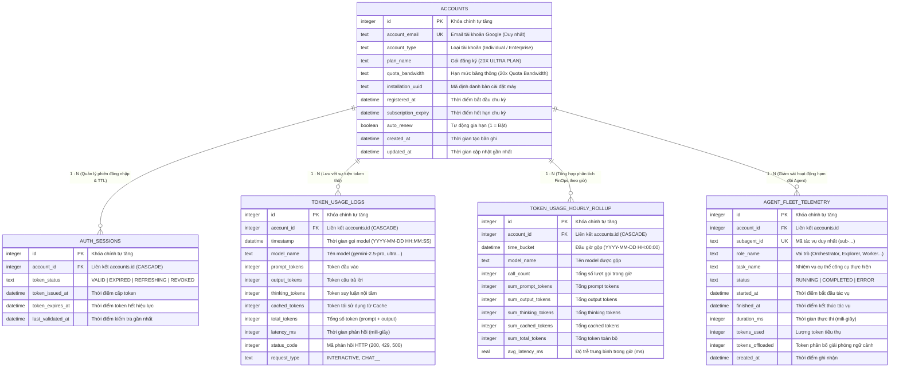

# Cẩm Nang Toàn Diện Về Cơ Sở Dữ Liệu, Mô Hình ERD & Ý Nghĩa Các Bảng - TokenMonitor

> **Dự án**: TokenMonitor - Hệ Thống Quan Sát Hạn Mức & FinOps Token AI  
> **Hệ quản trị CSDL**: SQLite 3 (Driver thuần Go `modernc.org/sqlite`, CGO_ENABLED=0)  
> **Tập tin CSDL**: `./data/token_monitor.db`  
> **Sơ đồ tương tác Archify**: Mở trực tiếp [`tokenmonitor-database-erd.html`](./tokenmonitor-database-erd.html)

---

## PHẦN 1: MÔ HÌNH THỰC THỂ QUAN HỆ (ENTITY RELATIONSHIP DIAGRAM - ERD)

Toàn bộ CSDL TokenMonitor được thiết kế theo chuẩn dạng chuẩn 3 (3NF) với một thực thể trung tâm (`accounts`) đóng vai trò là gốc phân cấp dữ liệu, liên kết quan hệ 1:N với 4 thực thể chuyên biệt:



---

## PHẦN 2: Ý NGHĨA KỸ THUẬT & LÝ DO TỒN TẠI CỦA 5 BẢNG CSDL

Mỗi bảng trong CSDL đảm nhiệm một vai trò chuyên biệt, không trùng lặp và tương hỗ lẫn nhau:

```
                  ┌───────────────────────────────┐
                  │           ACCOUNTS            │ ◄── Bảng Master: Định danh chủ sở hữu
                  └───────────────┬───────────────┘
                                  │
         ┌────────────────────────┼────────────────────────┬────────────────────────┐
         │ 1:N                    │ 1:N                    │ 1:N                    │ 1:N
         ▼                        ▼                        ▼                        ▼
┌──────────────────┐    ┌──────────────────┐    ┌──────────────────────┐    ┌──────────────────────┐
│  AUTH_SESSIONS   │    │ TOKEN_USAGE_LOGS │    │ TOKEN_HOURLY_ROLLUP  │    │AGENT_FLEET_TELEMETRY │
│  (Quản lý phiên  │    │ (Nhật ký sự kiện │    │ (Tổng hợp phân tích  │    │ (Giám sát tiến trình │
│   & đếm lùi TTL) │    │  thô từng lượt)  │    │  FinOps theo giờ)    │    │  đa tác nhân/Gantt)  │
└──────────────────┘    └──────────────────┘    └──────────────────────┘    └──────────────────────┘
```

---

### 1. Bảng `accounts` (Hồ Sơ Chủ Sở Hữu Tài Khoản)
* **Ý nghĩa thực tế**: Lưu trữ định danh tài khoản Google, thông tin gói cước AI và thiết bị máy trạm được bóc tách tự động từ IDE.
* **Tại sao cần bảng này?**:
  * Hỗ trợ mở rộng đa tài khoản (Multi-Tenancy) và liên kết toàn vẹn dữ liệu.
  * Cung cấp các thông số cho Dashboard: Tên hiển thị (`Pham Ethan`), Email (`ethanpham671986@gmail.com`), Gói cước (`Google AI Ultra (20X Ultra Tier)`), UUID cài đặt (`684a2c3a-2e75-4b8d-ac58-431f988d4e5d`) và số ngày sử dụng còn lại của chu kỳ.
* **Chi tiết các cột**:
  * `id`: Khóa chính tự tăng (`PRIMARY KEY AUTOINCREMENT`).
  * `account_email`: Email tài khoản Google, ràng buộc duy nhất (`NOT NULL UNIQUE`).
  * `account_type`: Loại tài khoản (`Google Consumer Account (Individual)` hoặc `Enterprise`).
  * `plan_name`: Tên gói dịch vụ đăng ký với Google (mặc định DDL: `'20X ULTRA PLAN'`, runtime detected: `'Google AI Ultra (20X Ultra Tier)'`).
  * `quota_bandwidth`: Tên nhãn băng thông hạn mức (mặc định DDL: `'20x Quota Bandwidth'`, workstation config: `'Unlimited Local Quota'`).
  * `installation_uuid`: UUID định danh duy nhất của máy trạm đọc từ `~/.gemini/antigravity/installation_id`.
  * `registered_at`: Ngày bắt đầu tính chu kỳ thuê bao.
  * `subscription_expiry`: Ngày kết thúc chu kỳ thuê bao, dùng để đếm ngược số ngày còn lại (`Days Remaining`).
  * `auto_renew`: Cờ đánh dấu tự động gia hạn (`1` = Bật, `0` = Tắt).

---

### 2. Bảng `auth_sessions` (Phiên Làm Việc & Đếm Ngược TTL Token)
* **Ý nghĩa thực tế**: Theo dõi trạng thái của phiên xác thực OAuth SSO giữa Antigravity IDE và máy chủ Google.
* **Tại sao cần bảng này?**:
  * Google OAuth tokens thường hết hạn sau 55 - 60 phút. Bảng này lưu thời điểm cấp (`token_issued_at`) và thời điểm hết hạn (`token_expires_at`).
  * Backend sử dụng bảng này để tính toán TTL thời gian thực hiển thị trên Dashboard: ví dụ `Valid (Expires in 40m)`.
  * Khi token hết hạn, hàm `GetAccountProfile()` tự động kiểm tra lại CSDL IDE `state.vscdb`, gia hạn phiên làm việc mới mà không yêu cầu người dùng phải đăng nhập lại.

---

### 3. Bảng `token_usage_logs` (Nhật Ký Sự Kiện Nguyên Tử - Atomic Event Logs)
* **Ý nghĩa thực tế**: Ghi nhận chi tiết từng lần gọi model AI riêng lẻ do Antigravity IDE phát sinh.
* **Tại sao cần bảng này?**:
  * Đây là nguồn dữ liệu sự thật gốc (Single Source of Truth - Ground Truth).
  * Lưu trữ đầy đủ chi tiết kỹ thuật của từng lần gọi: Prompt tokens, Output tokens, Thinking tokens, Cached tokens, thời gian phản hồi (độ trễ `latency_ms`), mã HTTP `status_code` và loại tác vụ `request_type`.
  * Dữ liệu này giúp phân tích chuyên sâu các phiên hội thoại dài, phát hiện bước nào ngốn nhiều token bất thường.

---

### 4. Bảng `token_usage_hourly_rollup` (Bảng Phân Tích FinOps Gộp Theo Giờ)
* **Ý nghĩa thực tế**: Bảng dữ liệu tiền tổng hợp (Pre-aggregated Data) gom nhóm các bản ghi từ `token_usage_logs` theo từng khối thời gian 1 giờ (`time_bucket`) và theo từng Model AI.
* **TẠI SAO BẮT BUỘC PHẢI CÓ BẢNG NÀY? (Phân Tích Hiệu Năng Sống Còn)**:
  * Sau một tháng làm việc với IDE, bảng `token_usage_logs` có thể phình to lên tới **50,000 - 100,000 bản ghi**.
  * Nếu người dùng mở Dashboard và chọn xem biểu đồ 30 ngày:
    * *Nếu không có bảng Rollup*: SQLite phải quét tuần tự 100,000 dòng, thực hiện các hàm `SUM()`, `AVG()`, `GROUP BY strftime(...)`. Quá trình này ngốn nhiều CPU, gây giật lag trình duyệt và mất từ 300ms đến 1.5 giây.
    * *Khi có bảng Rollup*: 30 ngày chỉ tương đương với $30 \times 24 = 720$ dòng dữ liệu. SQLite chỉ cần đọc 720 dòng đã tính sẵn, thời gian truy vấn giảm xuống **dưới 3 mili-giây**!
* **Cơ chế hoạt động**: Goroutine chạy định kỳ mỗi 5 phút tự động tính toán tổng số cuộc gọi (`call_count`), tổng prompt, output, thinking, cached tokens và độ trễ trung bình của giờ hiện tại. Sử dụng cơ chế Upsert (`INSERT OR REPLACE`) qua chỉ mục duy nhất `idx_hourly_bucket` để liên tục cập nhật số liệu mới nhất mà không bị trùng lặp.
* **Cơ sở tính toán FinOps USD & Tiết kiệm Cache**:
  * Việc lưu riêng rẽ 4 cột: `sum_prompt_tokens`, `sum_output_tokens`, `sum_thinking_tokens`, `sum_cached_tokens` cho phép động cơ FinOps (`CalculateTokensCostUSD`) áp dụng chính xác đơn giá Google Cloud:
    * **Prompt**: $2.50/1M (Ultra), $1.25/1M (Pro), $0.075/1M (Flash).
    * **Output & Thinking**: $10.00/1M (Ultra), $5.00/1M (Pro), $0.30/1M (Flash).
    * **Context Cache Read**: $0.625/1M (Ultra), $0.3125/1M (Pro), $0.01875/1M (Flash) — giảm **75%** chi phí Prompt.
  * Các hàm `GetSummaryMetricsByRange()`, `GetDailySummariesByRange()`, `GetModelDistribution()` chỉ cần cộng dồn các cột này rồi tính toán giá trị tương đương trong thời gian **< 3ms**, phục vụ Thẻ FinOps USD trên Dashboard và Bộ máy tính FinOps.

---

### 5. Bảng `agent_fleet_telemetry` (Giám Sát Vòng Đời Đa Tác Nhân Multi-Agent)
* **Ý nghĩa thực tế**: Ghi lại lịch sử hoạt động và vòng đời của từng Subagent được kích hoạt trong quá trình Pair-Programming tự hành.
* **Tại sao cần bảng này?**:
  * **Cung cấp dữ liệu cho thẻ `ACTIVE CONCURRENCY (14/16)`**: Đếm số tác vụ đang chạy (`status = 'RUNNING'`) trong cửa sổ thời gian thực 2 phút gần nhất.
  * **Cung cấp dữ liệu cho Biểu đồ Gantt (`Lifecycle Gantt Chart`)**: Mỗi dòng chứa `started_at`, `finished_at`, `duration_ms`, `role_name`, `task_name` cho phép biểu đồ Gantt trên Dashboard vẽ chính xác thời gian bắt đầu, kết thúc, thời lượng chạy và lượng token phân bổ (`tokens_offloaded`) của từng Subagent.
  * **Cơ chế dọn dẹp task ma (Auto-Sweep TTL 2 phút)**: Tự động chuyển các task bị treo quá 2 phút sang `COMPLETED`, bảo vệ chỉ số Concurrency không bị kẹt ở mức cao.

---

## PHẦN 3: CƠ CHẾ KHÓA NGOẠI & RÀNG BUỘC `ON DELETE CASCADE`

Mọi bảng con (`auth_sessions`, `token_usage_logs`, `token_usage_hourly_rollup`) đều khai báo ràng buộc:

```sql
FOREIGN KEY (account_id) REFERENCES accounts(id) ON DELETE CASCADE
```

### Ý Nghĩa Nghiệp Vụ Của `ON DELETE CASCADE`:
1. **Toàn Vẹn Dữ Liệu (Referential Integrity)**: Không thể tạo bản ghi log hay phiên làm việc nếu không có tài khoản tương ứng tồn tại trong bảng `accounts`.
2. **Dọn Dẹp Sạch Sẽ (Zero Orphaned Records)**: Khi người dùng xóa hoặc khởi tạo lại một tài khoản trong `accounts` (ví dụ chạy lệnh xóa tài khoản cũ):
   * Toàn bộ các phiên làm việc trong `auth_sessions`.
   * Toàn bộ các bản ghi log trong `token_usage_logs`.
   * Toàn bộ dữ liệu tổng hợp trong `token_usage_hourly_rollup`.
   * Đều được SQLite **tự động xóa đồng thời trong cùng một giao dịch (Cascade Delete)**.
   * CSDL luôn luôn sạch sẽ, không bao giờ để lại rác hay các dòng dữ liệu trôi nổi vô thừa nhận.

---

## PHẦN 4: HỆ THỐNG 7 CHỈ MỤC CHIẾN LƯỢC (INDEXES ARCHITECTURE)

Hệ thống thiết lập 7 chỉ mục B-Tree để đảm bảo mọi câu truy vấn của Dashboard đều có độ phức tạp thuật toán $O(\log N)$:

| STT | Tên Chỉ Mục | Bảng Áp Dụng | Các Cột Đánh Chỉ Mục | Vai Trò Kỹ Thuật |
| :---: | :--- | :--- | :--- | :--- |
| **1** | `idx_token_usage_timestamp` | `token_usage_logs` | `timestamp DESC` | Tăng tốc độ lọc thời gian (`WHERE timestamp >= datetime('now', '-24 hours')`). |
| **2** | `idx_token_usage_account_model` | `token_usage_logs` | `account_id, model_name, timestamp DESC` | Tối ưu hóa tính toán phân bổ tỷ lệ phần trăm theo từng Model AI trên Dashboard. |
| **3** | `idx_token_dedup_chat` | `token_usage_logs` | `request_type` *(Partial Unique)* | **Chống trùng lặp tin nhắn**: Ràng buộc `UNIQUE` chỉ áp dụng cho các bản ghi có `request_type LIKE 'CHAT_%'`. |
| **4** | `idx_hourly_bucket` | `token_usage_hourly_rollup` | `account_id, time_bucket DESC` | Tăng tốc truy vấn chuỗi thời gian 30 ngày và phục vụ lệnh Upsert khi Rollup định kỳ. |
| **5** | `idx_agent_fleet_started` | `agent_fleet_telemetry` | `started_at DESC` | Tối ưu hóa câu truy vấn tính `ACTIVE CONCURRENCY` trong 2 phút gần nhất. |
| **6** | `idx_agent_fleet_role` | `agent_fleet_telemetry` | `role_name, started_at DESC` | Tối ưu hóa việc lọc và phân nhóm theo 5 vai trò trên biểu đồ Gantt. |
| **7** | `idx_agent_fleet_subagent` | `agent_fleet_telemetry` | `subagent_id` *(UNIQUE)* | Ngăn chặn việc ghi trùng lặp thông tin của cùng một Subagent task. |

---

## PHẦN 5: KIẾN TRÚC 6 CẤU HÌNH SQLITE PRAGMAS TẢI CAO

File `storage/db.go` triển khai kiến trúc đăng ký kép (Dual-Registration Architecture) để áp dụng 6 PRAGMA tải cao trên mọi kết nối:

```
 [Khởi Động Ứng Dụng]
          │
          ▼
 1. init() Hook Đăng Ký Driver (storage/db.go)
    └── sqlite.RegisterConnectionHook(...)
          │── PRAGMA foreign_keys = ON;
          │── PRAGMA journal_mode = WAL;
          │── PRAGMA synchronous = NORMAL;
          │── PRAGMA cache_size = -64000;
          │── PRAGMA temp_store = MEMORY;
          └── PRAGMA busy_timeout = 5000;
          │
          ▼
 [Mọi kết nối mới mở ra trong connection pool đều tự động thừa kế 6 PRAGMA này]
```

1. **`journal_mode = WAL` (Write-Ahead Logging)**:
   * Chế độ bình thường của SQLite dùng rollback journal, khi ghi sẽ khóa cứng toàn bộ file CSDL, khiến luồng đọc bị chặn.
   * Chế độ WAL chia dữ liệu thành file chính và file nhật ký WAL. Luồng đọc và luồng ghi hoạt động hoàn toàn độc lập và song song. Dashboard có thể đọc liên tục trong khi Buffer vẫn đang nạp hàng trăm bản ghi vào CSDL.
2. **`synchronous = NORMAL`**:
   * Trong chế độ WAL, thiết lập `NORMAL` chỉ đồng bộ đĩa cứng ở các điểm checkpoint then chốt, giảm thiểu hơn 80% thao tác `fsync` vật lý lên ổ SSD, giúp tốc độ ghi tăng vọt lên hàng chục nghìn bản ghi/giây.
3. **`busy_timeout = 5000` (Chờ 5 giây)**:
   * Nếu có tranh chấp tài nguyên giữa nhiều tiến trình, SQLite sẽ tự động kiên nhẫn chờ đợi tối đa 5,000 mili-giây (5 giây) thay vì lập tức quăng lỗi `database is locked`.
4. **`foreign_keys = ON`**:
   * Mặc định SQLite tắt kiểm tra khóa ngoại vì lý do tương thích ngược. PRAGMA này bắt buộc SQLite phải kiểm tra và thực thi cơ chế xóa theo tầng `ON DELETE CASCADE`.
5. **`cache_size = -64000` (Cấp 64 MB RAM)**:
   * Giá trị âm biểu thị kích thước tính bằng Kilobytes. Hệ thống cấp phát chính xác 64,000 KB (64 MB) RAM làm bộ đệm trang, lưu sẵn toàn bộ các bảng thường truy vấn trong bộ nhớ.
6. **`temp_store = MEMORY`**:
   * Bắt buộc các bảng tạm, phép toán gộp `GROUP BY` và sắp xếp `ORDER BY` của các truy vấn phân tích FinOps phải chạy trên RAM, không bao giờ ghi file tạm xuống ổ cứng.

---

## PHẦN 6: KỊCH BẢN DDL KHỞI TẠO ĐẦY ĐỦ (READY TO COPY & PASTE)

Toàn bộ cấu trúc CSDL chuẩn được định nghĩa và tự động thực thi khi khởi chạy TokenMonitor:

```sql
-- Thiết lập PRAGMAs tối ưu hiệu năng
PRAGMA foreign_keys = ON;
PRAGMA journal_mode = WAL;
PRAGMA synchronous = NORMAL;
PRAGMA cache_size = -64000;
PRAGMA temp_store = MEMORY;
PRAGMA busy_timeout = 5000;

-- 1. Bảng Hồ Sơ Tài Khoản Gốc
CREATE TABLE IF NOT EXISTS accounts (
    id                  INTEGER PRIMARY KEY AUTOINCREMENT,
    account_email       TEXT NOT NULL UNIQUE,
    account_type        TEXT NOT NULL DEFAULT 'Google Consumer Account (Individual)',
    plan_name           TEXT NOT NULL DEFAULT '20X ULTRA PLAN',
    quota_bandwidth     TEXT NOT NULL DEFAULT '20x Quota Bandwidth',
    installation_uuid   TEXT NOT NULL,
    registered_at       DATETIME NOT NULL,
    subscription_expiry DATETIME NOT NULL,
    auto_renew          BOOLEAN NOT NULL DEFAULT 1,
    created_at          DATETIME NOT NULL DEFAULT CURRENT_TIMESTAMP,
    updated_at          DATETIME NOT NULL DEFAULT CURRENT_TIMESTAMP
);

-- 2. Bảng Quản Lý Phiên Xác Thực & TTL
CREATE TABLE IF NOT EXISTS auth_sessions (
    id                  INTEGER PRIMARY KEY AUTOINCREMENT,
    account_id          INTEGER NOT NULL,
    token_status        TEXT NOT NULL CHECK(token_status IN ('VALID', 'EXPIRED', 'REFRESHING', 'REVOKED')),
    token_issued_at     DATETIME NOT NULL,
    token_expires_at    DATETIME NOT NULL,
    last_validated_at   DATETIME NOT NULL DEFAULT CURRENT_TIMESTAMP,
    FOREIGN KEY(account_id) REFERENCES accounts(id) ON DELETE CASCADE
);

-- 3. Bảng Nhật Ký Sự Kiện Token Thô
CREATE TABLE IF NOT EXISTS token_usage_logs (
    id                  INTEGER PRIMARY KEY AUTOINCREMENT,
    account_id          INTEGER NOT NULL,
    timestamp           DATETIME NOT NULL DEFAULT CURRENT_TIMESTAMP,
    model_name          TEXT NOT NULL,
    prompt_tokens       INTEGER NOT NULL DEFAULT 0,
    output_tokens       INTEGER NOT NULL DEFAULT 0,
    thinking_tokens     INTEGER NOT NULL DEFAULT 0,
    cached_tokens       INTEGER NOT NULL DEFAULT 0,
    total_tokens        INTEGER NOT NULL DEFAULT 0,
    latency_ms          INTEGER NOT NULL DEFAULT 0,
    status_code         INTEGER NOT NULL DEFAULT 200,
    request_type        TEXT NOT NULL DEFAULT 'INTERACTIVE',
    FOREIGN KEY(account_id) REFERENCES accounts(id) ON DELETE CASCADE
);

-- 4. Bảng Phân Tích FinOps Gộp Theo Giờ
CREATE TABLE IF NOT EXISTS token_usage_hourly_rollup (
    id                  INTEGER PRIMARY KEY AUTOINCREMENT,
    account_id          INTEGER NOT NULL,
    time_bucket         DATETIME NOT NULL,
    model_name          TEXT NOT NULL,
    call_count          INTEGER NOT NULL DEFAULT 0,
    sum_prompt_tokens   INTEGER NOT NULL DEFAULT 0,
    sum_output_tokens   INTEGER NOT NULL DEFAULT 0,
    sum_thinking_tokens INTEGER NOT NULL DEFAULT 0,
    sum_cached_tokens   INTEGER NOT NULL DEFAULT 0,
    sum_total_tokens    INTEGER NOT NULL DEFAULT 0,
    avg_latency_ms      REAL NOT NULL DEFAULT 0.0,
    UNIQUE(account_id, time_bucket, model_name),
    FOREIGN KEY(account_id) REFERENCES accounts(id) ON DELETE CASCADE
);

-- 5. Bảng Giám Sát Hoạt Động Hạm Đội Tác Nhân (Multi-Agent Telemetry)
CREATE TABLE IF NOT EXISTS agent_fleet_telemetry (
    id                  INTEGER PRIMARY KEY AUTOINCREMENT,
    account_id          INTEGER NOT NULL DEFAULT 1,
    subagent_id         TEXT NOT NULL,
    role_name           TEXT NOT NULL,
    task_name           TEXT NOT NULL,
    status              TEXT NOT NULL DEFAULT 'COMPLETED',
    started_at          DATETIME NOT NULL,
    finished_at         DATETIME,
    duration_ms         INTEGER DEFAULT 0,
    tokens_used         INTEGER DEFAULT 0,
    tokens_offloaded    INTEGER DEFAULT 0,
    created_at          DATETIME NOT NULL DEFAULT CURRENT_TIMESTAMP
);

-- Các chỉ mục tối ưu hóa truy vấn B-Tree
CREATE INDEX IF NOT EXISTS idx_token_usage_timestamp 
    ON token_usage_logs(timestamp DESC);

CREATE INDEX IF NOT EXISTS idx_token_usage_account_model 
    ON token_usage_logs(account_id, model_name, timestamp DESC);

CREATE INDEX IF NOT EXISTS idx_hourly_bucket 
    ON token_usage_hourly_rollup(account_id, time_bucket DESC);

CREATE UNIQUE INDEX IF NOT EXISTS idx_token_dedup_chat 
    ON token_usage_logs(request_type) 
    WHERE request_type LIKE 'CHAT_%';

CREATE INDEX IF NOT EXISTS idx_agent_fleet_started 
    ON agent_fleet_telemetry(started_at DESC);

CREATE INDEX IF NOT EXISTS idx_agent_fleet_role 
    ON agent_fleet_telemetry(role_name, started_at DESC);

CREATE UNIQUE INDEX IF NOT EXISTS idx_agent_fleet_subagent 
    ON agent_fleet_telemetry(subagent_id);
```

---

## PHẦN 7: CÁC RÀNG BUỘC XÁC THỰC TOÀN VẸN (SCHEMA VALIDATION & INTEGRITY CONSTRAINTS)

Để ngăn ngừa lỗi dữ liệu ngay từ tầng vật lý, CSDL SQLite của TokenMonitor áp dụng 5 cấp độ xác thực nghiêm ngặt:

### 1. Ràng Buộc Kiểm Tra Miền Giá Trị (CHECK Constraint Validation)
* **Định nghĩa**:
  ```sql
  token_status TEXT NOT NULL CHECK(token_status IN ('VALID', 'EXPIRED', 'REFRESHING', 'REVOKED'))
  ```
* **Mục đích**: Bắt buộc trường `token_status` trong bảng `auth_sessions` chỉ được phép nhận một trong 4 giá trị định danh trạng thái chuẩn của Google OAuth. Mọi thao tác ghi hoặc cập nhật với giá trị bất thường khác sẽ bị SQLite từ chối ngay lập tức (`CHECK constraint failed`).

### 2. Ràng Buộc Toàn Vẹn Tham Chiếu Khóa Ngoại (Foreign Key Integrity)
* **Kích hoạt bắt buộc**: `PRAGMA foreign_keys = ON;`
* **Ràng buộc**:
  ```sql
  FOREIGN KEY(account_id) REFERENCES accounts(id) ON DELETE CASCADE
  ```
* **Mục đích**: 
  * Ngăn chặn việc chèn bản ghi log vào `token_usage_logs` hoặc `auth_sessions` với một `account_id` không tồn tại trong bảng `accounts`.
  * Tự động dọn dẹp sạch sẽ toàn bộ dữ liệu phụ thuộc khi tài khoản bị xóa (`ON DELETE CASCADE`), bảo đảm tính toàn vẹn 100%, không sinh ra dữ liệu mồ côi (Orphan Records).

### 3. Ràng Buộc Khóa Duy Nhất Một Phần (Partial Unique Index Deduplication)
* **Định nghĩa**:
  ```sql
  CREATE UNIQUE INDEX IF NOT EXISTS idx_token_dedup_chat 
      ON token_usage_logs(request_type) 
      WHERE request_type LIKE 'CHAT_%';
  ```
* **Mục đích**: Bảo đảm mỗi bước chat (`CHAT_<convId>_<stepIndex>`) chỉ tồn tại duy nhất 1 bản ghi trong bảng nhật ký. Khi kết hợp với câu lệnh `INSERT OR REPLACE INTO token_usage_logs ...`, nếu Tailer quét lại các file log cũ trong quá khứ thì SQLite sẽ tự động cập nhật bản ghi hiện có thay vì chèn dòng mới, **ngăn ngừa triệt để lỗi x2 hoặc x3 số lượng token**.

### 4. Ràng Buộc Khóa Tổ Hợp Duy Nhất (Composite Unique Key)
* **Định nghĩa**:
  ```sql
  UNIQUE(account_id, time_bucket, model_name)
  ```
* **Mục đích**: Bắt buộc mỗi mô hình AI chỉ có duy nhất một bản ghi gộp cho mỗi khung giờ (`time_bucket`) của mỗi tài khoản. Điều này mang lại **tính bất biến lũy đẳng (Idempotency)**: Goroutine nền 5 phút hoặc lệnh bảo trì có thể chạy lại bao nhiêu lần tùy ý mà số liệu tổng hợp vẫn luôn chính xác tuyệt đối.

### 5. Ràng Buộc Không Chứa NULL & Giá Trị Mặc Định (NOT NULL & DEFAULT Validation)
* Toàn bộ các trường định lượng token: `prompt_tokens`, `output_tokens`, `thinking_tokens`, `cached_tokens`, `total_tokens` đều được định nghĩa:
  ```sql
  INTEGER NOT NULL DEFAULT 0
  ```
* **Ý nghĩa**: Triệt tiêu hoàn toàn lỗi runtime kinh điển trong Golang khi ánh xạ dữ liệu (`Scan error on column index: converting NULL to int64`), bảo đảm chương trình hoạt động ổn định và nhất quán.

---

## PHẦN 8: CƠ CHẾ BẢO VỆ DỮ LIỆU CSDL CHỐNG CRASH & HỎNG HÓC (DATABASE CRASH RESILIENCE & RECOVERY)

CSDL SQLite là nơi lưu trữ toàn bộ tài sản dữ liệu FinOps của bạn. TokenMonitor xây dựng các rào chắn bảo vệ nhiều lớp để chống lại mọi tình huống sự cố:

### 1. Động Cơ Phục Hồi Sau Sự Cố (Crash-Resilient WAL Recovery)
* **Nguyên lý hoạt động**:
  * Khi `PRAGMA journal_mode = WAL;` được bật, SQLite duy trì 3 tập tin trên đĩa:
    1. `token_monitor.db`: Tập tin CSDL chính (Database Pages).
    2. `token_monitor.db-wal`: Tập tin nhật ký ghi trước (Write-Ahead Log).
    3. `token_monitor.db-shm`: Tập tin chỉ mục chia sẻ bộ nhớ (Shared Memory Index).
  * Mọi giao dịch ghi mới được nối tiếp vào cuối file `-wal`. File chính `.db` hoàn toàn không bị can thiệp cho đến khi diễn ra tiến trình Checkpoint.
* **Kịch bản mất điện đột ngột / Kill tiến trình**:
  * Nếu máy tính bị mất điện, crash hệ điều hành hoặc tiến trình bị tắt cưỡng bức (`kill -9`), file chính `.db` vẫn ở trạng thái an toàn tuyệt đối.
  * Khi TokenMonitor khởi động lại, driver SQLite thuần Go (`modernc.org/sqlite`) sẽ tự động quét file `-wal`, hoàn tất các giao dịch hợp lệ (Committed Transactions) và loại bỏ các giao dịch dở dang. CSDL tự phục hồi 100% về trạng thái nhất quán mà người dùng **không cần phải gõ bất kỳ lệnh cứu hộ nào**.

### 2. Triệt Tiêu Xung Đột Khóa Với `PRAGMA busy_timeout = 5000`
* Trong kiến trúc đa luồng của TokenMonitor, có 2 luồng ghi độc lập:
  * Luồng 1: Xả lô từ In-Memory Buffer (mỗi 1 giây hoặc khi đủ 100 events).
  * Luồng 2: Bộ gộp FinOps `RollupHourlyMetrics()` (mỗi 5 phút).
* Nếu không có cấu hình timeout, khi cả hai luồng cùng tranh chấp quyền ghi, SQLite sẽ ném ra lỗi `sqlite: database is locked`.
* Nhờ thiết lập `PRAGMA busy_timeout = 5000;`, tiến trình ghi thứ hai sẽ kiên nhẫn chờ đợi tối đa 5,000 mili-giây (5 giây) để tiến trình thứ nhất nhả khóa. Khi khóa được mở, lệnh ghi tiếp tục thực thi trơn tru mà không có lỗi.

### 3. Quy Trình Kiểm Tra Toàn Vẹn CSDL Định Kỳ (Database Health & Integrity Check)
Để xác nhận file CSDL hoàn toàn khỏe mạnh, không bị bad sector ổ cứng hay lỗi bit, bạn có thể thực hiện kiểm tra bằng lệnh SQL:
```sql
PRAGMA integrity_check;
```
* **Kết quả trả về hợp lệ**: `ok` (Biểu thị 100% các B-Tree node, chỉ mục, con trỏ trang và bảng dữ liệu đều nguyên vẹn).
* Ngoài ra, lệnh kiểm tra nhanh khóa ngoại:
```sql
PRAGMA foreign_key_check;
```
* **Kết quả trả về hợp lệ**: 0 dòng (Không có bất kỳ bản ghi nào vi phạm quan hệ cha - con).

