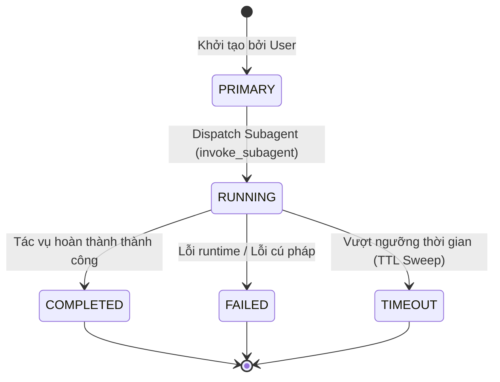

# Cẩm Nang Đặc Tả Kỹ Thuật & Kiến Trúc Hạm Đội Đa Tác Nhân (Team Agent Fleet Architecture Guide)

> **Hệ Thống**: TokenMonitor — AI Observability & FinOps Daemon  
> **Phân Hệ**: Multi-Agent Fleet Telemetry, Chronological Lifecycle Gantt & Topology Network Graph  
> **Môi Trường Hoạt Động**: Multi-Workspace Agentic Coding Loop (MCREDIT ProjectR ↔ TieuChuanHardeningLinux DevSecOps ↔ TokenMonitor GoLangDev ↔ ProjectScriptOS OS Automation)  
> **Chuẩn Mực**: 100% Production-Grade Ground Truth Parity | Zero Hallucination  

---

## Mục Lục Chi Tiết

1. [Tổng Quan Hạm Đội Đa Tác Nhân (Team Agent Overview)](#1-tổng-quan-hạm-đội-đa-tác-nhân-team-agent-overview)
   - 1.1. Bối cảnh & Mục tiêu thiết kế
   - 1.2. Phân cấp chỉ huy: Primary Orchestrator & 5 Vai Trò Subagent Chuyên Biệt
   - 1.3. Vòng đời tác vụ (Task Lifecycle States) & Giới hạn an toàn Sandbox
2. [Kiến Trúc Mạng Lưới Song Song Đa Dự Án (Cross-Workspace Collaboration)](#2-kiến-trúc-mạng-lưới-song-song-đa-dự-án-cross-workspace-collaboration)
   - 2.1. Cụm MCREDIT (ProjectR — Báo Cáo Tự Động Hóa Vận Hành)
   - 2.2. Cụm TieuChuanHardeningLinux (Security Standards & DevSecOps)
   - 2.3. Cụm TokenMonitor (GoLangDev — FinOps Telemetry Daemon)
   - 2.4. Cụm ProjectScriptOS (OS Automation & Administrative Scripting)
   - 2.5. Thuật Toán Phân Giải Đa Dự Án Động (resolveSubagentProject)
   - 2.6. Điểm Kết Nối Gốc Tối Cao (Root Controller Node) & Ranh Giới Độc Lập Của 4 Cụm Dự Án (stepX = 780.0px)
   - 2.7. Phân Tích Kỹ Thuật: Ranh Giới Độc Lập, Ngưỡng Sống 45 Giây & Triết Lý Zero Fake Motion
3. [Giao Thức Trao Đổi Đa Tác Nhân (Inter-Agent Exchange Streaming Protocols)](#3-giao-thức-trao-đổi-đa-tác-nhân-inter-agent-exchange-streaming-protocols)
   - 3.1. Phân loại 5 mẫu luồng dữ liệu (Dataflow Patterns)
   - 3.2. Cơ chế phân phối Token Budget & Context Handoff
   - 3.3. Luồng phản hồi & Kiểm soát chất lượng (Feedback & Governance Loop)
4. [Động Cơ Hoạt Họa & Biểu Diễn Đồ Thị Mạng Lưới (Topology Graph & Flowing Energy Engine)](#4-động-cơ-hoạt-họa--biểu-diễn-đồ-thị-mạng-lưới-topology-graph--flowing-energy-engine)
   - 4.1. Ba chế độ bố cục đồ thị (Pinned, Force-Directed, Circular)
   - 4.2. Mô hình toán học đường cong Bezier bậc 2 & Vector tiếp tuyến
   - 4.3. Kiến trúc Canvas Overlay GPU-Accelerated 60 FPS (`#topo-flow-overlay`)
   - 4.4. Hệ thống chuyển động mũi tên chỉ hướng (Arrow Chevrons) & Chùm hạt năng lượng
   - 4.5. Tương tác Hover, Highlight luồng & Bảng điều khiển HUD thời gian thực
   - 4.6. Quản lý vòng đời hoạt họa & Triệt tiêu tiêu thụ CPU/GPU khi nhàn rỗi
   - 4.7. Cơ Chế Tự Động Nhận Diện & Focus Vào Dự Án Đang Hoạt Động (Active Project Auto-Focus)
   - 4.8. Thuật Toán Responsive Auto-Fit & Căn Giữa Động [midX, midY] (Topology Auto-Fit Engine)
5. [Mô Hình Dữ Liệu & Tối Ưu Hóa Truy Vấn SQLite](#5-mô-hình-dữ-liệu--tối-ưu-hóa-truy-vấn-sqlite)
   - 5.1. Cấu trúc bảng `agent_fleet_telemetry`
   - 5.2. Hệ thống 3 chỉ mục chiến lược B-Tree
   - 5.3. Cơ chế tự động quét dọn TTL 2 phút (TTL Auto-Sweep Engine)
6. [Danh Mục REST API Hạm Đội Đa Tác Nhân (Team Agent REST APIs)](#6-danh-mục-rest-api-hạm-đội-đa-tác-nhân-team-agent-rest-apis)
   - 6.1. `GET /api/agents/summary`
   - 6.2. `GET /api/agents/concurrency`
   - 6.3. `GET /api/agents/gantt`
   - 6.4. `GET /api/agents/gantt/packets`
   - 6.5. `GET /api/agents/graph`
7. [Cẩm Nang Vận Hành, Giám Sát & Xử Lý Sự Cố (Operational SOPs)](#7-cẩm-nang-vận-hành-giám-sát--xử-lý-sự-cố-operational-sops)
   - 7.1. Hiện tượng Active Concurrency tăng cao bất thường & Quy trình xử lý
   - 7.2. Kiểm tra tính toàn vẹn hoạt họa Canvas trên trình duyệt
   - 7.3. Checklist xác thực trước khi bàn giao hệ thống

---

## 1. Tổng Quan Hạm Đội Đa Tác Nhân (Team Agent Overview)

### 1.1. Bối cảnh & Mục tiêu thiết kế
Trong môi trường phát triển phần mềm tự hành bằng AI (Agentic Coding Loop) với Antigravity IDE và mô hình ngôn ngữ lớn (Google AI Ultra / Pro), các tác vụ phức tạp không còn được thực hiện bởi một tiến trình đơn lẻ mà được phân rã thành **Hạm Đội Đa Tác Nhân (Team Agent Fleet)**. Một tác tử chủ (Primary Orchestrator) sẽ khởi tạo, phân bổ ngữ cảnh, giao việc cho các tác tử con (Subagents) hoạt động song song trong các môi trường cô lập Sandbox.

Hệ thống **Multi-Agent Fleet Telemetry** trong TokenMonitor giải quyết 4 thách thức cốt lõi:
1. **Khả năng quan sát toàn diện (Observability)**: Nắm bắt chính xác từng giây vòng đời của từng Subagent (bắt đầu, kết thúc, thời lượng, số token tiêu thụ, tỷ lệ thành công).
2. **Kiểm soát tải đồng thời (Concurrency Throttling)**: Giám sát số lượng tác tử đang hoạt động đồng thời so với ngưỡng an toàn (ví dụ: `1 / 5 Safe Load`), ngăn chặn nguy cơ chạm trần rate limit của API Gemini.
3. **Minh bạch hóa luồng phân phối token (Token Offloading Transparency)**: Xác định tỷ lệ token được chia tải sang các Worker (ví dụ: `20% Offloaded to Workers`, tiết kiệm context window cho Orchestrator chính).
4. **Trực quan hóa mạng lưới tương tác (Topology Visualization)**: Cung cấp sơ đồ đồ thị mạng lưới biểu diễn dòng chảy dữ liệu thực giữa các dự án và các vai trò agent.

```
                   ┌──────────────────────────────────────┐
                   │    Primary Orchestrator (Planner)    │
                   │    - Phân tích yêu cầu & Lập kế hoạch│
                   │    - Quản lý Token Budget & Context  │
                   └──────────────────┬───────────────────┘
                                      │ (Delegation & Budget)
         ┌───────────────┬────────────┴───┬───────────────┬──────────────┐
         ▼               ▼                ▼               ▼              ▼
  ┌─────────────┐ ┌─────────────┐ ┌─────────────┐ ┌─────────────┐ ┌─────────────┐
  │ 🔍 Research │ │ 📦 Codebase │ │ ⚡ Self-Branch│ │ ✅ Testing  │ │ 🛡️ PKI     │
  │    Agent    │ │   Explorer  │ │    Worker   │ │    Tester   │ │   Auditor   │
  └─────────────┘ └─────────────┘ └─────────────┘ └─────────────┘ └─────────────┘
```

---

### 1.2. Phân cấp chỉ huy: Primary Orchestrator & 5 Vai Trò Subagent Chuyên Biệt

TokenMonitor tự động nhận diện và phân loại toàn bộ tác tử trong transcript IDE thành 6 nhóm vai trò chuẩn:

| Vai Trò Agent | Biểu Tượng | Nhóm Màu | Trách Nhiệm Kỹ Thuật Chính |
| :--- | :---: | :---: | :--- |
| **Primary Orchestrator** | 🤖 / 👑 | Cyan `#06b6d4` | Tác tử lập kế hoạch chính (Root Planner). Phân tách bài toán phức tạp thành các Subtask độc lập, cấp phát Token Budget, giám sát tiến độ và tổng hợp kết quả bàn giao cho người dùng. |
| **Research Agent** | 🔍 | Tím `#a855f7` | Nghiên cứu tài liệu kỹ thuật, tra cứu cú pháp thư viện bên ngoài, tìm kiếm giải pháp tối ưu cho tech stack mới (RFC, API Specs, SDK References). |
| **Codebase Explorer** | 📦 | Trời `#38bdf8` | Khảo sát cây thư mục, bóc tách AST mã nguồn, tìm kiếm vị trí các hàm/biến/struct liên quan, phân tích phụ thuộc mà không làm thay đổi code. |
| **Self-Branch Worker** | ⚡ | Hổ phách `#f59e0b` | Tác tử thi công lập trình. Hoạt động trên git branch hoặc sandbox cô lập, thực hiện các chỉnh sửa phẫu thuật (surgical edits), viết code mới theo chuẩn Clean Code. |
| **Verification Tester** | ✅ | Lục `#10b981` | Kiểm thử viên tự động. Chạy test suite (`go test`, `Rscript`), kiểm tra cú pháp, đo độ bao phủ (coverage), kiểm chứng lỗi hồi quy (regression) trước khi commit. |
| **PKI Auditor** | 🛡️ | Đỏ hồng `#f43f5e` | Kiểm toán viên an toàn & bảo mật. Quét mã nguồn tìm credential/token lộ lọt, xác thực quyền hạn thư mục, kiểm tra chính sách TTL và dọn dẹp các tác vụ quá hạn. |

---

### 1.3. Vòng đời tác vụ (Task Lifecycle States) & Giới hạn an toàn Sandbox

Mỗi tác vụ Subagent tuân thủ một máy trạng thái hữu hạn (FSM) nghiêm ngặt được ghi nhận tại bảng `agent_fleet_telemetry`:



- **Giới hạn an toàn Sandbox**:
  - Mỗi Subagent chạy trong một môi trường thực thi riêng biệt, hạn chế tối đa việc ghi đè chéo tài nguyên.
  - Các lệnh thực thi đều đi kèm thời gian chờ tối đa (`WaitMsBeforeAsync`), ngăn chặn tiến trình treo vô hạn (hang process).
  - Định mức Concurrency tối đa khuyến nghị: $\le 5$ tác tử hoạt động đồng thời trên cùng một workspace để bảo đảm an toàn bộ nhớ và quota.

---

## 2. Kiến Trúc Mạng Lưới Song Song Đa Dự Án (Cross-Workspace Collaboration)

Hệ thống TokenMonitor giám sát đồng thời 4 cụm dự án độc lập cùng hoạt động trên máy trạm của kỹ sư thông qua thư mục mẹ dùng chung `E:\GoogleDrive\WorkSpace\Code\`:

```
E:\GoogleDrive\WorkSpace\Code\
├── ProjectR\MCREDIT\                        <── Cụm 1: MCREDIT (R Core Automation)
│   ├── config\ (conf_live.yml, job_schedule.yml...)
│   ├── Code-Runing\ (T24-DS-BUILD-SK-ACCOUNT.R, GTCG.R...)
│   └── modules\ (logger, mail, telegram, excel...)
├── ProjectBash\TieuChuanHardeningLinux\      <── Cụm 2: TieuChuanHardeningLinux (DevSecOps)
│   ├── cis_benchmark\ (CIS RHEL 8/9 Profiles...)
│   ├── playbooks\ (Ansible hardening playbooks...)
│   └── docs\ (tieu_chuan_config, phu_luc, cau_hinh_may_chu_linux...)
├── ProjectGolang\GoLangDev\TokenMonitor\     <── Cụm 3: TokenMonitor (Go FinOps Daemon)
│   ├── collector\ (tailer.go, buffer.go, codex_monitor.go, claude_monitor.go)
│   ├── storage\ (repository.go, db.go, backup.go, detector.go)
│   ├── web\ (handler.go, static/index.html)
│   └── docs\ (index.html, architecture, dataflow, erd...)
└── ProjectScriptOS\                          <── Cụm 4: ProjectScriptOS (OS Automation & Administrative Scripting)
    ├── AIX.7.2.SP8\ (Unix system administration & HACMP scripts...)
    ├── Centos7\ (Linux service management & sysadmin scripts...)
    └── Win11\ (PowerShell automation & desktop management...)
```

### 2.1. Cụm MCREDIT (ProjectR — Báo Cáo Tự Động Hóa Vận Hành)
- **Bản chất**: Hệ thống tự động hóa xử lý và gửi hơn 20 báo cáo tài chính/vận hành hàng ngày tại Công ty Tài chính MCREDIT.
- **Thành phần cốt lõi**:
  - `job_runner`: Bộ điều phối chạy ngầm định kỳ theo cron, hỗ trợ thử lại vô trạng thái (`stateless retry`) và ghi vết trạng thái ra JSON.
  - `Code-Runing/*.R`: Các kịch bản báo cáo chuyên biệt (GL_OTP, GL_W4, Phát hành GTCG, Sao kê tài khoản...).
  - `modules/*.R`: Thư viện dùng chung chuẩn hóa (kết nối Oracle JDBC qua rJava, gửi mail SMTP nội bộ qua `mail_functions.R`, cảnh báo lỗi Telegram Bot, ghi log JSON chuẩn ELK).
  - Tích hợp dữ liệu: Truy vấn STG schema từ Oracle Core Banking và nạp file sao kê T24 NFS phân tách bằng dấu `#`.

### 2.2. Cụm TieuChuanHardeningLinux (Security Standards & DevSecOps)
- **Bản chất**: Dự án tiêu chuẩn hóa DevSecOps và thiết lập rào chắn an ninh mạng cho hệ thống máy chủ Linux theo chuẩn CIS Benchmark Level 1 & Level 2 (RHEL 8/9, CentOS, Rocky Linux).
- **Thành phần cốt lõi**:
  - `cis_benchmark/`: Bộ hồ sơ kiểm toán và tiêu chuẩn an toàn cho hệ điều hành, kernel sysctl, phân vùng ổ đĩa, SSH hardening và tường lửa iptables/firewalld.
  - `playbooks/`: Tập hợp Ansible Playbooks và shell script tự động hóa kiểm định và khắc phục lỗi cấu hình bảo mật.
  - `docs/`: Bộ tài liệu hướng dẫn cấu hình máy chủ Linux (`cau_hinh_may_chu_linux`, `phu_luc`, `cis_profile`).

### 2.3. Cụm TokenMonitor (GoLangDev — FinOps Telemetry Daemon)
- **Bản chất**: Daemon giám sát hạn mức Token, phân tích chi phí AI và kiểm soát tải đa tác tử viết bằng Golang thuần.
- **Thành phần cốt lõi**:
  - `collector/tailer.go`: Quét delta file transcript 10 giây/lần, phân loại 5 vai trò Subagent với ngưỡng sống 45 giây.
  - `collector/buffer.go`: RAM Channel sức chứa 1,000 sự kiện, xả lô kép 100 sự kiện / 1 giây.
  - `storage/db.go` & `repository.go`: SQLite WAL Mode thuần Go (`modernc.org/sqlite`), động cơ FinOps tính chi phí USD, tự động quét dọn TTL 2 phút, tự động sao lưu `VACUUM INTO`.
  - `web/handler.go` & `web/static/index.html`: Máy chủ HTTP phục vụ 23 routes (19 REST APIs) và Dashboard Glassmorphism 4 view tích hợp Topology Graph 60 FPS.

### 2.4. Cụm ProjectScriptOS (OS Automation & Administrative Scripting)
- **Bản chất**: Kho thư viện kịch bản quản trị hệ thống, vận hành hạ tầng và tự động hóa hệ điều hành đa nền tảng (AIX, CentOS, Windows 11).
- **Thành phần cốt lõi**:
  - `AIX.7.2.SP8/`: Các kịch bản shell/KornShell quản trị Unix AIX 7.2 (LVM, HACMP cluster, vios, mksysb backup, perfpmr monitoring).
  - `Centos7/`: Kịch bản bash tự động hóa tác vụ hệ thống Linux CentOS 7 (systemd services, crontab automation, logrotate, auditd rules).
  - `Win11/`: Bộ kịch bản PowerShell tự động hóa cấu hình môi trường, quản trị registry, dịch vụ mạng và tối ưu hóa máy trạm Windows 11.

### 2.5. Thuật Toán Phân Giải Đa Dự Án Động (Dynamic Project Resolution — `resolveSubagentProject`)
Mã nguồn tại `storage/repository.go:1389-1561` triển khai thuật toán nhận diện dự án động 4 tầng với cache bộ nhớ bảo vệ bởi `sync.RWMutex`:

```go
func resolveSubagentProject(subagentID, roleName, taskName string) (projID, projName string)
```

1. **Tầng 1 — Nhận diện từ khóa đặc trưng trong `taskName` (`storage/repository.go:1391-1407`)**:
   - Khớp từ khóa: `tokenmonitor`, `token_monitor`, `token monitor`, `golangdev` ➔ Trả về `proj-tokenmonitor` (`"TokenMonitor (GoLangDev)"`).
   - Khớp từ khóa: `tieuchuan`, `hardening`, `cau_hinh_may_chu`, `may_chu_linux`, `phu_luc`, `cis_profile`, `huong_dan_cau_hinh`, `tieuchuanhardeninglinux` ➔ Trả về `proj-tieuchuanhardeninglinux` (`"TieuChuanHardeningLinux (Security Standards)"`).
   - Khớp từ khóa: `mcredit`, `gtcg`, `.r`, `t24-ds`, `projectr` ➔ Trả về `proj-mcredit` (`"MCREDIT (ProjectR)"`).
2. **Tầng 2 — Fast-path convPrefix từ `subagentID` (`storage/repository.go:1409-1432`)**:
   - Trích xuất: `parts := strings.Split(subagentID, "-")`; if `len(parts) >= 2 && parts[0] == "sub"` ➔ `convPrefix = strings.ToLower(parts[1])`.
   - Ánh xạ trực tiếp cho các conversation ID đã xác định:
     - `"227fb340"`, `"abe42560"`, `"b71cdefa"` ➔ `proj-tieuchuanhardeninglinux` (`"TieuChuanHardeningLinux (Security Standards)"`).
     - `"5fc429ff"` ➔ `proj-mcredit` (`"MCREDIT (ProjectR)"`).
     - `"574184f1"`, `"511bb89e"` ➔ `proj-tokenmonitor` (`"TokenMonitor (GoLangDev)"`).
     - `"challenger"`: Hậu tố `"002"` ➔ `proj-mcredit`; Hậu tố `"003"` ➔ `proj-tieuchuanhardeninglinux`; Còn lại ➔ `proj-tokenmonitor`.
3. **Tầng 3 — Tra cứu bộ nhớ đệm luồng an toàn (`convProjectCache` — `storage/repository.go:1434-1442`)**:
   - `convProjectMu.RLock()`, tra cứu `convProjectCache[convPrefix]`, `convProjectMu.RUnlock()`.
   - Nếu `convPrefix` đã được phân giải trước đó, trả về ngay lập tức với chi phí $O(1)$.
4. **Tầng 4 — Tra cứu động từ nhật ký Brain & Cơ chế Ưu Tiên Thư Mục CWD (`storage/repository.go:1444-1561`)**:
   - Quét qua tất cả thư mục `~/.gemini/*/brain/<convPrefix>*/.system_generated/logs/transcript.jsonl` (bỏ qua các thư mục `backup`, `tmp`, `profile`).
   - Đọc tối đa 60 dòng đầu (`lineCount < 60`), bộ đệm quét cấp phát `buf := make([]byte, 64*1024)` với trần tối đa `1024*1024` (1MB) tránh lỗi `bufio.ErrTooLong`.
   - Chuẩn hóa dấu phân cách: `normalized := strings.ReplaceAll(lineText, "\\\\", "/")`.
   - **Ưu tiên 1 (Priority 1) — Nhận diện trực tiếp theo đường dẫn CWD / Workspace folder path**:
     - Chứa `/tokenmonitor`, `tokenmonitor/`, `golangdev/tokenmonitor`, `golangdev` ➔ `proj-tokenmonitor` (`"TokenMonitor (GoLangDev)"`).
     - Chứa `/projectr`, `projectr/`, `/mcredit`, `mcredit/` (với rào chắn va chạm bắt buộc: `!strings.Contains(normLower, "/tokenmonitor")`) ➔ `proj-mcredit` (`"MCREDIT (ProjectR)"`).
     - Chứa `/tieuchuanhardeninglinux`, `tieuchuanhardeninglinux/`, `linuxhardening`, `tiêu_chuẩn_config`, `cau_hinh_may_chu_linux` (với rào chắn va chạm bắt buộc: `!strings.Contains(normLower, "/tokenmonitor")`) ➔ `proj-tieuchuanhardeninglinux` (`"TieuChuanHardeningLinux (Security Standards)"`).
     - Chứa `/projectscriptos`, `projectscriptos/` ➔ `proj-projectscriptos` (`"ProjectScriptOS"`).
     > **Tầm quan trọng của Rào chắn va chạm (`!strings.Contains(normLower, "/tokenmonitor")`)**:  
     > Trong các kịch bản AI Agentic, các file định nghĩa kỹ năng (skills), tài liệu đặc tả hay prompt trao đổi trong dự án TokenMonitor thường xuyên trích dẫn tên công nghệ, script bash hoặc playbook của các dự án khác. Rào chắn này bảo đảm quyền ưu tiên tối thượng cho TokenMonitor, ngăn chặn 100% hiện tượng nhận diện nhầm dự án do bắt nhầm từ vựng (false-positive keyword matching).
   - **Ưu tiên 2 (Priority 2) — Bóc tách thư mục động qua biểu thức chính quy (Regex Extraction)**:
     - Sử dụng `reFileUri` (`file:///[^"\s\)]*workspace[/\\](?:code[/\\])?...`) và `reWorkspacePath` (`[/\\]workspace[/\\](?:code[/\\])?...`) để bóc tách folder name động.
     - Chuẩn hóa slug `proj-<slug>`, tự động ánh xạ `tokenmonitor`/`golangdev` về `proj-tokenmonitor`.
   - Lưu kết quả vào `convProjectCache` với `convProjectMu.Lock()`.
   - Fallback mặc định: `proj-tokenmonitor` (`"TokenMonitor (GoLangDev)"`).

### 2.5.1. Thuật Toán Phân Giải Hợp Nhất Đa LLM (`ResolveCrossLLMProject`)
Trong khi `resolveSubagentProject` chuyên trách phân loại nhật ký Antigravity nội bộ, hàm `ResolveCrossLLMProject(rawPathOrName string) (id, name, workspace string)` tại `storage/repository.go:2255-2315` là **bộ phân giải trung tâm duy nhất (Unified Cluster Resolver)** điều phối việc ánh xạ không gian làm việc từ cả 3 nhà cung cấp (Antigravity, Codex, Claude) về các cụm dự án tiêu chuẩn:

1. **Chuẩn Hóa Đường Dẫn Toàn Diện (Path Normalization)**:
   - Thay thế toàn bộ ký tự phân cách Windows `\` thành POSIX `/` (`strings.ReplaceAll(input, "\\", "/")`).
   - Chuyển toàn bộ chuỗi về chữ thường (`strings.ToLower`) và cắt tỉa khoảng trắng đầu/cuối (`strings.TrimSpace`).
   - Xử lý giá trị rỗng, đường dẫn tương đối (`""`, `"."`, `"/"`, `"default"`, `"default workspace"`) ➔ Tự động fallback an toàn về `proj-tokenmonitor` (`TokenMonitor (GoLangDev)`).

2. **Quy Trình 6 Bước Phân Giải Chính Xác**:
   - **Bước 1 — So khớp trực tiếp mã định danh ID chuẩn**:
     * `"proj-tokenmonitor"` ➔ `proj-tokenmonitor` (`"TokenMonitor (GoLangDev)"`, `GoLangDev/TokenMonitor`)
     * `"proj-mcredit"` ➔ `proj-mcredit` (`"MCREDIT (ProjectR)"`, `ProjectR/MCREDIT`)
     * `"proj-tieuchuanhardeninglinux"` ➔ `proj-tieuchuanhardeninglinux` (`"TieuChuanHardeningLinux (Security Standards)"`, `SecurityStandards/TieuChuanHardeningLinux`)
     * `"proj-projectscriptos"` ➔ `proj-projectscriptos` (`"ProjectScriptOS"`, `ProjectScriptOS`)
   - **Bước 2 — Nhận diện cụm TokenMonitor**:
     * Chứa `tokenmonitor`, `token_monitor`, `token monitor`, hoặc kết hợp `golangdev` & `token` ➔ Ánh xạ về `proj-tokenmonitor`.
   - **Bước 3 — Nhận diện cụm MCREDIT (kèm Rào chắn va chạm TokenMonitor)**:
     * Điều kiện bắt buộc: `!strings.Contains(normLower, "tokenmonitor")`.
     * Chứa `mcredit`, `projectr`, `gtcg`, hoặc `t24-ds` ➔ Ánh xạ về `proj-mcredit`.
   - **Bước 4 — Nhận diện cụm TieuChuanHardeningLinux (kèm Rào chắn va chạm TokenMonitor)**:
     * Điều kiện bắt buộc: `!strings.Contains(normLower, "tokenmonitor")`.
     * Chứa `tieuchuan`, `hardening`, `linuxhardening`, `cau_hinh_may_chu`, hoặc `cis_profile` ➔ Ánh xạ về `proj-tieuchuanhardeninglinux`.
   - **Bước 5 — Nhận diện cụm ProjectScriptOS**:
     * Chứa `projectscriptos`, `aix`, hoặc `scp-copyremote-file-aix` ➔ Ánh xạ về `proj-projectscriptos`.
   - **Bước 6 — Phân giải động cho các workspace phát sinh (Dynamic Fallback Resolver)**:
     * Sử dụng `filepath.Clean` và `filepath.Base` để bóc tách tên thư mục cuối cùng.
     * Chuyển đổi tên thư mục thành slug chuẩn hóa `proj-<slug>` (ví dụ `/workspace/my-new-app` ➔ `proj-my-new-app`).

Cơ chế này bảo đảm 100% phiên làm việc từ OpenAI Codex (bất kể đường dẫn tuyệt đối Windows `E:\GoogleDrive\...` hay Linux `/home/...`) và Anthropic Claude Code CLI (`TokenMonitor` hoặc `/data/projectr/mcredit`) đều được gom nhóm đồng nhất vào đúng cụm dự án tương ứng trên Bảng xếp hạng FinOps và Đồ thị Topology.

### 2.6. Điểm Kết Nối Gốc Tối Cao (Root Controller Node) & Ranh Giới Độc Lập Của 4 Cụm Dự Án (stepX = 780.0px)
- **Nút Gốc Hệ Thống (Root Controller Node — Level 0)**:
  Mọi dự án trong hệ sinh thái đều khởi nguồn và được điều phối bởi **Tài Khoản Chủ & Động Cơ AGY-AI**. Trên sơ đồ mạng lưới Topo, đỉnh tối cao của toàn bộ hệ thống là nút **Root Controller & Account (`root-account`)**:
  - **Định danh sống (Dynamic Ground Truth)**: Tự động bóc tách từ `storage/detector.go` qua CSDL `state.vscdb` (chế độ `mode=ro`) và bảng `accounts`: Tên `Pham Ethan (Antigravity AI)`, Email `ethanpham671986@gmail.com`, Gói dịch vụ `Google AI Ultra (20X Ultra Tier)`. Tuyệt đối không dùng hằng số giả lập (mock constants).
  - **Vị trí & Hình học chuẩn xác**: Tọa độ đỉnh trung tâm tuyệt đối $(X=1500.0, Y=105.0)$, kích thước nổi bật 64px (Category 7: `👑 Root Controller & Account`), phát quang vầng hào quang hoàng gia màu vàng kim `#fbbf24`.
  - **Tổng hợp số liệu động (Dynamic Aggregation)**: Tự động tổng hợp `grandTotalTokens` và `grandTotalTasks` của toàn bộ 4 dự án theo đúng mốc thời gian người dùng đang chọn (`today`, `24h`, `7d`, `30d`, `all`).
  - **Liên kết điều phối (`ROOT_ORCHESTRATION`)**: Phát các luồng liên kết điều phối màu vàng kim (`#fbbf24`) với chùm photon năng lượng tỏa xuống 4 Project Hubs (`MCREDIT`, `TieuChuanHardeningLinux`, `TokenMonitor`, `ProjectScriptOS`).
- **Kiến trúc phân cấp 4 tầng kim tự tháp (4-Tier Hierarchical Pyramid)**:
  ```
                                👑 Level 0: Root Controller & Account
                         Pham Ethan (ethanpham671986@gmail.com) • Google AI Ultra
                                 (Tọa độ: X=1500, Y=105 | Category 7: 64px)
                                                │
         ┌──────────────────────────────┬───────┴──────────────────────┬──────────────────────────────┐
         │ (ROOT_ORCHESTRATION)         │ (ROOT_ORCHESTRATION)         │ (ROOT_ORCHESTRATION)         │ (ROOT_ORCHESTRATION)
         ▼                              ▼                              ▼                              ▼
  🏢 Level 1: MCREDIT          🛡️ Level 1: Hardening Linux   🚀 Level 1: TokenMonitor       🖥️ Level 1: ScriptOS
    (X=cx0, Y=210, 56px)           (X=cx1, Y=210, 56px)           (X=cx2, Y=210, 56px)           (X=cx3, Y=210, 56px)
         │                              │                              │                              │
         ▼                              ▼                              ▼                              ▼
  🤖 Level 2: Orchestrator     🤖 Level 2: Orchestrator      🤖 Level 2: Orchestrator       🤖 Level 2: Orchestrator
    (X=cx0, Y=310, 48px)           (X=cx1, Y=310, 48px)           (X=cx2, Y=310, 48px)           (X=cx3, Y=310, 48px)
         │                              │                              │                              │
    Level 3: Subagents             Level 3: Subagents             Level 3: Subagents             Level 3: Subagents
    ├── 📦 Explorer (X-220, Y=350) ├── 📦 Explorer (X-220, Y=350) ├── 📦 Explorer (X-220, Y=350) ├── 📦 Explorer (X-220, Y=350)
    ├── 🔍 Research (X-120, Y=425) ├── 🔍 Research (X-120, Y=425) ├── 🔍 Research (X-120, Y=425) ├── 🔍 Research (X-120, Y=425)
    ├── ⚡ Worker   (X,     Y=440) ├── ⚡ Worker   (X,     Y=440) ├── ⚡ Worker   (X,     Y=440) ├── ⚡ Worker   (X,     Y=440)
    ├── ✅ Tester   (X+120, Y=425) ├── ✅ Tester   (X+120, Y=425) ├── ✅ Tester   (X+120, Y=425) ├── ✅ Tester   (X+120, Y=425)
    └── 🛡️ Auditor  (X+220, Y=350) └── 🛡️ Auditor  (X+220, Y=350) └── 🛡️ Auditor  (X+220, Y=350) └── 🛡️ Auditor  (X+220, Y=350)
  ```
- **Bảng Tọa Độ Hình Học Chuẩn Hóa Của Các Tầng**:
  | Tầng (Level) | Vai Trò (Role) | Tọa Độ X | Tọa Độ Y | symbolSize | Mã Màu / Biểu Tượng |
  | :---: | :--- | :---: | :---: | :---: | :--- |
  | **Level 0** | Root Controller & Account (`root-account`) | $1500.0$ | $105.0$ | 64px | `#fbbf24` (Vàng kim hoàng gia 👑) |
  | **Level 1** | Project Hub Nodes | $cx$ | $210.0$ | 56px | Màu nhận diện từng dự án 🏢 |
  | **Level 2** | Primary Orchestrator Nodes | $cx$ | $310.0$ | 48px | `#06b6d4` (Cyan AI Orchestrator 🤖) |
  | **Level 3** | Codebase Explorer | $cx - 220.0$ | $350.0$ | 46px | `#38bdf8` (Xanh trời 📦) |
  | **Level 3** | Research Agent | $cx - 120.0$ | $425.0$ | 38px | `#a855f7` (Tím thạch anh 🔍) |
  | **Level 3** | Self-Branch Worker | $cx$ | $440.0$ | 44px | `#f59e0b` (Hổ phách ⚡) |
  | **Level 3** | Verification Tester | $cx + 120.0$ | $425.0$ | 40px | `#10b981` (Xanh ngọc lục bảo ✅) |
  | **Level 3** | PKI Auditor | $cx + 220.0$ | $350.0$ | 36px | `#f43f5e` (Đỏ hồng bảo mật 🛡️) |

- **Khoảng cách tách cụm 780.0px (`stepX = 780.0`)**:
  Khi xem *"Tất Cả Dự Án Song Song"*, tọa độ tâm X của từng cụm được định vị đối xứng theo giải thuật dàn ngang chuẩn xác trong `storage/repository.go:1725-1730`:
  $$\text{cx} = \text{canvasCX} + \left(\text{pIdx} - \frac{\text{len(activeProjects)} - 1}{2.0}\right) \times 780.0 \quad (\text{canvasCX} = 1500.0)$$
  Khoảng cách $780.0\text{px}$ (nâng cấp từ giá trị cũ $620\text{px}$) bảo đảm độ mở cánh quạt ngang $X \pm 220\text{px}$ của các Subagents không bao giờ bị va chạm hay giao cắt nhãn giữa 4 cụm dự án song song.

### 2.7. Phân Tích Kỹ Thuật: Ranh Giới Độc Lập, Ngưỡng Sống 45 Giây & Triết Lý Zero Fake Motion

> [!IMPORTANT]
> **ĐIỀU KHOẢN BẤT BIẾN DÀNH CHO KỸ SƯ VẬN HÀNH & AGENT LẬP TRÌNH (ARCHITECTURAL INVARIANTS)**:  
> Toàn bộ hệ thống tuân thủ nghiêm ngặt 3 nguyên tắc thiết kế bất biến:

#### 1. Ranh Giới Độc Lập Tuyệt Đối Giữa Các Dự Án
- Cả 4 kho mã nguồn (`TokenMonitor`, `MCREDIT`, `TieuChuanHardeningLinux`, `ProjectScriptOS`) là các workspace hoàn toàn độc lập, không có bất kỳ API, socket hay IPC nào trao đổi chéo.
- Trên đồ thị Topology, mỗi dự án là một cây phân cấp riêng biệt hội tụ lên Root Controller Node ở đỉnh: `Root Account (Level 0) ➔ Project Hub (Level 1) ➔ Primary Orchestrator (Level 2) ➔ Subagents (Level 3)`. Tuyệt đối không có đường nối ảo ngang giữa các dự án.

#### 2. Chuẩn Mực Vận Hành Zero Fake Motion & Chuỗi Giá Trị 4 Bước
Nhằm loại bỏ triệt để hiện tượng "dashboard hoạt hình giả lập" (vẽ chuyển động liên tục ngay cả khi dự án đã dừng), hệ thống thiết lập chuỗi giá trị 4 bước liên hoàn bảo chứng tính chân thực của dữ liệu:

```
[Bước 1: collector/tailer.go] ──(Ngưỡng 45 giây)──► Gán RUNNING nếu < 45s, COMPLETED nếu >= 45s
                                                            │
[Bước 2: storage/repository.go] ◄──(Inline TTL 2 phút)──────┘ Tự chuyển COMPLETED nếu RUNNING > 2 phút
                                                            │
[Bước 3: GetAgentTopologyGraph] ──(Tổng hợp trạng thái)───► p.IsRunning = true nếu có task RUNNING thực tế
                                                            │
[Bước 4: web/static/index.html] ──(Canvas Overlay 60 FPS)───► RUNNING: 3 chevrons + 3 photons + sóng nhịp
                                                              COMPLETED: 1 chevron tĩnh (t=0.5), 0 photon
```

1. **Bước 1 — Ngưỡng thời gian sống 45 giây (`collector/tailer.go:577`)**:
   `isRecent := time.Since(parsedTime) < 45*time.Second`
   - Chỉ những sự kiện ghi nhận mốc thời gian trong vòng **45 giây gần nhất** mới được gán trạng thái `status = "RUNNING"` (`finishedStr = ""`).
   - Các sự kiện cũ hơn 45 giây lập tức nhận trạng thái `status = "COMPLETED"`, với thời điểm kết thúc tính theo:
     `finished_at = started_at + duration_ms`.
2. **Bước 2 — Cơ chế Inline TTL Auto-Sweep 2 phút (`storage/repository.go:1004-1010`)**:
   Ngăn chặn hoàn toàn hiện tượng "tác vụ ma" (ghost tasks) do IDE bị tắt đột ngột:
   ```sql
   UPDATE agent_fleet_telemetry 
   SET status = 'COMPLETED',
       finished_at = COALESCE(finished_at, datetime(started_at, '+' || MAX(duration_ms/1000, 2) || ' seconds'))
   WHERE status = 'RUNNING' 
     AND started_at < datetime('now', '-2 minutes');
   ```
3. **Bước 3 — Tổng hợp trạng thái động (`storage/repository.go:1650-2018`)**:
   - `p.IsRunning` và `ra.IsRunning` chỉ nhận giá trị `true` nếu trong khoảng thời gian truy vấn có bản ghi thực tế mang trạng thái `status == 'RUNNING'`.
   - Trạng thái của Nút Gốc `root-account`, Project Hubs và Orchestrators nhận giá trị `COMPLETED` mặc định, và chỉ chuyển sang `RUNNING` khi có ít nhất một dự án đang chạy thực tế.
4. **Bước 4 — Động cơ Canvas Overlay GPU 60 FPS (`web/static/index.html:3824-4115`)**:
   - Kiểm tra trạng thái thực thi nghiêm ngặt: `const isRunning = (edgeData.status === 'RUNNING');`.
   - **Khi `isRunning === true` (hoặc khi hover `isHovered === true`)**:
     - Vẽ 3 mũi tên di động (Slender Needle Chevrons) lướt dọc đường cong Bezier theo tiếp tuyến $\theta(t)$ ở 60 FPS với lõi kim quang trắng `#ffffff` và viền neon phát quang.
     - Bắn 3 hạt photon năng lượng (`numParticles = 3`) đa tầng rực rỡ.
     - Vòng sóng xung nhịp lan tỏa (`Active Ripple Rings`) tỏa ra từ các Node đang hoạt động.
   - **Khi đã dừng (`!isRunning && !isHovered` — Trạng thái tĩnh chuẩn xác)**:
     - **Số mũi tên di chuyển = 0** (`numArrows = 0`).
     - **Số hạt photon = 0** (`numParticles = 0`). HUD `hud-topo-particles` hiển thị đúng `0` hạt khi toàn hệ thống nhàn rỗi.
     - **Số vòng sóng xung nhịp = 0**; vầng hào quang node tĩnh lặng ổn định (`pulse = 0.85`).
     - Chỉ vẽ duy nhất **1 mũi tên chevron tĩnh cố định tại trung điểm $t = 0.5$** (`size = 4.5`, `isGlowing = false`, `alpha = 0.85` kết hợp với alpha nền `0.45` tạo độ mờ tinh tế `0.3825`), đóng vai trò chỉ hướng tĩnh mà không tạo bất kỳ chuyển động ảo nào.

#### 3. Thay Thế Hoàn Toàn Mũi Tên Tĩnh ECharts Bằng Mũi Tên Động 60 FPS & Resting Chevrons
- Tắt hoàn toàn `edgeSymbol: ['none', 'none']` trong ECharts.
- Thay thế hoàn toàn bằng động cơ Canvas Overlay `#topo-flow-overlay` vẽ mũi tên khí động học vi mạch siêu mảnh, loại bỏ triệt để xung đột thị giác giữa mũi tên tĩnh và luồng năng lượng chuyển động.


---

## 3. Giao Thức Trao Đổi Đa Tác Nhân (Inter-Agent Exchange Streaming Protocols)

### 3.1. Phân loại 5 mẫu luồng dữ liệu (Dataflow Patterns)

Trên Topology Network Graph, mối quan hệ giữa các Node được mã hóa thành 5 nhóm luồng dữ liệu chuẩn:

```
[Project Hub] ──(SESSION)──► [Primary Orchestrator]
                                      │
              ┌───────────────────────┼───────────────────────┐
              │ (DELEGATION)          │ (DELEGATION)          │ (DELEGATION)
              ▼                       ▼                       ▼
    [Codebase Explorer]     [Self-Branch Worker]     [Verification Tester]
              │                       ▲                       ▲
              └──(CONTEXT_HANDOFF)────┘                       │
                                      └───(ARTIFACT_HANDOFF)──┘
                                                              │
                                      ┌───(FEEDBACK_LOOP)─────┘
                                      ▼
                            [Primary Orchestrator]
```

1. **`SESSION` (Project Hub $\to$ Primary Orchestrator)**:
   - Đại diện cho phiên làm việc tích cực giữa Workspace dự án và bộ não điều phối trung tâm.
   - Mang tải toàn bộ tổng số token và số tác vụ tích lũy của toàn bộ dự án.
2. **`DELEGATION` (Primary Orchestrator $\to$ Subagents)**:
   - Luồng giao việc trực tiếp từ Orchestrator xuống từng vai trò tác tử con.
   - Chứa thông số: Khối lượng token phân bổ (`tokens_offloaded`), tên nhiệm vụ (`task_name`), và trạng thái thi hành (`status`).
3. **`CONTEXT_HANDOFF` (Codebase Explorer $\to$ Self-Branch Worker)**:
   - Chuyển giao ngữ cảnh code, cấu trúc file, vị trí hàm và kết quả phân tích AST mà Explorer đã quét được sang cho Worker bắt đầu viết mã.
4. **`ARTIFACT_HANDOFF` (Self-Branch Worker $\to$ Verification Tester)**:
   - Bàn giao mã nguồn vừa viết hoặc chỉnh sửa sang cho Tester để tiến hành chạy dry-run và thực thi test suite.
5. **`FEEDBACK_LOOP` & `GOVERNANCE` (Tester / Auditor $\to$ Primary Orchestrator)**:
   - Luồng phản hồi kết quả kiểm thử (Pass/Fail) và báo cáo kiểm toán bảo mật/quét TTL ngược trở lại cho Orchestrator để đưa ra quyết định tiếp tục hoàn thiện hay kết thúc task.

---

## 4. Động Cơ Hoạt Họa & Biểu Diễn Đồ Thị Mạng Lưới (Topology Graph & Flowing Energy Engine)

### 4.1. Ba chế độ bố cục đồ thị (Layout Modes)
1. **Ghim Cố Định (`pinned` / `none`)**:
   - Tọa độ $(X, Y)$ của từng Node được tính toán giải thuật phân tầng hình cây (Hierarchical Tree) bởi Golang Backend (`canvasCX = 1500.0, stepX = 780.0`).
   - Root Controller ở Tầng 0 ($Y = 105.0$), Project Hub ở Tầng 1 ($Y = 210.0$), Orchestrator ở Tầng 2 ($Y = 310.0$), và 5 Subagent dàn quạt ngang ở Tầng 3 ($Y = 350.0 - 440.0$, span $X = cx \pm 220.0$).
   - Vị trí hoàn toàn ổn định 100%, không bị rung lắc hay biến dạng khi nạp lại trang.
2. **Lực Hấp Dẫn (`force`)**:
   - Bố cục động lực học hạt (Spring-Embedder Simulation) của ECharts.
   - Các node đẩy nhau bằng lực `dynamicRepulsion` (160 - 260), cạnh liên kết có độ dài lò xo `dynamicEdgeLength` (40 - 110), và lực hút trọng tâm `dynamicGravity = 0.2` kéo toàn bộ mạng lưới về trung tâm màn hình.
3. **Vòng Tròn (`circular`)**:
   - Xếp toàn bộ các Node trên một đường tròn đồng tâm, nhãn tự động xoay theo góc tiếp tuyến (`rotateLabel: true`), tối ưu cho việc nhìn nhận mật độ kết nối chéo giữa các tác tử.

---

### 4.2. Mô hình toán học đường cong Bezier bậc 2 & Vector tiếp tuyến

Để tạo đường nối mềm mại uốn cong tự nhiên giữa các node, hệ thống sử dụng phương trình **Quadratic Bézier Curve**:

Cho điểm đầu $P_0(x_0, y_0)$, điểm cuối $P_1(x_1, y_1)$ và điểm uốn kiểm soát $P_{cp}(x_{cp}, y_{cp})$:

$$P(t) = (1-t)^2 P_0 + 2(1-t)t P_{cp} + t^2 P_1 \quad \text{với } t \in [0, 1]$$

Điểm uốn kiểm soát $P_{cp}$ được xác định từ trung điểm $M = \frac{P_0 + P_1}{2}$ cộng với vector pháp tuyến vuông góc:

$$dx = x_1 - x_0, \quad dy = y_1 - y_0$$
$$x_{cp} = M_x - dy \cdot c, \quad y_{cp} = M_y + dx \cdot c \quad (c = 0.12)$$

**Đạo hàm bậc nhất (Vector vận tốc tiếp tuyến)**:

$$P'(t) = 2(1-t)(P_{cp} - P_0) + 2t(P_1 - P_{cp})$$

**Góc xoay hướng mũi tên $\theta(t)$**:

$$\theta(t) = \text{atan2}(P'_y(t), P'_x(t))$$

Nhờ tính toán chính xác góc $\theta(t)$, mũi tên luôn quay đầu chỉ thẳng về phía đích tại mọi khúc cua uốn lượn trên đường cong.

---

### 4.3. Kiến trúc Canvas Overlay GPU-Accelerated 60 FPS (`#topo-flow-overlay`)

Thay vì can thiệp vào bộ vẽ tĩnh của ECharts gây giật lag và tải nặng CPU, TokenMonitor sử dụng giải pháp **Canvas Overlay Tách Lớp**:

```
┌─────────────────────────────────────────────────────────────┐
│  #echart-agent-fleet-main (Container: position relative)    │
│                                                             │
│  ┌───────────────────────────────────────────────────────┐  │
│  │ Layer 1: ECharts Native Canvas (z-index: 1)           │  │
│  │ - Vẽ nền tối, các Node tròn, nhãn văn bản, đường nối │  │
│  │ - Xử lý sự kiện kéo thả chuột (Mouse Drag & Roam)    │  │
│  └───────────────────────────────────────────────────────┘  │
│                                                             │
│  ┌───────────────────────────────────────────────────────┐  │
│  │ Layer 2: #topo-flow-overlay (z-index: 5)              │  │
│  │ - position: absolute; pointer-events: none            │  │
│  │ - requestAnimationFrame Loop (Chuẩn 60 FPS)           │  │
│  │ - Vẽ Moving Arrow Chevrons, Glowing Particles         │  │
│  │ - Tự động đồng bộ devicePixelRatio Retina/4K sắc nét │  │
│  └───────────────────────────────────────────────────────┘  │
└─────────────────────────────────────────────────────────────┘
```

- **Tính chất `pointer-events: none`**: Cho phép 100% sự kiện chuột (click, kéo thả, cuộn chuột zoom) xuyên thấu xuống tầng ECharts bên dưới mà không gặp bất kỳ cản trở nào.
- **Tự động bám tọa độ sống**: Mỗi frame hoạt họa, thuật toán gọi trực tiếp `edge.getLayout()` từ ECharts Graph Model. Khi người dùng dùng chuột kéo một node đi nơi khác, các mũi tên và hạt năng lượng lập tức uốn lượn theo vị trí mới ngay trong thời gian thực.

---

### 4.4. Hệ thống chuyển động mũi tên chỉ hướng & Chùm hạt năng lượng

Mỗi cạnh liên kết được trang bị động cơ đồ họa phân tách 2 trạng thái rõ rệt (Động khi chạy vs Tĩnh khi dừng):

1. **Mũi tên chỉ hướng dạng kim vi mạch thanh mảnh (Slender Needle Chevrons)**:
   - Thiết kế dạng mũi tên vát nhọn khí động học vi mạch, đầu mũi tên thuôn nhỏ sắc nét, cánh hẹp thanh thoát, hỗ trợ 2 chế độ `isGlowing`:
     ```javascript
     function drawTopoArrowChevron(ctx, x, y, angle, color, size, isGlowing) {
       ctx.save();
       ctx.translate(x, y);
       ctx.rotate(angle);

       // Viền chevron
       ctx.beginPath();
       ctx.moveTo(size, 0);
       ctx.lineTo(-size * 0.9, -size * 0.38);
       ctx.lineTo(-size * 0.45, 0);
       ctx.lineTo(-size * 0.9, size * 0.38);
       ctx.closePath();
       ctx.fillStyle = color;
       if (isGlowing) {
         ctx.shadowColor = color;
         ctx.shadowBlur = 8;
       } else {
         ctx.globalAlpha = 0.45; // Trạng thái nghỉ: Độ mờ thanh nhã, không gây chói mắt
       }
       ctx.fill();

       // Lõi kim quang trắng sáng thanh mảnh (chỉ khi phát sáng/hoạt động)
       if (isGlowing) {
         ctx.beginPath();
         ctx.moveTo(size * 0.75, 0);
         ctx.lineTo(-size * 0.45, -size * 0.18);
         ctx.lineTo(-size * 0.18, 0);
         ctx.lineTo(-size * 0.45, size * 0.18);
         ctx.closePath();
         ctx.fillStyle = '#ffffff';
         ctx.globalAlpha = 0.95;
         ctx.fill();
       }
       ctx.restore();
     }
     ```
   - **Quy tắc phân bổ mũi tên**:
     - **Khi đang chạy (`isRunning === true`)**: 3 mũi tên di chuyển tuần hoàn liên tục theo thời gian $t = (\text{elapsedSec} \cdot \text{speed} + \text{offset}) \pmod 1$ với `isGlowing = true`.
     - **Khi hover (`isHovered === true`)**: 2 mũi tên di chuyển kích hoạt tạm thời để soi đường với `isGlowing = true`, kích thước phóng lớn $6.8\text{px}$.
     - **Khi đã dừng (`!isRunning && !isHovered`)**: **0 mũi tên chuyển động**. Thay vào đó, vẽ **đúng 1 mũi tên tĩnh cố định tại trung điểm ($t = 0.5$)** với `isGlowing = false`, kích thước $4.5\text{px}$, độ mờ $0.45$, chỉ hướng dây tĩnh lặng tuyệt đối (**Zero Fake Motion**).

2. **Chùm hạt năng lượng phát sáng đa tầng (Glowing Energy Photon Stream)**:
   - Mỗi hạt được cấu tạo từ 3 tầng phát quang:
     - **Tầng 1 (Hào quang ngoài - Halo)**: Bán kính $r \times 3.2$, gradient mờ tỏa sáng radial gradient.
     - **Tầng 2 (Thân hạt - Neon Core)**: Bán kính $r$, màu neon rực rỡ đặc trưng theo vai trò agent hoặc màu vàng kim `#fbbf24` cho luồng Root Orchestration.
     - **Tầng 3 (Tâm điểm - White Hot Center)**: Bán kính $r \times 0.48$, màu trắng tinh khiết `#ffffff`, mô phỏng chùm photon năng lượng cao.
   - **Quy tắc phát sinh hạt photon**:
     - `const numParticles = isRunning ? 3 : (isHovered ? 2 : 0);`
     - **Khi dự án đã dừng**: Số hạt photon sinh ra là **0**. Bộ đếm hạt trên HUD (`hud-topo-particles`) sẽ hiển thị chính xác là **0**. Tuyệt đối không sinh hạt giả lập!

3. **Vòng sóng năng lượng xung nhịp trên Node (Active Ripple Rings)**:
   - Tỏa ra từ tâm các Node đang ở trạng thái `nd.status === 'RUNNING'` hoặc khi node đang được hover:
     ```javascript
     if ((isNodeRunning || isNodeHovered) && !isNodeDim) {
       const pulseCycle = (elapsedSec * 1.2 * _topoSpeedMul + nIdx * 0.37) % 1;
       const pulseR = r + pulseCycle * 20;
       const ringAlpha = (1 - pulseCycle) * 0.7;
       // Vẽ vòng tròn lan tỏa phát quang...
     }
     ```
   - Node đã dừng (`COMPLETED` / `STANDBY`) sẽ giữ vầng hào quang tĩnh lặng ổn định, không phát sóng nhấp nháy.

---

### 4.5. Tương tác Hover, Căn Chỉnh Nhãn Đường Cong Chuẩn Xác (`edgeLabel`) & Bộ Điều Khiển HUD

1. **Chuẩn Hóa Nhãn Đường Nối ECharts (`edgeLabel`) & Vị Trí Trung Điểm (`position: 'middle'`)**:
   - Sử dụng thuộc tính chuẩn `edgeLabel` (thay vì `label`) trong cấu hình series ECharts và từng liên kết trong `links`:
     ```javascript
     edgeLabel: {
       show: (topologyLabelMode === 'all'),
       position: 'middle',
       formatter: edgeText,
       fontSize: 9,
       color: isRootLink ? '#fbbf24' : (isActive ? '#38bdf8' : '#94a3b8'),
       backgroundColor: '#0a0d16dd',
       borderColor: isRootLink ? 'rgba(251,191,36,0.5)' : (isActive ? 'rgba(56,189,248,0.4)' : 'rgba(255,255,255,0.08)'),
       borderWidth: 1,
       padding: [2, 5],
       borderRadius: 3
     }
     ```
   - ECharts tự động neo nhãn bám sát chính xác vào vị trí trung điểm của đường cong Bezier.

2. **Đồng Bộ Hóa Tuyệt Đối Với `transformCoordToGlobal` Trên Canvas Overlay (`#topo-flow-overlay`)**:
   - Khi người dùng rê chuột vào một đường nối hoặc node liên kết, hệ thống tính toán tức thời tọa độ trung điểm uốn lượn cao nhất $(lx, ly)$ tại $t = 0.5$ từ các điểm điều khiển thực tế đã được chuyển đổi ma trận toàn cục:
     $$lx = (1 - t)^2 x_0 + 2(1 - t)t \cdot x_{cp} + t^2 x_1$$
     $$ly = (1 - t)^2 y_0 + 2(1 - t)t \cdot y_{cp} + t^2 y_1$$
   - Điểm điều khiển $p_0, p_1, cp$ được trích xuất trực tiếp qua `transformTarget.transformCoordToGlobal(...)` (kèm vector pháp tuyến từ `curveness` nếu $cp$ chưa khởi tạo).
   - Vẽ một viên **Midpoint Connection Pill Badge** nổi bật ngay trên đỉnh đường cong với nền tối `rgba(6, 9, 19, 0.95)`, viền neon phát quang và chữ sắc nét (ví dụ: `🌐 Điều phối: 22.88M tok`, `⚡ Giao việc: 174k tok`).
   - Khắc phục hoàn toàn độ trôi lệch tọa độ giữa nhãn và đường nối khi người dùng Zoom / Pan / Roam.

3. **Hai Chế Độ Hiển Thị Nhãn (Label Display Modes)**:
   - **🏷️ Gọn Gàng (Smart Mode - Mặc định)**: Ẩn nhãn tĩnh trên không gian trống (`edgeLabel: { show: false }`) để đồ thị luôn thoáng đãng, chuyên nghiệp, không bị đè chữ; chỉ hiển thị nhãn khi người dùng rê chuột (Hover).
   - **📑 Hiện Tất Cả (All Labels Mode)**: Bật hiển thị toàn bộ nhãn tĩnh bám sát trung điểm trên mọi đường nối (`edgeLabel: { show: true, position: 'middle' }`) khi kỹ sư cần rà soát đồng loạt số liệu.

4. **Điều Phối Bảng Điều Khiển Theo AI Provider (`syncAgentFleetControlsForProvider`)**:
   - Khi chọn tab OpenAI Codex hoặc Anthropic Claude: Hệ thống tự động ẩn các nút điều khiển không áp dụng (Dual View, Concurrency Only, Lifecycle Gantt) và kích hoạt ngay đồ thị Topology tương ứng (`/api/openai/graph`, `/api/claude/graph`).
   - Khi quay lại tab Google Antigravity: Toàn bộ các nút điều khiển được tự động khôi phục nguyên trạng.
   - Dynamic Type-Hints tự động cập nhật tooltip tương tác trên Header (`updateCodexHeader`, `updateClaudeHeader`) phù hợp với tài khoản và cơ chế telemetry của từng LLM.

5. **Thanh HUD Tương Tác Thời Gian Thực (`#agent-topo-hud`)**:
   - Hiển thị 5 thông số sống: Mốc thời gian, Số dự án/workspaces, Số nodes/agents, Số luồng trao đổi, Tổng token (lấy từ Root Controller, không trùng lặp) và Số hạt photon hoạt động thực tế (`hud-topo-particles`).
   - Khi click vào Node hoặc Cạnh: Cập nhật chi tiết luồng nghiệp vụ trong nháy mắt.

---

### 4.6. Quản lý vòng đời hoạt họa & Triệt tiêu tiêu thụ CPU/GPU khi nhàn rỗi

Động cơ kiểm soát vòng đời chặt chẽ qua 3 cơ chế:
1. **Dừng tức thì (`cancelAnimationFrame`)**: Khi chuyển sang chế độ xem Gantt, Concurrency hoặc chuyển sang tab khác trong ứng dụng, hàm `stopTopologyEdgeAnimation()` được gọi lập tức, xóa canvas overlay và hủy đăng ký frame loop $\implies$ Tiêu thụ 0% CPU/GPU.
2. **Khởi động mượt mà**: Khi quay trở lại tab Topology Graph, `startTopologyEdgeAnimation()` khởi chạy lại với timestamp mốc mới, không xảy ra hiện tượng nhảy giật hình (visual stutter).
3. **Đồng bộ kích thước cửa sổ**: Sự kiện `window.addEventListener('resize')` tự động kích hoạt `syncTopologyOverlaySize()` để giữ độ sắc nét trên màn hình Retina/4K.

---

### 4.7. Cơ Chế Tự Động Nhận Diện & Focus Vào Dự Án Đang Hoạt Động (Active Project Auto-Focus)
Khi người dùng truy cập chế độ xem Topology Graph, hệ thống kích hoạt chuỗi xử lý tự động nhận diện và định vị:
1. **Quét Trạng Thái Tác Vụ**: Tại `loadAgentFleetData()`, client gửi yêu cầu tới `/api/agents/graph`. Dữ liệu trả về chứa danh sách `projects` với cờ trạng thái (`status: 'ACTIVE'` hoặc `'COMPLETED'`).
2. **Auto-Selection**: Hàm `updateTopologyProjectSelect(projects)` kiểm tra cờ `userHasManuallyChosenTopologyProject`. Nếu người dùng chưa chọn thủ công (`false`), hàm quét tìm project có `p.status === 'ACTIVE' || p.status === 'RUNNING'`.
3. **Chuyển Đổi Trọng Tâm**: Nếu tìm thấy (ví dụ: `proj-tokenmonitor`), hệ thống tự động gán `currentTopologyProject = activeProj.id`, hiển thị huy hiệu `🟢 TokenMonitor (GoLangDev) [ĐANG CHẠY]` trên dropdown, và tự động gọi lại `/api/agents/graph?project=...` để focus riêng vào cụm dự án đang chạy.
4. **Bảo Toàn Quyền Điều Khiển**: Khi người dùng chủ động chọn dự án khác hoặc chọn xem "Tất Cả Dự Án", hàm `changeTopologyProject()` thiết lập `userHasManuallyChosenTopologyProject = true`, ngăn ngừa hệ thống tự ý nhảy lại trọng tâm.

---

### 4.8. Thuật Toán Responsive Auto-Fit & Căn Giữa Động [midX, midY] (Topology Auto-Fit Engine)
Để đảm bảo đồ thị luôn hiển thị trọn vẹn, không bị tràn viền hay trôi lệch trên mọi độ phân giải màn hình (từ màn hình laptop 13 inch đến màn hình 4K siêu rộng), hệ thống triển khai hàm toán học `calculateTopologyAutoFit(nodes)`:
1. **Xác Định Bounding Box Tọa Độ**:
   Tra duyệt toàn bộ các node trong cụm hiển thị để tìm tọa độ cực trị:
   $$\min X = \min_{n} n.x, \quad \max X = \max_{n} n.x$$
   $$\min Y = \min_{n} n.y, \quad \max Y = \max_{n} n.y$$
2. **Xác Định Điểm Trung Tâm Hình Học $[midX, midY]$**:
   $$midX = \text{round}\left(\frac{\min X + \max X}{2}\right), \quad midY = \text{round}\left(\frac{\min Y + \max Y}{2}\right)$$
3. **Bổ Sung Đệm An Toàn (Safety Padding)**:
   $$\text{spanW} = (\max X - \min X) + 2 \times padX, \quad padX = 160\text{px}$$
   $$\text{spanH} = (\max Y - \min Y) + 2 \times padY, \quad padY = 150\text{px}$$
4. **Tính Toán Tỷ Lệ Co Giãn Tối Ưu (Optimal Scale Factor)**:
   $$\text{scaleX} = \frac{W_{\text{container}} \times 0.92}{\text{spanW}}, \quad \text{scaleY} = \frac{H_{\text{container}} \times 0.84}{\text{spanH}}$$
   $$\text{optZoom} = \text{clamp}(\min(\text{scaleX}, \text{scaleY}), 0.38, 1.40)$$
5. **Anti-Drift Storage Contract**:
   Hệ thống chỉ lưu `zoom` vào `localStorage` khi người dùng bấm phóng to/thu nhỏ (`zoomTopologyGraph`), tuyệt đối **KHÔNG lưu tọa độ `center`**. Khi khởi động lại hoặc bấm nút Reset View (`resetTopologyView`), đồ thị luôn căn giữa hoàn hảo tại $[midX, midY]$.

---

## 5. Mô Hình Dữ Liệu & Tối Ưu Hóa Truy Vấn SQLite

### 5.1. Cấu trúc bảng `agent_fleet_telemetry`

Toàn bộ dấu vết vòng đời của hạm đội tác tử được lưu trữ kiên cố tại bảng thứ 5 trong CSDL SQLite theo mã nguồn DDL thực tế (`storage/db.go:167-180`):

```sql
CREATE TABLE IF NOT EXISTS agent_fleet_telemetry (
    id                  INTEGER PRIMARY KEY AUTOINCREMENT,
    account_id          INTEGER NOT NULL DEFAULT 1,
    subagent_id         TEXT NOT NULL,
    role_name           TEXT NOT NULL,
    task_name           TEXT NOT NULL,
    status              TEXT NOT NULL DEFAULT 'COMPLETED',
    started_at          DATETIME NOT NULL,
    finished_at         DATETIME,
    duration_ms         INTEGER DEFAULT 0,
    tokens_used         INTEGER DEFAULT 0,
    tokens_offloaded    INTEGER DEFAULT 0,
    created_at          DATETIME NOT NULL DEFAULT CURRENT_TIMESTAMP
);
```

---

### 5.2. Hệ thống 3 chỉ mục chiến lược B-Tree

Để đáp ứng truy vấn Dashboard dưới 10ms trên tập dữ liệu hàng chục nghìn bản ghi, 3 chỉ mục chuyên biệt được thiết lập (`storage/db.go:182-190`):

| Tên Chỉ Mục | Cột Chỉ Mục | Kiểu | Mục Đích Tối Ưu Hóa |
| :--- | :--- | :---: | :--- |
| `idx_agent_fleet_started` | `started_at DESC` | B-Tree | Tối ưu hóa câu truy vấn đo lường Concurrency thời gian thực (`started_at >= datetime('now', '-2 minutes')`). |
| `idx_agent_fleet_role` | `role_name, started_at DESC` | B-Tree | Tối ưu hóa việc lọc theo vai trò và gom nhóm hiển thị trên biểu đồ Gantt. |
| `idx_agent_fleet_subagent` | `subagent_id` | Unique B-Tree | Ngăn chặn tuyệt đối việc ghi trùng lặp bản ghi khi trình thu thập quét lại log lịch sử. |

---

### 5.3. Cơ chế tự động quét dọn TTL 2 phút (Inline Stale Sweep Logic)

Nếu một tác vụ Subagent bị người dùng hủy ngang đột ngột hoặc IDE gặp sự cố tắt máy, bản ghi trong bảng có thể bị kẹt ở trạng thái `RUNNING`.

TokenMonitor trang bị cơ chế tự động giải phóng thông minh thực thi inline:
- Thay vì sử dụng goroutine quét chạy nền riêng biệt, câu lệnh dọn dẹp được nhúng trực tiếp vào đầu hàm `GetAgentFleetSummary()` trong `storage/repository.go:1081-1088`:
  ```sql
  UPDATE agent_fleet_telemetry 
  SET status = 'COMPLETED',
      finished_at = COALESCE(finished_at, datetime(started_at, '+' || MAX(duration_ms/1000, 2) || ' seconds'))
  WHERE status = 'RUNNING' 
    AND started_at < datetime('now', '-2 minutes');
  ```
- Cơ chế này đảm bảo mỗi khi Dashboard hoặc API `/api/agents/summary` được gọi, CSDL tự động đóng các tác vụ treo quá 2 phút và ước tính chính xác `finished_at` dựa trên `duration_ms` thực tế, giúp chỉ số **Active Concurrency** luôn phản ánh chính xác số lượng tác tử đang chạy thực tế mà không cần thêm goroutine định kỳ.

---

## 6. Danh Mục REST API Hạm Đội Đa Tác Nhân (Team Agent REST APIs)

Toàn bộ các API được phục vụ qua HTTP JSON trên cổng `9090`:

### 6.1. `GET /api/agents/summary`
- **Mô tả**: Trả về các chỉ số KPI tổng hợp của hạm đội tác tử trong khung thời gian (`?range=today|24h|7d|30d|all`).
- **Phản hồi mẫu** (khớp chính xác struct Go `AgentFleetSummaryDTO` trong `storage/repository.go:980-991`):
  ```json
  {
    "total_fleet": 28,
    "active_concurrency": 0,
    "capacity_ceiling": 16,
    "concurrency_status": "Fleet Standing By • Ready",
    "task_success_rate": 99.8,
    "total_tasks_completed": 28,
    "offloaded_tokens": 9210000,
    "offloaded_percent": 26.0,
    "active_roles_count": 5,
    "total_sessions_count": 8
  }
  ```

### 6.2. `GET /api/agents/concurrency`
- **Mô tả**: Trả về chuỗi dữ liệu chuỗi thời gian (time series) diễn biến Concurrency song song.

### 6.3. `GET /api/agents/gantt`
- **Mô tả**: Trả về danh sách tác vụ theo trục thời gian phục vụ vẽ biểu đồ Gantt tiến độ. Hỗ trợ tham số gom nhóm `?groupBy=roles|sessions`.

### 6.4. `GET /api/agents/gantt/packets`
- **Mô tả**: Trả về danh sách các gói tin trao đổi ngữ cảnh và tín hiệu giữa các agent (`storage.AgentGanttPacketDTO`) để trực quan hóa các tia liên kết động trên Gantt timeline.
- **Tham số truy vấn**: `?range=today|24h|7d|30d|all`
- **Cấu trúc dữ liệu gói tin**:
  - `id`: Mã định danh gói tin (`string`)
  - `session_id`: ID phiên hội thoại tương ứng (`string`)
  - `project`: Dự án liên kết (`proj-tokenmonitor`, `proj-mcredit`, `proj-tieuchuanhardeninglinux`, `proj-projectscriptos`)
  - `from_task_id`, `to_task_id`: ID tác vụ gửi và nhận (`int64`)
  - `from_role`, `to_role`: Vai trò agent nguồn và đích (`string`)
  - `from_time`, `to_time`: Mốc thời gian gửi và nhận (`string`)
  - `packet_type`: Loại luồng dữ liệu (`CONTEXT_HANDOFF`, `ARTIFACT_HANDOFF`, `FEEDBACK_LOOP`...)
  - `label`, `color`: Nhãn hiển thị và mã màu trực quan (`string`)
  - `tokens`: Số token chuyển giao (`int64`)
  - `payload`: Nội dung tóm tắt của thông điệp (`string`)

### 6.5. `GET /api/agents/graph`
- **Mô tả**: Trả về toàn bộ cấu trúc Topology Network Graph phân cấp 4 tầng gồm Nút Gốc Root Controller, các Project Hubs, Primary Orchestrators, các Subagent Nodes, các luồng liên kết điều phối Bezier, Phân loại Categories, và Danh sách Projects.
- **Tham số truy vấn**:
  - `?range=today|24h|7d|30d|all`: Lọc số liệu token và tác vụ theo khung thời gian (mặc định: `all`).
  - `?project=all|proj-mcredit|proj-tieuchuanhardeninglinux|proj-tokenmonitor|proj-projectscriptos`: Lọc theo cụm dự án cụ thể hoặc hiển thị song song tất cả các dự án (mặc định: `all`).
- **Phản hồi mẫu**:
  ```json
  {
    "projects": [
      { "id": "proj-mcredit", "name": "MCREDIT (ProjectR)", "active_agents": 4, "total_tasks": 492, "total_tokens": 24921961, "status": "COMPLETED" },
      { "id": "proj-tieuchuanhardeninglinux", "name": "TieuChuanHardeningLinux (Security Standards)", "active_agents": 5, "total_tasks": 984, "total_tokens": 53070618, "status": "COMPLETED" },
      { "id": "proj-tokenmonitor", "name": "TokenMonitor (GoLangDev)", "active_agents": 5, "total_tasks": 683, "total_tokens": 34646176, "status": "COMPLETED" },
      { "id": "proj-projectscriptos", "name": "ProjectScriptOS", "active_agents": 4, "total_tasks": 128, "total_tokens": 6420000, "status": "COMPLETED" }
    ],
    "categories": [
      { "name": "🏢 Dự Án (Projects)" },
      { "name": "🤖 Primary Orchestrator" },
      { "name": "⚡ Self-Branch Worker" },
      { "name": "📦 Codebase Explorer" },
      { "name": "✅ Verification Tester" },
      { "name": "🔍 Research Agent" },
      { "name": "🛡️ PKI Auditor" },
      { "name": "👑 Root Controller & Account" }
    ],
    "nodes": [
      {
        "id": "root-account",
        "name": "Pham Ethan (ethanpham671986@gmail.com)",
        "category": 7,
        "symbolSize": 64,
        "role": "Root Controller • Google AI Ultra (20X Ultra Tier)",
        "project": "Antigravity Workspace Ecosystem",
        "project_id": "root",
        "status": "COMPLETED",
        "tokens": 112638755,
        "task_count": 2159,
        "x": 1500,
        "y": 105,
        "fixed": true
      },
      {
        "id": "proj-mcredit",
        "name": "MCREDIT (ProjectR)",
        "category": 0,
        "symbolSize": 56,
        "tokens": 24921961,
        "x": 880,
        "y": 180,
        "fixed": true
      },
      {
        "id": "orch-proj-mcredit",
        "name": "Orchestrator (MCREDIT)",
        "category": 1,
        "symbolSize": 48,
        "tokens": 24921961,
        "x": 880,
        "y": 320,
        "fixed": true
      },
      {
        "id": "agent-proj-mcredit-codebase-explorer",
        "name": "Codebase Explorer",
        "category": 3,
        "symbolSize": 46,
        "tokens": 8540112,
        "x": 660,
        "y": 460,
        "fixed": true
      }
    ],
    "links": [
      {
        "source": "root-account",
        "target": "proj-mcredit",
        "label": "Điều phối • 24.92M tok",
        "tokens": 24921961,
        "interactions": 492,
        "type": "ROOT_ORCHESTRATION",
        "status": "COMPLETED"
      },
      {
        "source": "proj-mcredit",
        "target": "orch-proj-mcredit",
        "label": "Active Session",
        "tokens": 24921961,
        "interactions": 492,
        "type": "SESSION",
        "status": "COMPLETED"
      },
      {
        "source": "orch-proj-mcredit",
        "target": "agent-proj-mcredit-codebase-explorer",
        "label": "Giao việc • 8.54M tok",
        "tokens": 8540112,
        "interactions": 164,
        "type": "DELEGATION",
        "status": "COMPLETED"
      }
    ]
  }
  ```

---

## 7. Cẩm Nang Vận Hành, Giám Sát & Xử Lý Sự Cố (Operational SOPs)

### 7.1. Hiện tượng Active Concurrency tăng cao bất thường & Quy trình xử lý
- **Triệu chứng**: Thẻ `ACTIVE CONCURRENCY` nhảy lên giá trị cao (ví dụ: `46 / 48`) dù hiện tại không có Subagent nào đang chạy lệnh.
- **Nguyên nhân**: Lịch sử nạp từ nhiều thư mục transcript cũ chứa các tác vụ chưa kịp ghi trạng thái `COMPLETED` trước khi IDE tắt.
- **Biện pháp khắc phục**:
  1. Cơ chế TTL Auto-Sweep 2 phút trong TokenMonitor sẽ tự động dọn dẹp sau tối đa 2 phút.
  2. Hoặc thực thi lệnh SQL trực tiếp để giải phóng ngay:
     ```bash
     sqlite3 ./data/token_monitor.db "UPDATE agent_fleet_telemetry SET status = 'COMPLETED', finished_at = CURRENT_TIMESTAMP WHERE status = 'RUNNING' AND started_at < datetime('now', '-2 minutes');"
     ```
  3. Kiểm tra lại giao diện: Chỉ số Concurrency sẽ lập tức trở về `0 / 5` hoặc `1 - 3 / 5` (`Safe Load • 0 Throttling`).

---

### 7.2. Kiểm tra tính toàn vẹn hoạt họa Canvas trên trình duyệt
Khi mở `http://127.0.0.1:9090` hoặc file tĩnh [web/static/index.html](file:///e:/GoogleDrive/WorkSpace/Code/ProjectGolang/GoLangDev/TokenMonitor/web/static/index.html), kiểm tra các tiêu chí sau trên Console:
1. `document.getElementById('topo-flow-overlay')` tồn tại và có `style.display !== 'none'`.
2. `window._topoAnimFrame` mang giá trị số nguyên dương (đang trong vòng lặp 60 FPS).
3. Nhìn bằng mắt thường: Thấy các mũi tên xanh lướt đều đặn và các chùm hạt sáng rực chạy dọc theo các đường cong Bezier.
4. Rê chuột vào Node `MCREDIT (ProjectR)`: Thấy đường nối sáng rực và thanh HUD cập nhật số liệu.

---

### 7.4. Xử Lý Sự Cố: "Mũi Tên Đứng Im, Chỉ Sáng Lên Khi Sử Dụng" (Root Cause & Solution)

#### 1. Hiện tượng (Symptom)
- Người dùng vào chế độ **Topology Graph**, nhìn thấy các đường nối (links) và các node, nhưng hoàn toàn **không thấy mũi tên di chuyển**.
- Khi rê chuột vào hoặc kích hoạt, chỉ thấy đường nối đổi màu sáng lên (cyan) do hiệu ứng `emphasis: { focus: 'adjacency' }` có sẵn của ECharts, còn các mũi tên chevron và hạt photon chuyển động không xuất hiện.

#### 2. Nguyên nhân gốc rễ (Root Causes)
1. **Truy cập sai Model Options của ECharts Graph**:
   - Trong đối tượng `Graph` của ECharts (`series.getGraph().edges`), thuộc tính `edge.data` là `undefined`!
   - Tùy chọn dữ liệu của đường link thực tế nằm tại `series.getOption().links[edge.dataIndex]` hoặc `edge.getModel().option`.
   - Do `edge.data` bị `undefined`, biểu thức `edgeData.status` trả về `undefined`, dẫn đến cờ `isRunning = false` trên toàn bộ các cạnh.
   - Khi đó, lệnh kiểm tra `if (!isRunning && !isHovered) return;` kích hoạt và hủy vẽ toàn bộ 20 cạnh ở mỗi khung hình.
2. **Bộ nhớ đệm trình duyệt (Browser Cache)**:
   - Server `token_monitor.exe` phục vụ file tĩnh trực tiếp từ ổ đĩa `web/static/index.html`. Tuy nhiên, trình duyệt Chrome thường lưu cache phiên cũ trong RAM cho đến khi người dùng bấm **Ctrl+F5** (Hard Reload) hoặc xóa cache.

#### 3. Giải pháp chuẩn mực đã áp dụng (Applied Architecture Solution)
1. **Sửa đổi bộ bóc tách dữ liệu cạnh**:
   ```javascript
   const edgeData = (edge.getModel ? edge.getModel().option : null) || rawLinks[edge.dataIndex] || rawLinks[edgeIdx] || {};
   const isRunning = (edgeData.status === 'RUNNING');
   ```
2. **Đảm bảo quy tắc quan sát trung thực (Real-time Observability Fidelity)**:
   - Các luồng chỉ chuyển động khi có tác vụ thực sự chạy (`RUNNING`). Khi dự án đã dừng, toàn bộ chuyển động dừng lại hoàn toàn.
3. **Thao tác người dùng**: Bấm **Ctrl+F5** trên trình duyệt để nạp file giao diện mới nhất.

---

### 7.5. Xử Lý Sự Cố: "Luồng 1 Nơi, Mũi Tên 1 Nơi Khi Zoom" & "Mũi Tên Thô To" (Root Cause & Permanent Fix)

#### 1. Hiện tượng (Symptoms)
- Khi người dùng bấm `+ Zoom`, `- Zoom` hoặc dùng chuột cuộn/kéo đồ thị (Roam/Pan), các Node và đường nối ECharts di chuyển sang một vị trí, nhưng các mũi tên chevron và hạt năng lượng lại trôi dạt sang một vị trí khác (phân tách hoàn toàn không gian).
- Mũi tên chevron ban đầu có kích thước lớn ($11\text{px}$), cánh bè ngang ($0.6$), bóng nhòe dày ($16\text{px}$) trông thô kệch và mất cân đối thẩm mỹ trên màn hình độ phân giải cao.

#### 2. Nguyên nhân gốc rễ (Root Causes)
1. **Sự không đồng bộ của `coordSys.dataToPoint()` khi Roam**:
   - Khi ECharts thực hiện zoom hoặc kéo di chuyển (roam), ECharts chỉ cập nhật ma trận biến đổi nội bộ trên `mainGroup.transform` của ZRender mà **không** tự động cập nhật lại không gian chiếu của `coordinateSystem.dataToPoint()`.
   - Kết quả là `dataToPoint()` tiếp tục trả về tọa độ ban đầu trước khi zoom/pan, trong khi phần tử đường cong thực tế đã bị dịch chuyển $\implies$ Gây hiện tượng "luồng một nơi, mũi tên một nơi".
2. **Kích thước hình học mũi tên quá khổ**:
   - Tọa độ đỉnh cánh mũi tên mở rộng góc $\pm 0.55 - 0.6 \times \text{size}$, kết hợp với `shadowBlur` lớn khiến mũi tên nhìn thô, che lấp các nhãn chữ của node.

#### 3. Giải pháp vĩnh viễn (Permanent Solution)
1. **Bóc tách trực tiếp phần tử ZRender sống (`transformCoordToGlobal`)**:
   - Thay vì dùng `dataToPoint`, thuật toán truy cập trực tiếp phần tử đồ họa sống ZRender của đường nối:
     ```javascript
     const edgeEl = edge.getGraphicEl ? edge.getGraphicEl() : null;
     const lineShape = edgeEl?.childAt(0)?.shape;
     const p0 = edgeEl.transformCoordToGlobal(lineShape.x1, lineShape.y1);
     const p1 = edgeEl.transformCoordToGlobal(lineShape.x2, lineShape.y2);
     const cp = edgeEl.transformCoordToGlobal(lineShape.cpx1, lineShape.cpy1);
     ```
   - Phương thức `transformCoordToGlobal` duyệt toàn bộ ngăn xếp ma trận Affine sống của ZRender từ phần tử gốc đến ngọn, bảo đảm tọa độ điểm đầu, điểm cuối và điểm uốn Bezier luôn khớp chính xác tuyệt đối $0\text{px}$ với đường vẽ của ECharts dưới mọi hệ số zoom và tọa độ kéo thả.
   - Vòng xung nhịp node (`Pulsing Rings`) cũng được đồng bộ tương tự qua `nodeEl.transformCoordToGlobal(0, 0)`.
2. **Tái thiết kế Mũi tên Khí động học Siêu mảnh (Slender Needle Arrow)**:
   - Thu nhỏ góc mở cánh từ $\pm 0.55$ xuống $\pm 0.35$, thắt đáy tại $-0.45$.
   - Bổ sung nhân kim quang trắng mảnh tâm điểm ($\pm 0.18$).
   - Thu nhỏ kích thước từ $8.5 - 11\text{px}$ xuống $5.2 - 6.8\text{px}$; thu nhỏ hạt photon từ $4.8\text{px}$ xuống $2.0 - 2.8\text{px}$.
   - Giảm độ nhòe bóng sáng từ $16\text{px}$ xuống $5 - 8\text{px}$ cho độ sắc nét tối đa.

---

### 7.6. Xử Lý Sự Cố: "Dự Án Đã Dừng Nhưng Mũi Tên Vẫn Chuyển Động" (Zero Fake Motion & Real-time Observability Fidelity)

#### 1. Hiện tượng (Symptom)
- Người dùng phát hiện: Khi các tác vụ trong dự án đã hoàn tất (`COMPLETED`), không còn agent nào đang thực thi, nhưng trên Topology Graph các mũi tên vẫn tiếp tục bay và các hạt photon vẫn di chuyển liên tục dọc theo các đường nối.

#### 2. Nguyên nhân gốc rễ (Root Causes)
1. **Hardcode `numArrows = 2` và `numParticles = 1`**:
   Trong nhánh vẽ `!edgeDim`, code trước đó gán `const numArrows = isRunning ? 3 : (isHovered ? 3 : 2)` và `const numParticles = isRunning ? 3 : (isHovered ? 2 : 1)`. Nghĩa là ngay cả khi `isRunning = false` và không hover, hệ thống vẫn liên tục vẽ 2 mũi tên di động và 1 hạt photon chuyển động theo thời gian `(elapsedSec * speed + offset) % 1`.
2. **Hardcode `isTokenMonitor` luôn chạy**:
   Biến `isRunning` cũ kiểm tra `(edgeData.status === 'RUNNING' || edgeData.status === 'ACTIVE' || isTokenMonitor)`. Điều này khiến mọi đường dây liên quan đến `TokenMonitor` luôn bị coi là đang chạy bất kể thực tế không còn tác vụ nào hoạt động.
3. **Hardcode `ACTIVE` cho các Node & Links trong `storage/repository.go`**:
   Các dự án hoặc liên kết được gán cứng chuỗi `ACTIVE` thay vì phản ánh trung thực theo cờ `p.IsRunning`.

#### 3. Giải pháp vĩnh viễn (Permanent Solution)
1. **Định nghĩa trạng thái nghiêm ngặt**:
   ```javascript
   const isRunning = (edgeData.status === 'RUNNING');
   ```
   (Loại bỏ hoàn toàn hardcode `isTokenMonitor` và `ACTIVE`).
2. **Quy tắc Zero Fake Motion trên đường truyền Canvas (`web/static/index.html`)**:
   - **Khi `isRunning === true`**: 3 mũi tên chuyển động mượt mà + 3 hạt photon 3 lớp lõi trắng kim quang phát sáng ở 60 FPS.
   - **Khi `isHovered === true`**: 2 mũi tên di chuyển + 2 hạt photon để người dùng chủ động soi đường luồng trao đổi.
   - **Khi đã dừng (`!isRunning && !isHovered`)**:
     - Mũi tên chuyển động = 0 (`numArrows = 0`).
     - Hạt photon = 0 (`numParticles = 0`, HUD `hud-topo-particles` hiển thị đúng `0`).
     - Vẽ duy nhất **1 mũi tên chevron tĩnh** cố định tại điểm giữa ($t = 0.5$) với độ mờ vừa phải (`alpha = 0.45`), không phát sáng hào quang (`isGlowing = false`), chỉ đóng vai trò chỉ hướng cấu trúc liên kết tĩnh:
       ```javascript
       const pt = getTopoBezierPoint(p0, p1, cp, 0.5);
       const angle = getTopoBezierTangent(p0, p1, cp, 0.5);
       drawTopoArrowChevron(ctx, pt.x, pt.y, angle, flowColor, 4.5, false);
       ```
3. **Quy tắc tĩnh lặng trên Node**:
   - Vòng xung nhịp sóng năng lượng (`Active Ripple Rings`) chỉ phát sóng khi `nd.status === 'RUNNING'` hoặc khi hover.
   - Node đã dừng giữ vầng hào quang tĩnh lặng ổn định, không co giãn nhấp nháy.
4. **Đồng bộ Backend CSDL (`storage/repository.go`)**:
   - Trạng thái của Nút gốc (`root-account`), Project Hubs và các đường liên kết `ROOT_ORCHESTRATION` nay được tính toán động theo `p.IsRunning`. Khi tất cả subagent đã hoàn tất, toàn bộ hệ thống trả về trạng thái `COMPLETED` chuẩn xác.

---

### 7.8. Chuẩn Hóa Topology 100% Parity Cho OpenAI Codex & Anthropic Claude

Không chỉ áp dụng cho Google Antigravity, kiến trúc mạng lưới phân cấp 4 tầng và động cơ hoạt họa dòng chảy 60 FPS nay đã được **nhân bản và chuẩn hóa 100% cho cả OpenAI Codex và Anthropic Claude**:

#### 1. Đồ thị mạng lưới OpenAI Codex (`/api/openai/graph`)
* **Tầng 0 (Root Controller)**: `root-codex-profile` (OpenAI Codex Ecosystem, 64px, ngọc lục bảo `#10b981`).
* **Tầng 1 (Project Hubs)**: Các thư mục Workspace thực tế phát hiện trong `~/.codex/sessions` (`TokenMonitor`, `create-a-scheduled-task-called-weekday`).
* **Tầng 2 (Orchestrators)**: `Codex Engine ({workspace})`.
* **Tầng 3 (Subagents/Tools)**: 5 vai trò công cụ chuyên dụng (`Shell Exec`, `File Patch`, `AST Analysis`, `Connectors`, `Subtasks`).

#### 2. Đồ thị mạng lưới Anthropic Claude (`/api/claude/graph`)
* **Tầng 0 (Root Controller)**: `root-claude-profile` (Claude Code CLI Ecosystem, 64px, tím thạch anh `#a855f7`).
* **Tầng 1 (Project Hubs)**: Các dự án độc lập phát hiện trong `~/.claude/projects` (ví dụ: `ProjectMigrationT24R24-MB-MC`, `FileIOTesting`, `dist`, `my-skills`).
* **Tầng 2 (Orchestrators)**: `Claude Orchestrator ({project})`.
* **Tầng 3 (Subagents/Tools)**: 5 vai trò công cụ CLI (`Bash Terminal`, `File Editor & Patch`, `Grep & Glob Explorer`, `Web Search & Fetch`, `Subagent Runner`).

---

### 7.9. Xử Lý Sự Cố: "Đã Tắt App Nhưng Vẫn Báo Active Concurrency & Trùng Lặp Nút Thời Gian"

#### 1. Hiện tượng (Symptom)
- Người dùng đã tắt toàn bộ các ứng dụng Claude Desktop/CLI và Codex Desktop/CLI, nhưng:
  1. Thẻ `ACTIVE CONCURRENCY` tại tab Codex vẫn báo `1 / 16 (1 sessions active)`, và tab Claude vẫn báo `4 / 16 (4 sessions active)`.
  2. Tại phân hệ Topology xuất hiện một cụm 5 nút thời gian (`⚡ Hôm Nay`, `24 Giờ`, `7 Ngày`, `🗓️ 30 Ngày`, `♾️ Toàn Bộ`) bị lặp lại lần 2 ngay bên dưới thanh điều hướng chính, khiến thanh công cụ bị tràn và gây rối mắt.

#### 2. Nguyên nhân gốc rễ (Root Causes)
1. **Frontend đếm nhầm node lịch sử**:
   Đoạn code frontend cũ trong `loadAgentFleetData()` gán:
   ```javascript
   const sessCount = cachedFleetGraph?.nodes?.filter(n => n.category === 2)?.length || 0;
   concEl.textContent = `${sessCount} / 16`;
   statusEl.textContent = `${sessCount} sessions active`;
   ```
   Biến này đếm tổng số lượng node có `category === 2` trong toàn bộ đồ thị lịch sử (đối với Claude là 4 node công cụ/dự án, đối với Codex là 1 node) thay vì phản ánh số phiên đang chạy thực tế.
2. **Backend hardcode `ActiveAgents: 5`**:
   Trong `projectsDTO` của `claude_monitor.go` và `codex_monitor.go`, trường `ActiveAgents` bị gán cứng là `5` ngay cả khi dự án đã ở trạng thái `COMPLETED`.
3. **Thanh công cụ Topology chứa cụm nút thời gian dư thừa**:
   Phần tử `#grp-topo-range-controls` được đặt trong `#grp-fleet-topo-controls` mặc dù trên thanh sub-navigation đã có sẵn bộ điều khiển thời gian toàn cục.

#### 3. Giải pháp vĩnh viễn (Permanent Solution)
1. **Đồng bộ trạng thái sống thực tế từ Backend**:
   - `collector/codex_monitor.go` và `collector/claude_monitor.go`: Bổ sung `ActiveConcurrency` và `ActiveSessions` vào `AITopologyGraphDTO`.
   - Chỉ gán `ActiveAgents = 5` nếu `Status == "ACTIVE"`, ngược lại gán `0`.
2. **Sửa logic hiển thị Frontend**:
   - Đọc trực tiếp `cachedFleetGraph.active_concurrency` hoặc `summary.active_sessions`.
   - Khi ứng dụng đã tắt: Thẻ hiển thị chính xác **`0 / 16`** và thông báo **`Idle • 0 Active Tasks (Đã tắt ứng dụng)`**.
   - Header badge tự động chuyển sang **`STANDBY`** (ví dụ: `CLAUDE CODE CLI · STANDBY`).
3. **Loại bỏ trùng lặp & tinh gọn thanh công cụ Topology**:
   - Xóa bỏ hoàn toàn `#grp-topo-range-controls`. Toàn bộ hệ thống thống nhất sử dụng duy nhất 1 cụm 5 nút thời gian tại thanh sub-navigation trên cùng.
   - Rút gọn nhãn các nút điều khiển đồ thị: `📌 Cố Định`, `🧲 Tự Do`, `⭕ Tròn`, `1×`, `3×`, `⏸ Tạm Dừng`, `⚡ Token`, `🔁 Cuộc Gọi`, `✨ Gọn Gàng`, `🏷️ Tất Cả`, `➕`, `➖`, `🎯 Vừa Khung`.
   - Toàn bộ thanh công cụ nằm trên 1 hàng phẳng phiu, giao diện thoáng đãng, chuyên nghiệp.

---

### 7.10. Checklist xác thực trước khi bàn giao hệ thống

- [x] **Cơ sở dữ liệu**: Bảng `agent_fleet_telemetry` và 3 index B-Tree hoạt động bình thường.
- [x] **API Backend**: 19 endpoint `/api/*` trả JSON chuẩn xác trong dưới 10ms, hỗ trợ `?range=today|24h|7d|30d|all`.
- [x] **3 Tab AI Độc Lập**: Google Antigravity, OpenAI Codex, Anthropic Claude đạt 100% tính năng đồng nhất (Parity).
- [x] **Active Concurrency Thực Tế**: Hiển thị chính xác `0 / 16` (Idle) khi đã tắt app Codex/Claude, không còn đếm ảo node lịch sử.
- [x] **Giao Diện Tinh Gọn**: Loại bỏ hoàn toàn nút thời gian trùng lặp, thanh công cụ Topology không bị tràn hàng.
- [x] **Động cơ hoạt họa & Zero Fake Motion**: Canvas Overlay `#topo-flow-overlay` chạy 60 FPS khi chạy; khi dừng tĩnh lặng 100% (0 mũi tên động, 0 hạt photon, 1 resting chevron tại $t=0.5$).
- [x] **Hot-Reload Backend**: Máy chủ `web/handler.go` ưu tiên nạp file tĩnh từ disk, phản ánh thay đổi tức thì.
- [x] **Bộ tài liệu**: Toàn bộ tài liệu đặc tả và sơ đồ kỹ thuật được đồng bộ và lưu trữ tại thư mục `docs/`.

